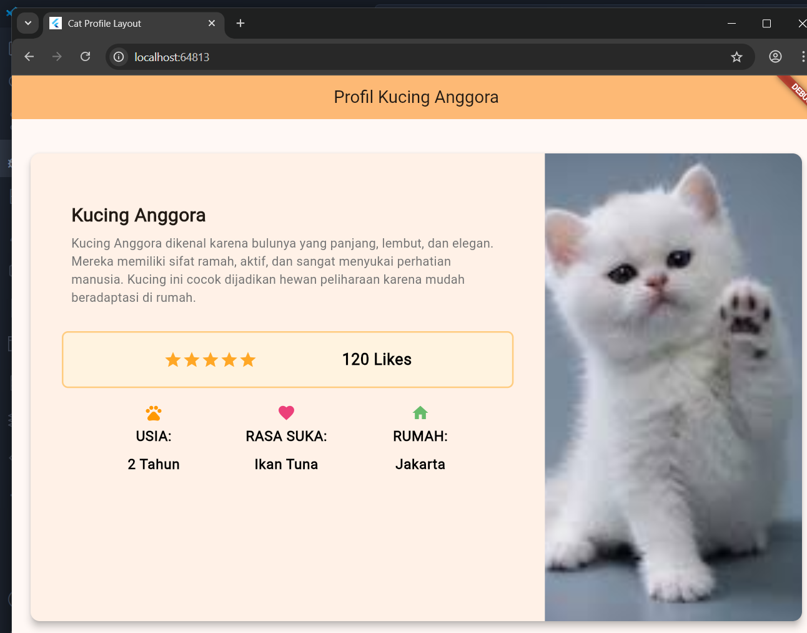

# basic_layout_flutter

Berikut penjelasan lengkap dari kode **Flutter Cat Profile Layout** dalam format **Markdown** 👇

---

# 🐾 Penjelasan Kode Flutter: *Profil Kucing Anggora*

Kode ini menampilkan **layout profil seekor kucing Anggora** dengan tampilan menarik menggunakan **widget layout dan dekorasi Material Design 3**.

---

## 📌 1. Struktur Program Utama

```dart
void main() {
  runApp(const MyApp());
}
```

➡️ Fungsi `main()` merupakan titik awal aplikasi Flutter.
Widget `MyApp` dijalankan sebagai root dari aplikasi menggunakan `runApp()`.

---

## 🏠 2. Kelas `MyApp`

```dart
class MyApp extends StatelessWidget {
  ...
  return MaterialApp(
    title: 'Cat Profile Layout',
    theme: ThemeData(
      colorScheme: ColorScheme.fromSeed(seedColor: Colors.orange),
      useMaterial3: true,
    ),
    home: const CatProfileLayout(),
  );
}
```

**Penjelasan:**

* `MaterialApp` digunakan untuk menerapkan gaya **Material Design**.
* `title`: judul aplikasi yang tampil di task manager.
* `theme`: menggunakan tema **oranye**, cocok dengan nuansa hewan peliharaan.
* `home`: mengarah ke halaman utama yaitu `CatProfileLayout`.

---

## 🧩 3. Kelas `CatProfileLayout`

Kelas ini menampilkan konten utama dari halaman profil kucing.

---

### 🐱 3.1 Title Section

```dart
Widget titleSection = Container(
  padding: const EdgeInsets.all(32),
  child: Column(
    crossAxisAlignment: CrossAxisAlignment.start,
    children: [
      ...
      Text('Kucing Anggora', ...),
      Text('Kucing Anggora dikenal karena bulunya ...'),
    ],
  ),
);
```

**Penjelasan:**

* Menggunakan `Container` untuk memberi **padding**.
* `Column` digunakan agar teks disusun **vertikal**.
* Bagian ini berisi:

  * Nama kucing: **“Kucing Anggora”**
  * Deskripsi singkat tentang karakteristiknya.

---

### ⭐ 3.2 Rating Section

```dart
Widget ratingsSection = Container(
  padding: const EdgeInsets.all(20),
  decoration: BoxDecoration(
    border: Border.all(color: Colors.orange.shade200, width: 2),
    borderRadius: BorderRadius.circular(8),
    color: Colors.orange.shade50,
  ),
  child: Row(
    mainAxisAlignment: MainAxisAlignment.spaceEvenly,
    children: [
      stars,
      const Text('120 Likes', ...),
    ],
  ),
);
```

**Penjelasan:**

* Menggunakan **lima ikon bintang** (⭐) untuk menunjukkan rating.
* Terdapat teks “120 Likes”.
* Didekorasi dengan:

  * Border oranye lembut.
  * Warna latar oranye muda.
  * Sudut melengkung (rounded corners).

---

### 📊 3.3 Info Section

```dart
Widget iconSection = DefaultTextStyle.merge(
  style: descTextStyle,
  child: Container(
    child: Row(
      mainAxisAlignment: MainAxisAlignment.spaceEvenly,
      children: [
        Column(children: [Icon(Icons.pets), Text('USIA:'), Text('2 Tahun')]),
        Column(children: [Icon(Icons.favorite), Text('RASA SUKA:'), Text('Ikan Tuna')]),
        Column(children: [Icon(Icons.home), Text('RUMAH:'), Text('Jakarta')]),
      ],
    ),
  ),
);
```

**Penjelasan:**

* Menampilkan **informasi detail** kucing dengan ikon dan teks:

  * 🐾 **Usia:** 2 Tahun
  * ❤️ **Rasa Suka:** Ikan Tuna
  * 🏠 **Rumah:** Jakarta
* Menggunakan `Row` agar setiap kolom tersusun **horizontal** dengan jarak rata.

---

### 📋 3.4 Left Column

```dart
Widget leftColumn = Container(
  padding: const EdgeInsets.fromLTRB(20, 30, 20, 20),
  child: Column(
    children: [
      titleSection,
      ratingsSection,
      iconSection,
    ],
  ),
);
```

**Penjelasan:**

* Menggabungkan tiga bagian sebelumnya:

  * Judul + deskripsi
  * Rating bintang
  * Info ikon
* Ditempatkan di sisi kiri layout.

---

### 🖼️ 3.5 Gambar Kucing

```dart
Image.asset(
  'images/cat.jpg',
  fit: BoxFit.cover,
  height: 600,
  errorBuilder: ...
)
```

**Penjelasan:**

* Menampilkan gambar kucing (`images/cat.jpg`).
* `BoxFit.cover` membuat gambar menyesuaikan ukuran card tanpa distorsi.
* `errorBuilder` menampilkan ikon 🐾 dan teks “Kucing Anggora” jika gambar gagal dimuat.

---

## 🧱 4. Layout Utama dalam `Card`

```dart
Card(
  shape: RoundedRectangleBorder(
    borderRadius: BorderRadius.circular(12),
  ),
  child: Row(
    crossAxisAlignment: CrossAxisAlignment.start,
    children: [
      Expanded(flex: 2, child: leftColumn),
      Expanded(flex: 1, child: imageSection),
    ],
  ),
)
```

**Penjelasan:**

* `Card` digunakan sebagai kontainer dengan efek bayangan (elevation).
* Menggunakan `Row` untuk menampilkan dua bagian:

  * Kiri: teks dan info (`leftColumn`)
  * Kanan: gambar (`imageSection`)
* `Expanded` memberi proporsi ruang (2:1).

---

## 🧭 5. Scaffold & AppBar

```dart
Scaffold(
  appBar: AppBar(
    backgroundColor: Theme.of(context).colorScheme.inversePrimary,
    title: const Text('Profil Kucing Anggora'),
    centerTitle: true,
  ),
  body: ...
)
```

**Penjelasan:**

* `Scaffold` menyediakan struktur dasar aplikasi (app bar + body).
* `AppBar` menampilkan judul di tengah.
* `body` berisi seluruh konten yang sudah dijelaskan sebelumnya.

---

## 📱 6. Scroll dan Responsivitas

* `SingleChildScrollView` memungkinkan konten di-scroll jika layar kecil.
* `constraints: BoxConstraints(maxWidth: 1200)` memastikan tampilan tetap rapi pada layar besar (seperti tablet atau web).

---

## 🎨 7. Hasil Akhir

🧩 Tampilan akhir berisi:

* AppBar dengan judul **“Profil Kucing Anggora”**
* Card berisi dua kolom:

  1. **Kiri:** Deskripsi, rating, dan info kucing.
  2. **Kanan:** Gambar kucing yang menyesuaikan ukuran layar.

---

## 💡 Ringkasan Konsep Flutter yang Dipakai

| Konsep                        | Deskripsi                                               |
| :---------------------------- | :------------------------------------------------------ |
| `MaterialApp`                 | Root widget dengan tema dan navigasi                    |
| `Scaffold`                    | Struktur dasar halaman                                  |
| `AppBar`                      | Bagian header                                           |
| `Container`, `Column`, `Row`  | Layout utama                                            |
| `Icon`, `Text`, `Image.asset` | Konten visual                                           |
| `BoxDecoration`               | Gaya dan border container                               |
| `Expanded`                    | Mengatur proporsi layout dalam `Row`                    |
| `SingleChildScrollView`       | Mengizinkan konten untuk digulir                        |
| `Card`                        | Menampilkan elemen dengan efek bayangan & border radius |

---


# HASIL AKHIR : 

