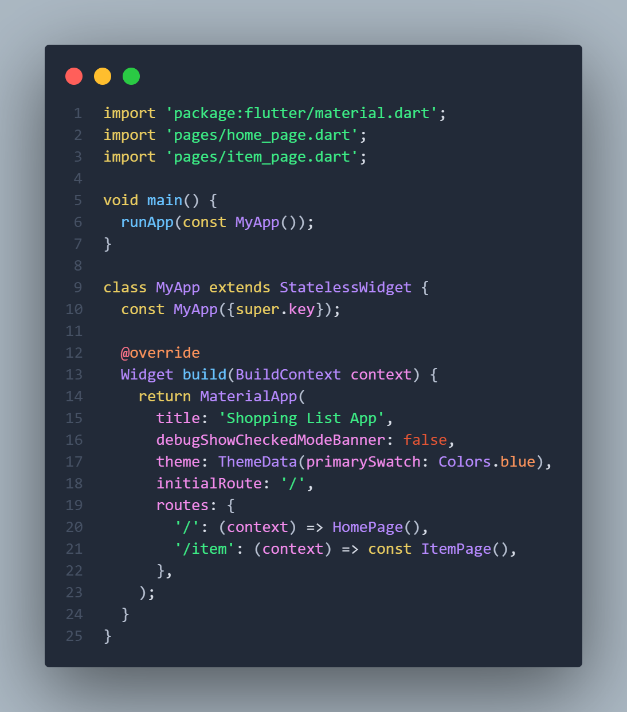
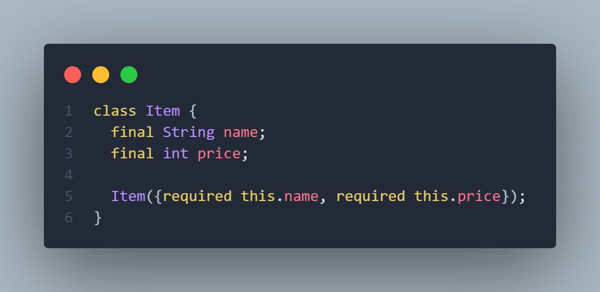
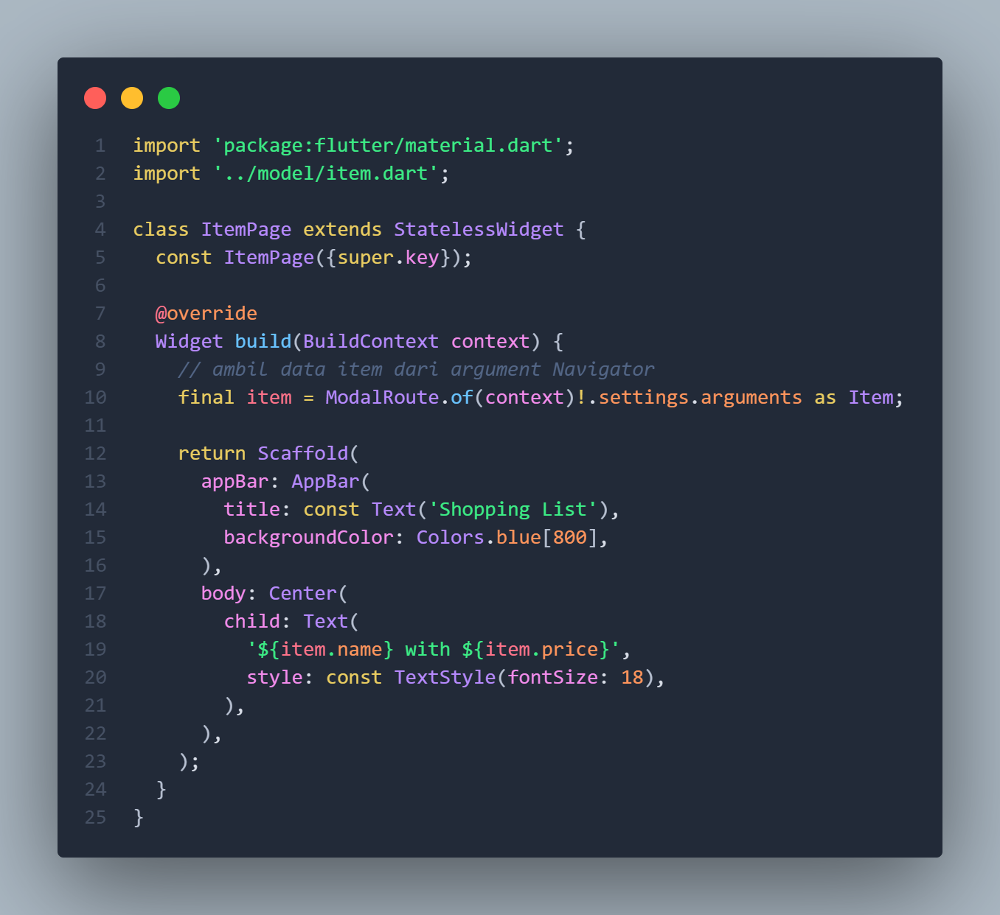
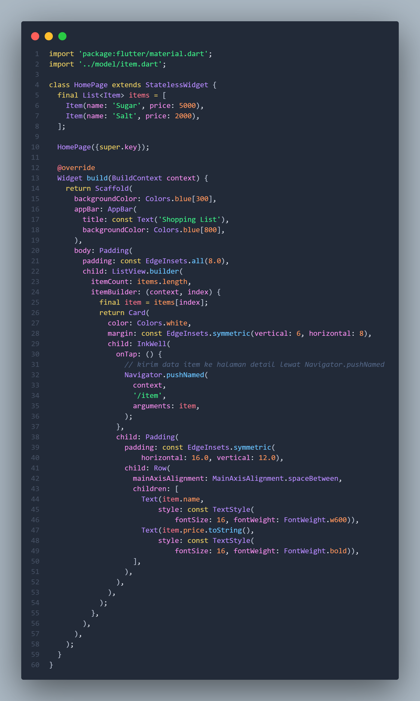
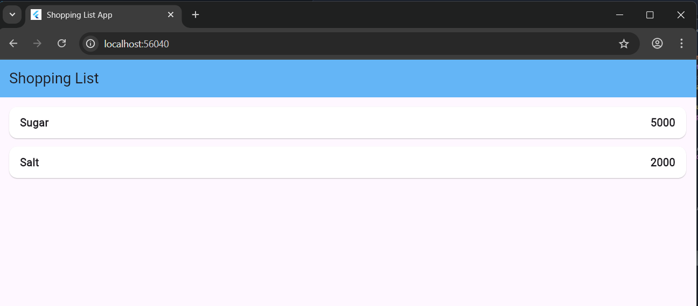
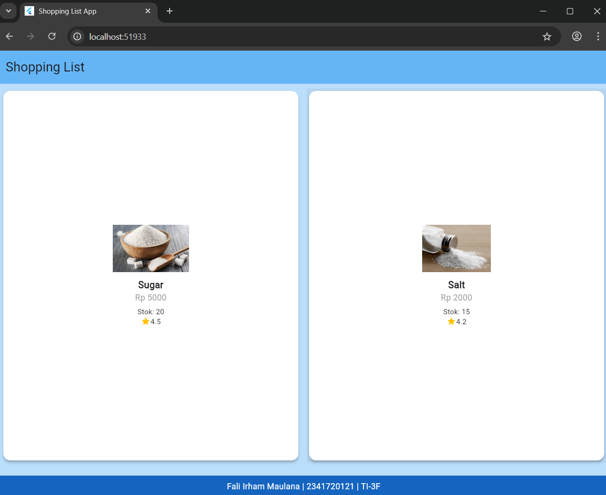
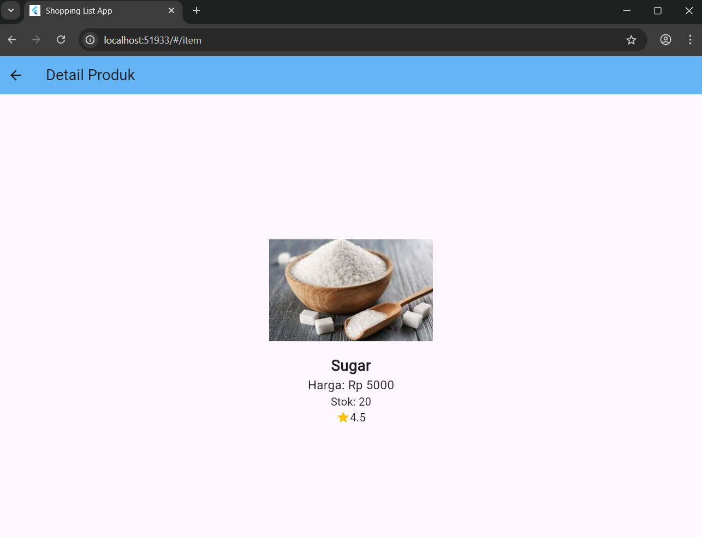

# Belanja

## Praktikum 5: Membangun Navigasi di Flutter

- File ```main.dart```



- File ```model/item.dart```



- File ```pages/item_page.dart```



- File ```pages/home_page.dart```



- **Output:**

- **Home:** 



- **Item:**


## Tugas Praktikum 2 

### 1️. Navigasi Menggunakan `Navigator.pushNamed`
Untuk berpindah ke halaman detail produk, digunakan perintah berikut:
```dart
Navigator.pushNamed(
  context,
  '/item',
  arguments: item,
);
```

Perintah di atas mengirimkan data `item` sebagai **arguments** ke halaman berikutnya.

---

### 2️. Penerimaan Data Menggunakan `ModalRoute`

Pada halaman tujuan (`ItemPage`), data diterima menggunakan:

```dart
final itemArgs = ModalRoute.of(context)!.settings.arguments as Item;
```

Nilai `itemArgs` kemudian digunakan untuk menampilkan detail produk seperti nama, harga, stok, dan rating.

---

## Model Data (`item.dart`)

Model `Item` menyimpan atribut produk seperti berikut:

```dart
class Item {
  final String name;
  final int price;
  final String image;
  final int stock;
  final double rating;

  Item({
    required this.name,
    required this.price,
    required this.image,
    required this.stock,
    required this.rating,
  });
}
```

---

## Tampilan GridView Produk

Tampilan utama menggunakan **GridView** agar mirip dengan aplikasi marketplace:

```dart
GridView.builder(
  gridDelegate: const SliverGridDelegateWithFixedCrossAxisCount(
    crossAxisCount: 2,
    childAspectRatio: 0.8,
    crossAxisSpacing: 10,
    mainAxisSpacing: 10,
  ),
  itemCount: items.length,
  itemBuilder: (context, index) {
    final item = items[index];
    return InkWell(
      onTap: () {
        Navigator.pushNamed(context, '/item', arguments: item);
      },
      child: Card(
        elevation: 4,
        color: Colors.white,
        shape: RoundedRectangleBorder(
          borderRadius: BorderRadius.circular(12),
        ),
        child: Column(
          mainAxisAlignment: MainAxisAlignment.center,
          children: [
            Hero(
              tag: item.name,
              child: Image.asset(item.image, height: 80),
            ),
            const SizedBox(height: 10),
            Text(item.name, style: const TextStyle(fontWeight: FontWeight.bold)),
            Text('Rp ${item.price}'),
            Text('Stok: ${item.stock}', style: const TextStyle(fontSize: 12)),
            Row(
              mainAxisAlignment: MainAxisAlignment.center,
              children: [
                const Icon(Icons.star, color: Colors.amber, size: 16),
                Text(item.rating.toString()),
              ],
            ),
          ],
        ),
      ),
    );
  },
)
```

---

## Implementasi Hero Animation

Untuk membuat transisi gambar yang halus antara dua halaman, digunakan **Hero widget**:

```dart
Hero(
  tag: item.name,
  child: Image.asset(item.image, height: 80),
);
```

Pada halaman detail, tag yang sama digunakan agar Flutter tahu bahwa kedua gambar tersebut saling terhubung:

```dart
Hero(
  tag: itemArgs.name,
  child: Image.asset(itemArgs.image, height: 150),
);
```

Hasilnya, saat gambar diklik pada halaman utama, gambar akan **meluncur mulus ke halaman detail**.

---

## Routing dan Inisialisasi di `main.dart`

Semua rute didefinisikan di `MaterialApp`:

```dart
return MaterialApp(
  title: 'Shopping List App',
  debugShowCheckedModeBanner: false,
  theme: ThemeData(primarySwatch: Colors.blue),
  initialRoute: '/',
  routes: {
    '/': (context) => HomePage(),
    '/item': (context) => const ItemPage(),
  },
);
```

---

## Footer Aplikasi

Footer ditambahkan di bagian bawah halaman utama menggunakan `bottomNavigationBar`:

```dart
bottomNavigationBar: Container(
  color: Colors.blue[800],
  padding: const EdgeInsets.all(8),
  child: const Text(
    'Fali Irham Maulana | 22417600XX',
    textAlign: TextAlign.center,
    style: TextStyle(color: Colors.white),
  ),
),
```
---

## 💡 Hasil Akhir Aplikasi

| Halaman Utama (GridView)            | Halaman Detail (Hero Animation)   |
| ----------------------------------- | --------------------------------- |
| 
| 

---

## Eksperimen Tambahan: go_router

Sebagai eksplorasi lebih lanjut, navigasi dapat diimplementasikan menggunakan plugin **go_router**, yang menyediakan sistem routing yang lebih deklaratif dan mudah dikontrol:

```dart
final router = GoRouter(
  routes: [
    GoRoute(
      path: '/',
      builder: (context, state) => HomePage(),
    ),
    GoRoute(
      path: '/item',
      builder: (context, state) {
        final item = state.extra as Item;
        return ItemPage(item: item);
      },
    ),
  ],
);
```

Kemudian dipanggil pada `MaterialApp.router`:

```dart
return MaterialApp.router(
  routerConfig: router,
  title: 'Shopping List App',
  theme: ThemeData(primarySwatch: Colors.blue),
);
```

---

## Kesimpulan

Melalui praktikum ini, kita telah mempelajari:

* Cara navigasi antar halaman menggunakan `Navigator.pushNamed`.
* Pengiriman data antar halaman dengan `arguments`.
* Penerimaan data menggunakan `ModalRoute`.
* Pembuatan tampilan **GridView** seperti marketplace.
* Implementasi animasi menggunakan **Hero widget**.
* Modularisasi kode Flutter (memisahkan model, halaman, dan widget).
* Eksplorasi tambahan penggunaan **go_router** untuk navigasi modern.


