# Pemrograman Mobile - Pertemuan 6 Layout dan Navigasi

**NIM : 2341720121**

**FALI IRHAM MAULANA**

## Praktikum 1: Membangun Layout di Flutter

### Langkah 2: Buka file lib/main.dart 

- Kode Program : 

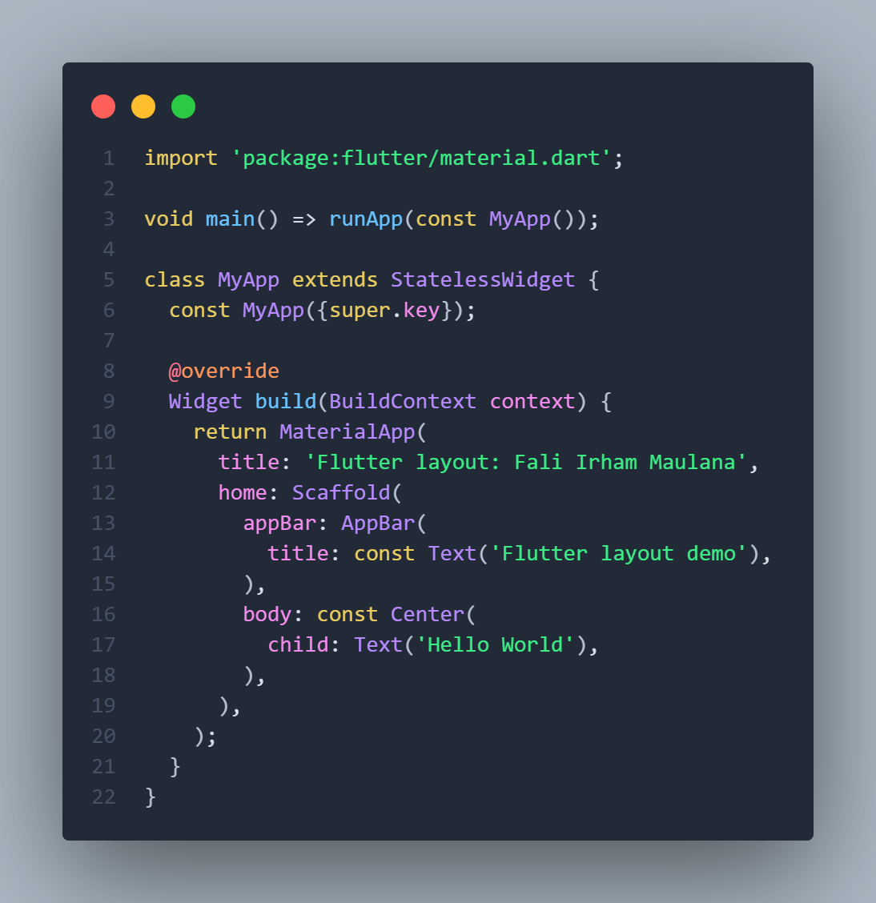

- Output : 

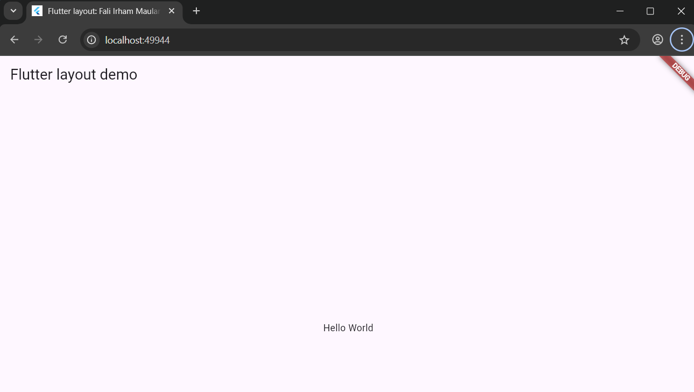

### Langkah 4: Implementasi title row

- Kode Program : 

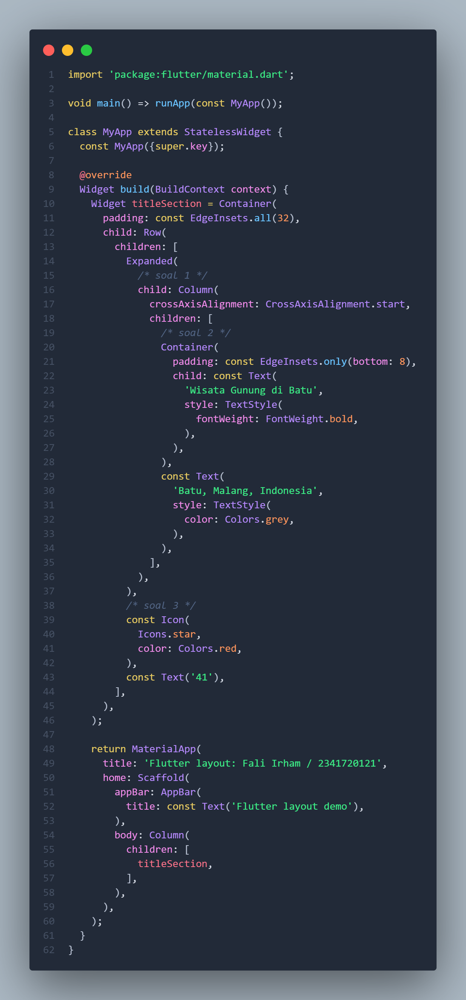

- Output :

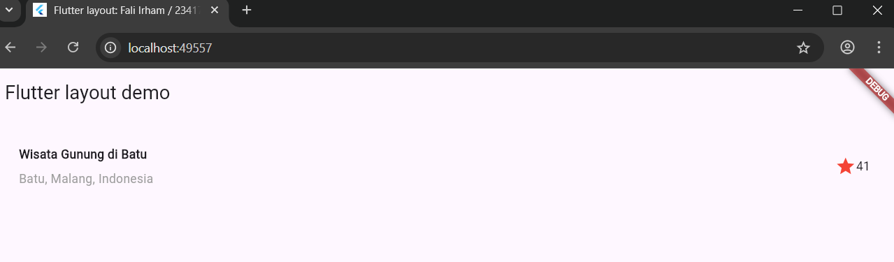

## Praktikum 2: Implementasi button row

### Langkah 1-3 

- Kode Program : 

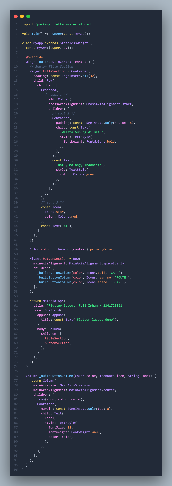

- Output : 

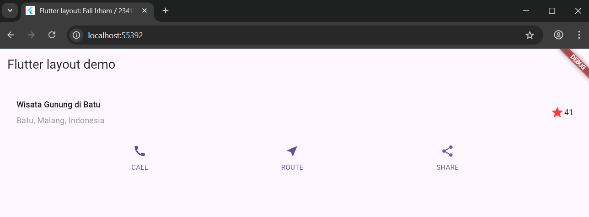

## Praktikum 3: Implementasi text section 

- Kode Program : 

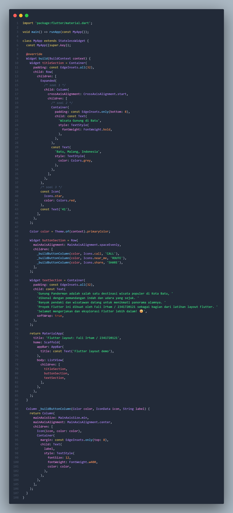

- Output : 

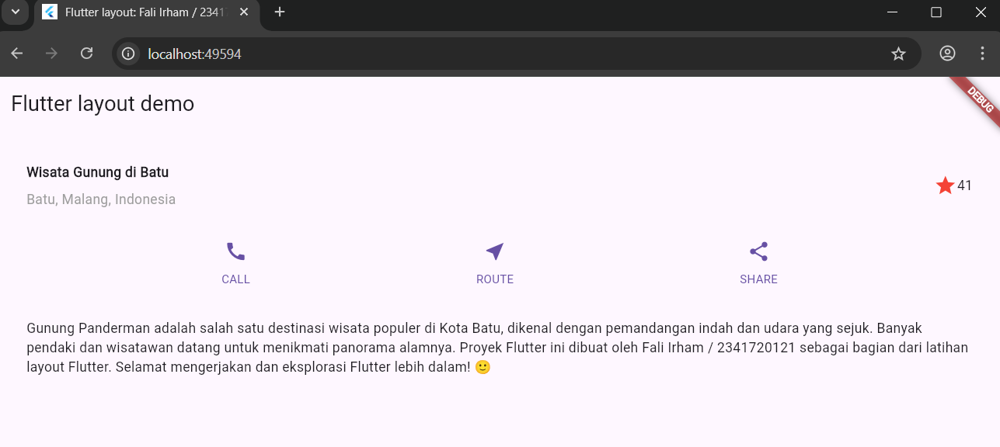

## Praktikum 4: Implementasi image section

- Kode Program : 

**pubspec.yaml :**

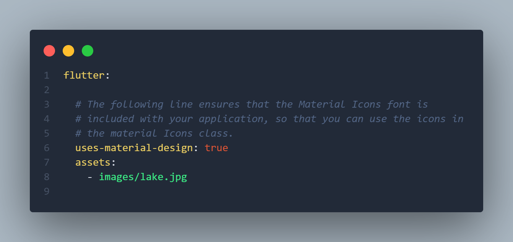

**main.dart :**

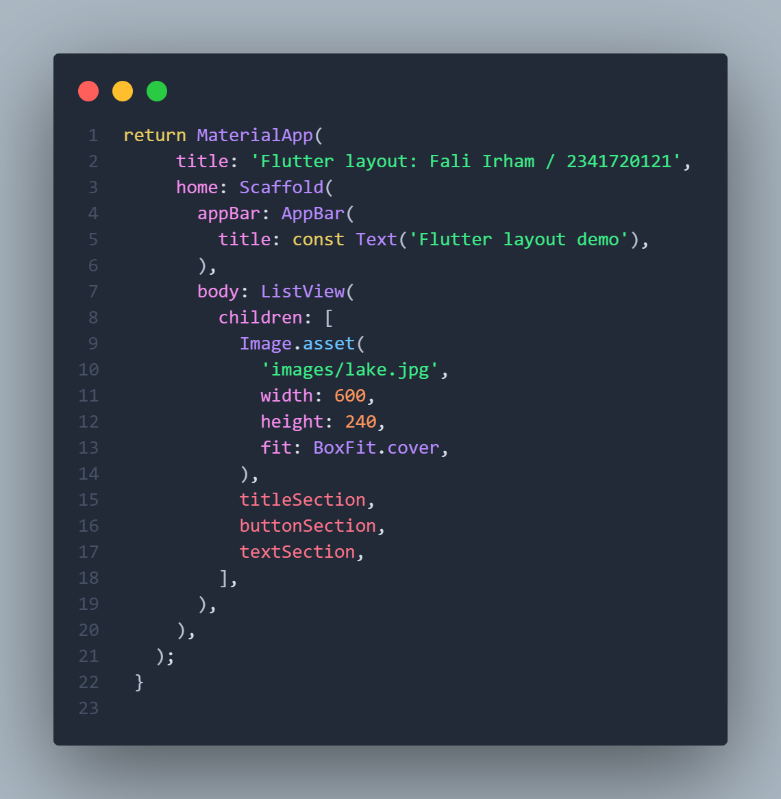

- Output : 

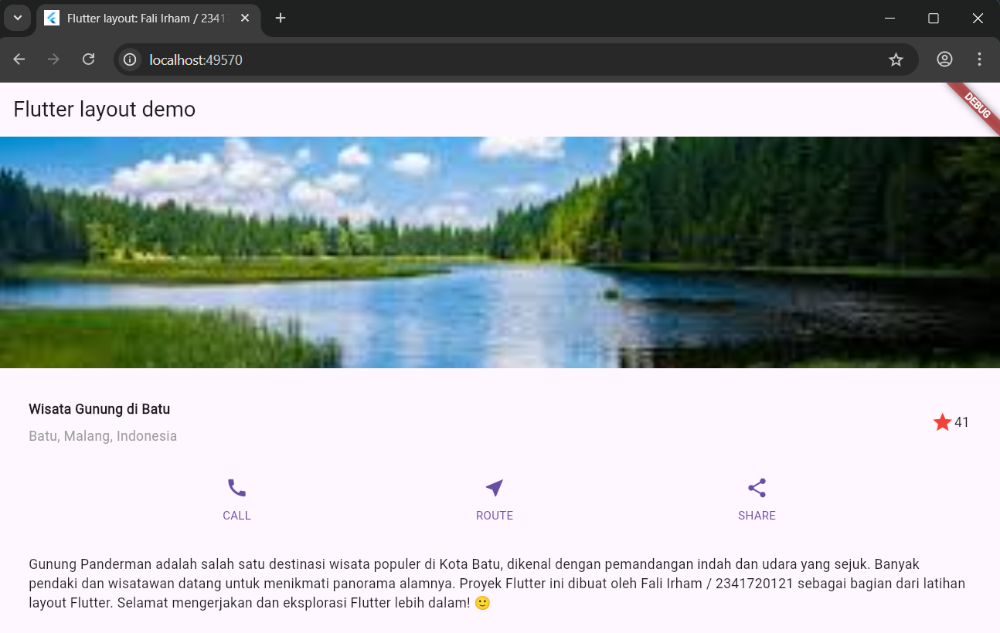
