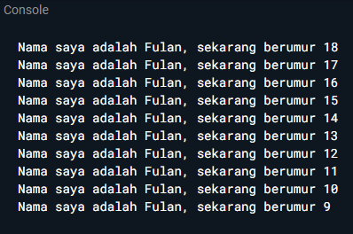
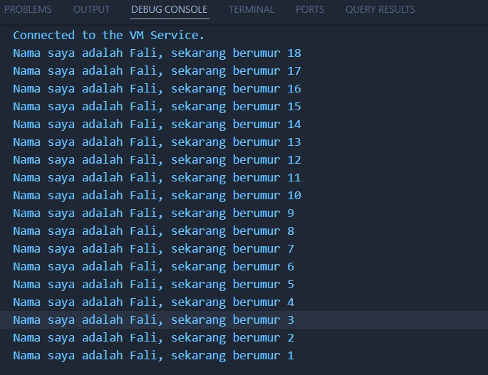

# Pemrograman Mobile - Pertemuan 2

**NIM : 2341720121**

**NAMA : FALI IRHAM MAULANA**

## Soal 1
Modifikasilah kode pada baris 3 di VS Code atau Editor Code favorit Anda berikut ini agar mendapatkan keluaran (output) sesuai yang diminta!

```dart
void main() {
  for (int i = 0; i < 10; i++) {
    print('Hello ${i+2}');
  }
}
```
Output yang diminta (Gantilah Fulan dengan nama Anda):



## Jawaban

**Kode program :**


**Output :**



## Soal 2
Mengapa sangat penting untuk memahami bahasa pemrograman Dart sebelum kita menggunakan framework Flutter?

## Jawaban
Memahami bahasa pemrograman Dart sangat penting sebelum mempelajari Flutter karena seluruh logika dan struktur Flutter dibangun menggunakan Dart. Jika kita tidak memahami dasar-dasar Dart, maka akan sulit untuk memahami cara kerja widget, manajemen state, serta fitur penting lainnya seperti asynchronous programming dengan `async` dan `await`. Selain itu, Dart memiliki fitur Null Safety yang krusial dalam menghindari error saat pengembangan aplikasi modern. Dengan menguasai Dart terlebih dahulu, proses belajar Flutter akan lebih mudah, cepat, dan efisien, sehingga kita tidak hanya bisa menggunakan framework, tetapi juga memahami dasar yang mendukung kinerjanya.

## Soal 3
Rangkumlah materi dari codelab ini menjadi poin-poin penting yang dapat Anda gunakan untuk membantu proses pengembangan aplikasi mobile menggunakan framework Flutter.

## Jawaban
Materi dari codelab menjelaskan bahwa Dart adalah bahasa utama yang digunakan dalam Flutter, dan seluruh komponen di Flutter berbasis pada konsep widget. Widget dalam Flutter terbagi menjadi dua, yaitu Stateless Widget yang tidak mengalami perubahan data, serta Stateful Widget yang dapat berubah sesuai interaksi pengguna. Flutter juga dilengkapi dengan fitur Hot Reload yang memungkinkan pengembang melihat hasil perubahan kode secara langsung tanpa perlu me-restart aplikasi, sehingga proses pengembangan menjadi lebih cepat. Selain itu, Flutter mendukung desain Material untuk Android dan Cupertino untuk iOS, sehingga pengembang dapat membuat aplikasi lintas platform hanya dengan satu basis kode yang sama. Hal ini menjadikan Flutter sangat efisien untuk membangun aplikasi mobile modern yang bisa berjalan di berbagai sistem operasi.

## Soal 4
Buatlah penjelasan dan contoh eksekusi kode tentang perbedaan Null Safety dan Late variabel!

## Jawaban

Null Safety dalam Dart adalah mekanisme yang memastikan bahwa sebuah variabel tidak akan bernilai `null` secara default. Hal ini penting untuk mencegah terjadinya error saat program dijalankan, karena nilai `null` yang tidak diantisipasi bisa menyebabkan aplikasi berhenti secara tiba-tiba. Jika ada kemungkinan sebuah variabel bernilai `null`, maka tipe data variabel tersebut harus ditandai dengan tanda tanya (`?`). 

Berbeda dengan Null Safety, penggunaan late ditujukan untuk menunda inisialisasi sebuah variabel. Variabel yang diberi kata kunci late tidak langsung memiliki nilai ketika dideklarasikan, tetapi Dart menjamin bahwa variabel tersebut akan diisi sebelum digunakan. Fitur ini sangat berguna ketika nilai variabel baru dapat diketahui setelah pemanggilan fungsi atau proses tertentu.


