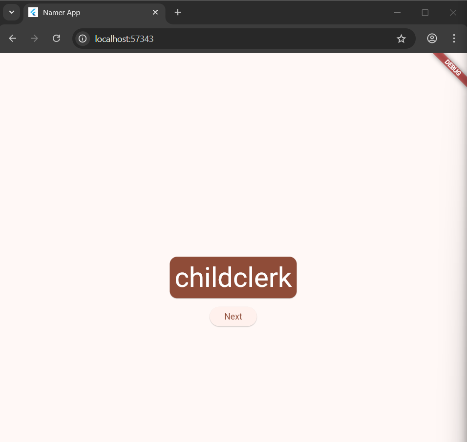
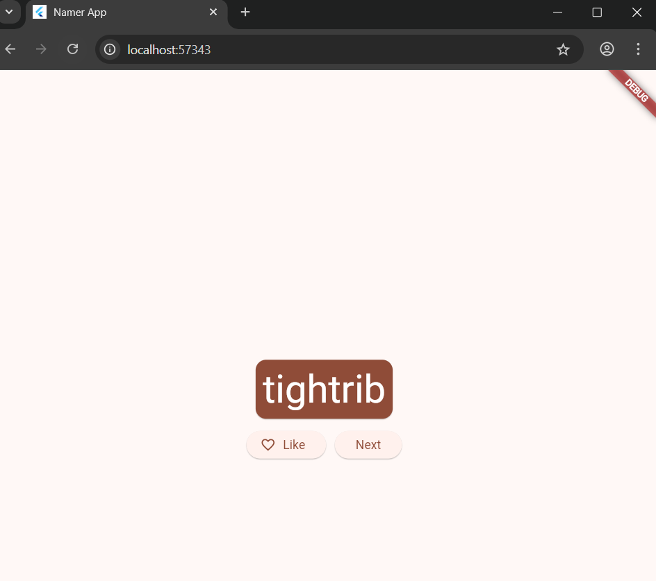
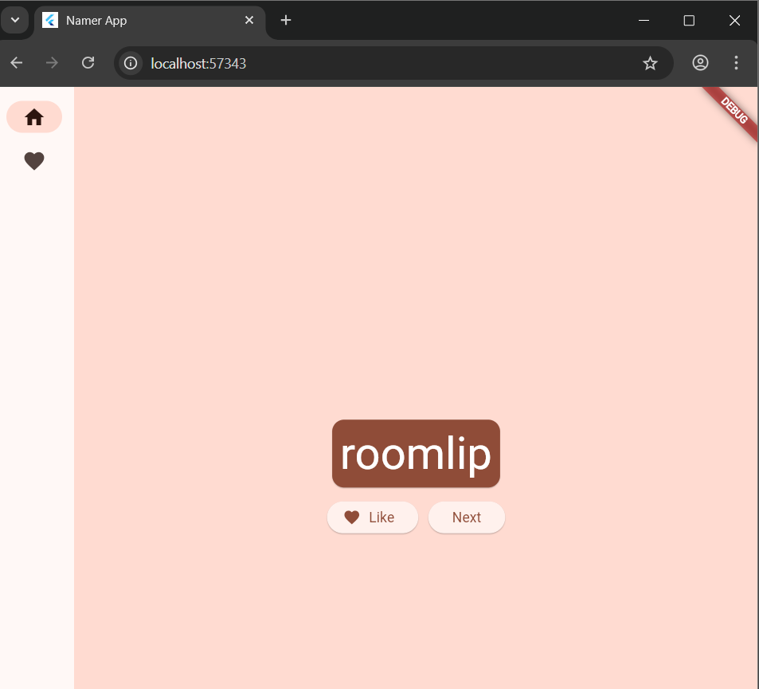
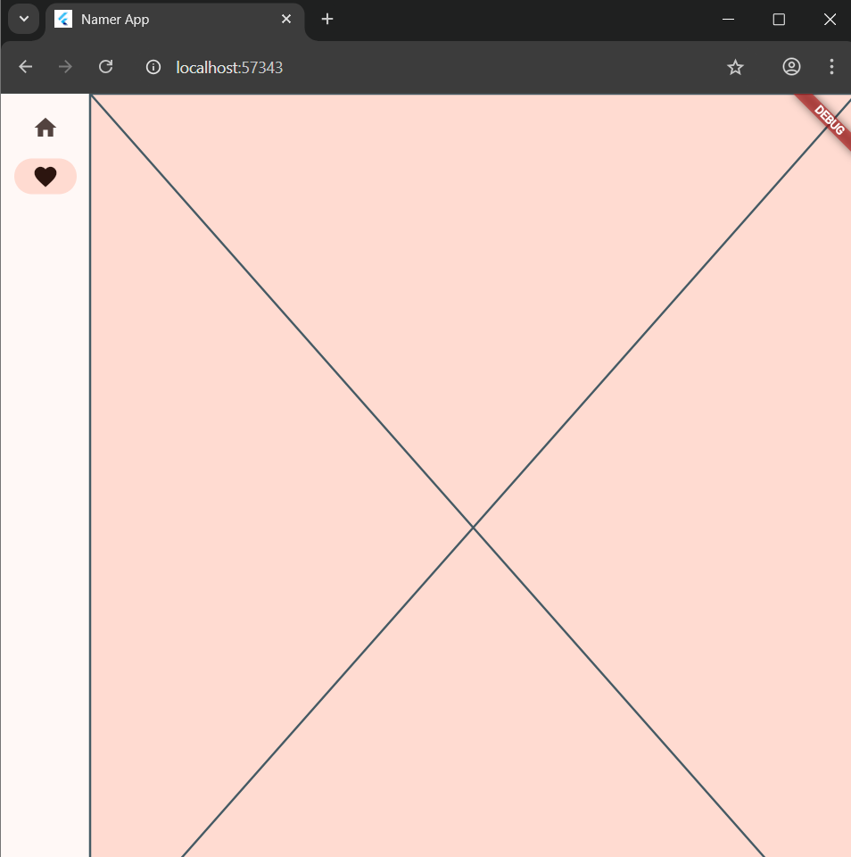
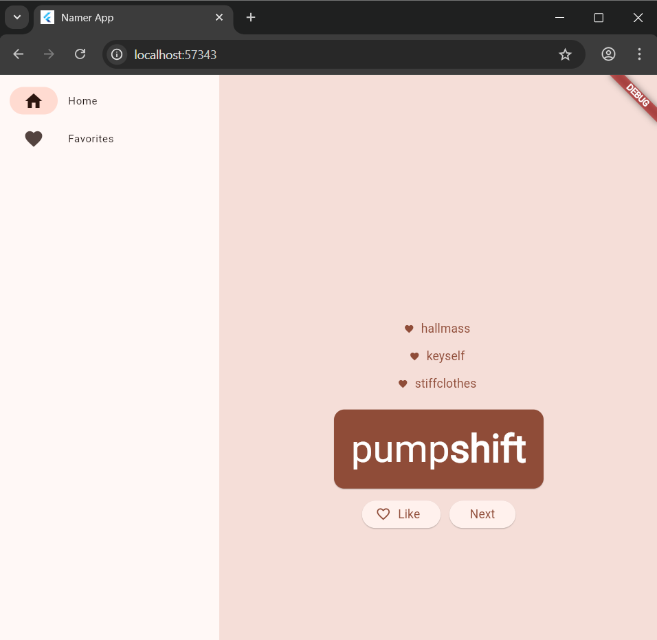
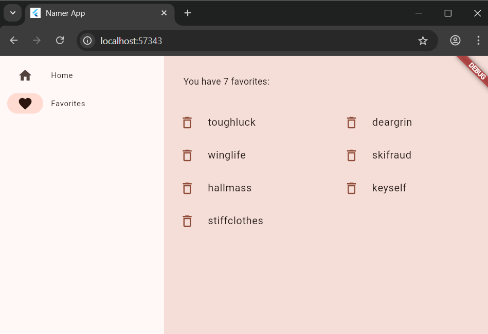

# namer_app

A new Flutter project.

## Getting Started

## Memperindah tampilan aplikasi 

## Menambahkan Fungsi

## Menambahkan kolom samping navigasi

## Hasil Akhir 

🧩 Penjelasan Kode Flutter: Namer App (Generator Kata Acak dengan Favorite List)

Aplikasi ini adalah versi pengembangan dari contoh Flutter Namer App, yang menghasilkan pasangan kata acak (WordPair) dan memungkinkan pengguna untuk:

Melihat riwayat kata yang telah digenerate,

Menyukai (menandai favorit) pasangan kata tertentu,

Menghapus item dari daftar favorit,

Menavigasi antara halaman Home dan Favorites.

🏗️ 1. Struktur Utama Aplikasi
void main() {
  runApp(MyApp());
}

Fungsi main() menjalankan widget utama MyApp.

MyApp menggunakan Provider (ChangeNotifierProvider) untuk mengatur state global.

🧠 2. State Management — MyAppState
class MyAppState extends ChangeNotifier

State global yang menyimpan dan mengelola data utama aplikasi:

current → pasangan kata yang sedang ditampilkan (WordPair.random()).

history → daftar riwayat kata yang telah digenerate.

favorites → daftar kata yang telah disukai.

Fungsi-fungsinya:
Fungsi	Deskripsi
getNext()	Mengambil pasangan kata baru, menambahkannya ke riwayat, dan memperbarui tampilan.
toggleFavorite()	Menandai / menghapus kata dari daftar favorit.
removeFavorite()	Menghapus kata dari daftar favorit secara permanen.

🔑 notifyListeners() digunakan agar UI otomatis terupdate ketika state berubah.

🎨 3. MyApp — Root Widget
class MyApp extends StatelessWidget

Mengatur tema aplikasi (ThemeData dengan ColorScheme.fromSeed).

Mengatur root provider agar MyAppState bisa diakses di seluruh widget tree.

Menentukan halaman awal (home: MyHomePage()).

🏠 4. MyHomePage — Halaman Utama dengan Navigasi

Widget ini menangani navigasi antar halaman dan responsif terhadap lebar layar.

🔹 Navigasi

BottomNavigationBar → digunakan untuk layar kecil (mobile).

NavigationRail → digunakan untuk layar lebar (tablet/desktop).

🔹 Dua halaman utama:
Index	Halaman	Widget
0	Generator kata	GeneratorPage()
1	Daftar favorit	FavoritesPage()

Tampilan halaman aktif dikelola oleh AnimatedSwitcher agar transisi antar halaman lebih halus.

⚙️ 5. GeneratorPage — Halaman Generator Kata

Menampilkan:

Riwayat kata sebelumnya melalui HistoryListView

Kartu besar (BigCard) berisi kata acak saat ini

Dua tombol:

❤️ Like → menambahkan ke favorit

🔁 Next → menghasilkan kata baru

💬 6. BigCard — Tampilan Kata Acak

Menampilkan pasangan kata secara besar dan estetis.

Card(
  color: theme.colorScheme.primary,
  child: Padding(
    padding: const EdgeInsets.all(20),
    child: AnimatedSize(
      duration: Duration(milliseconds: 200),
      child: Wrap(
        children: [
          Text(pair.first),
          Text(pair.second),
        ],
      ),
    ),
  ),
)

🔹 Menggunakan AnimatedSize agar teks bisa menyesuaikan perubahan ukuran secara animatif.
🔹 Wrap digunakan supaya kata tidak terpotong saat layar sempit.

💖 7. FavoritesPage — Halaman Daftar Favorit

Menampilkan semua kata yang telah disukai pengguna.

Jika belum ada, muncul teks “No favorites yet.”

Menggunakan GridView agar tampilan adaptif pada layar lebar.

Setiap item menampilkan:

Ikon 🗑️ untuk menghapus dari daftar favorit

Kata favorit dalam format lowercase

🕓 8. HistoryListView — Daftar Riwayat Kata

Menampilkan riwayat kata yang pernah digenerate menggunakan:

AnimatedList

Animasi muncul saat kata baru ditambahkan.

ShaderMask dengan LinearGradient digunakan untuk memberi efek fade-out di bagian atas list agar tampak seperti daftar panjang yang bisa digulir.

Setiap item dapat di-klik untuk langsung dijadikan atau dibatalkan sebagai favorit.

🧭 9. Interaksi Antarkomponen
Komponen	Akses State	Tujuan
GeneratorPage	context.watch<MyAppState>()	Menampilkan kata & update saat favorit berubah
FavoritesPage	context.watch<MyAppState>()	Menampilkan daftar favorit
HistoryListView	context.watch<MyAppState>()	Menampilkan daftar riwayat kata

Semua bagian ini terhubung oleh Provider, jadi setiap perubahan data langsung memicu pembaruan UI.

🎯 10. Fitur-Fitur Utama

✅ Generate kata acak
✅ Riwayat kata otomatis tersimpan
✅ Animasi pada riwayat dengan AnimatedList
✅ Menandai & menghapus favorit
✅ Navigasi adaptif (BottomNav / NavigationRail)
✅ Tema menggunakan Material 3 (useMaterial3: true)

🧾 Kesimpulan

Aplikasi ini menggabungkan konsep penting Flutter:

State Management dengan Provider

Responsiveness dengan LayoutBuilder

Animasi bawaan Flutter (AnimatedList, AnimatedSwitcher, AnimatedSize)

Navigasi adaptif antar halaman

Penggunaan Theme dan ColorScheme Material 3

Sehingga hasil akhirnya adalah aplikasi yang interaktif, responsif, dan modern 🌟.
