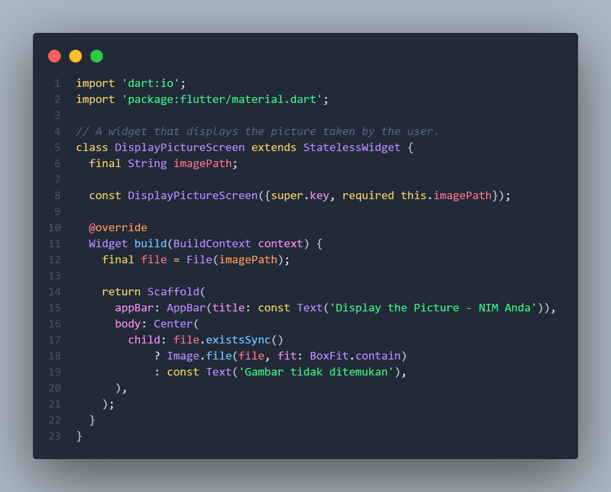
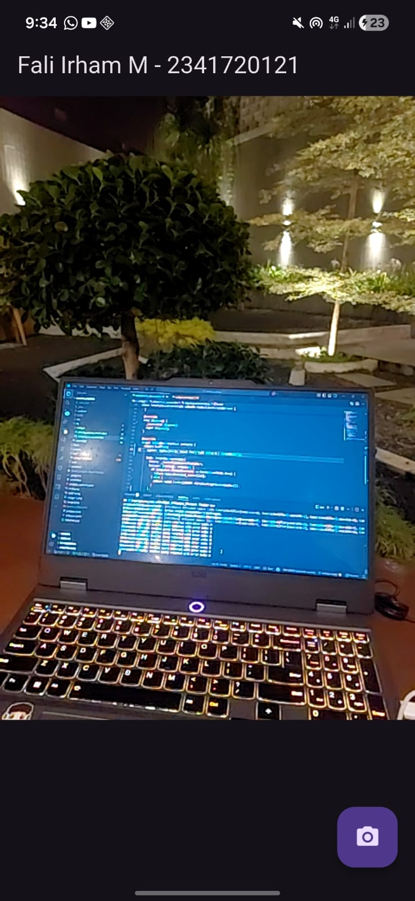

# Pemrograman Mobile - Pertemuan 9 

**NIM: 2341720121**

**NAMA: FALI IRHAM MAULANA**

## Praktikum 1: Mengambil Foto dengan Kamera di Flutter

### Langkah 1: Buat Project Baru

### Langkah 2: Tambah dependensi yang diperlukan

### Langkah 3 - 9 : 

- **takepicture_screen.dart :** 

- **displaypicture_screen.dart :**

- **main.dart :**

### Output Hasil : 

