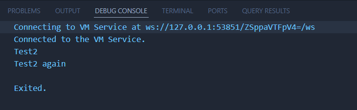
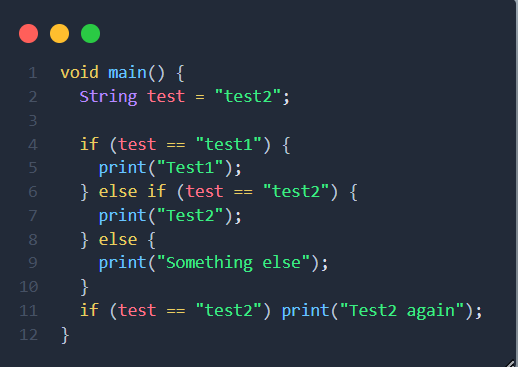
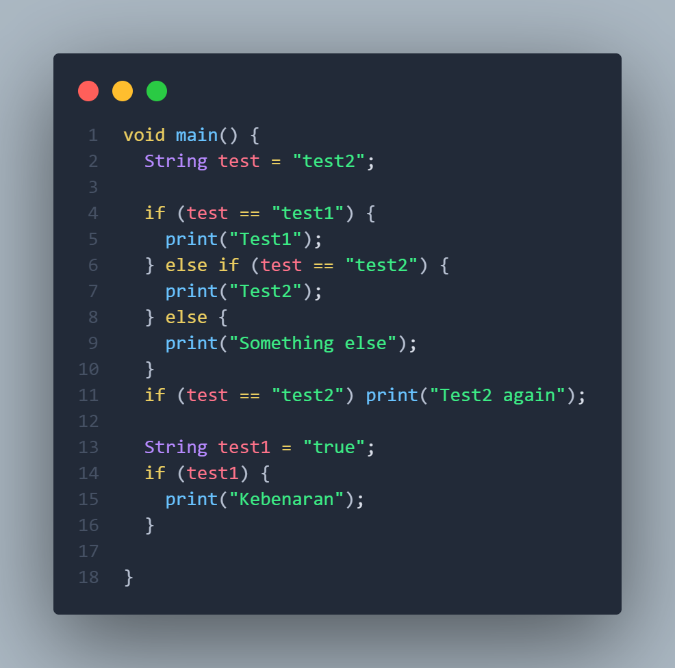
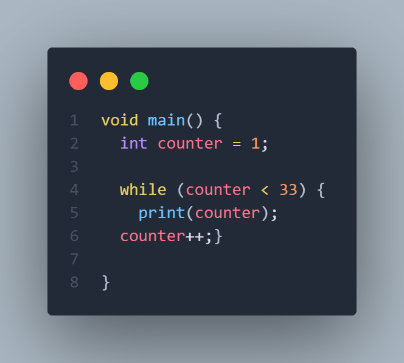
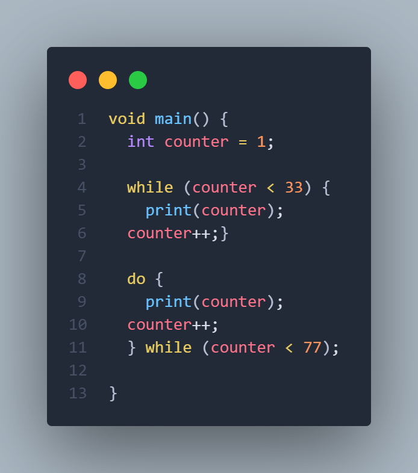
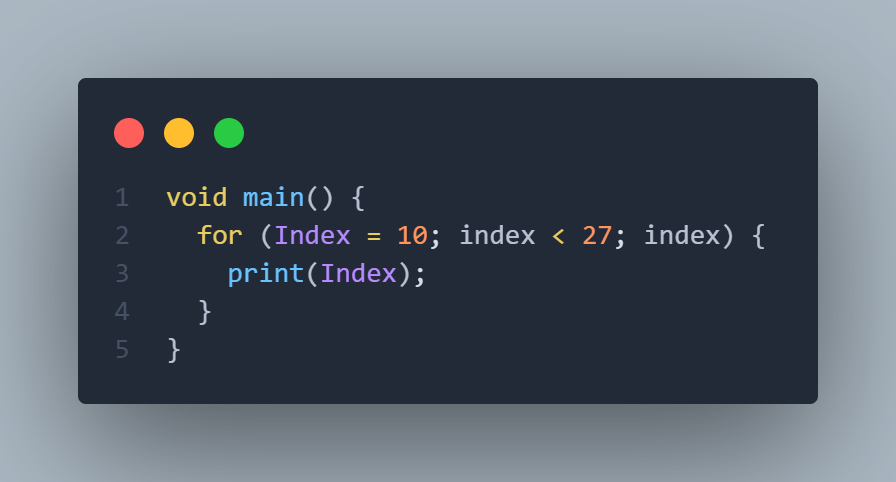
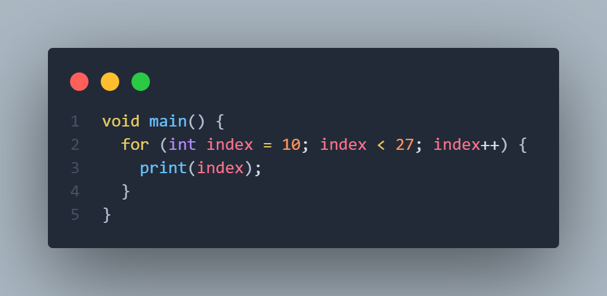
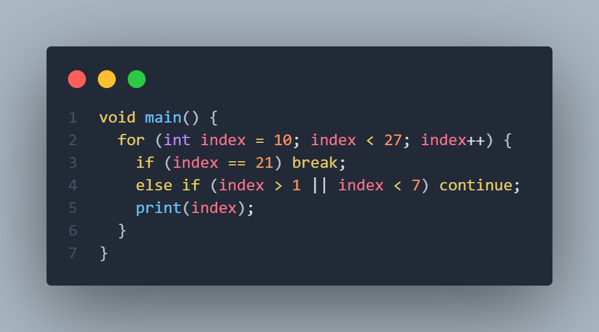
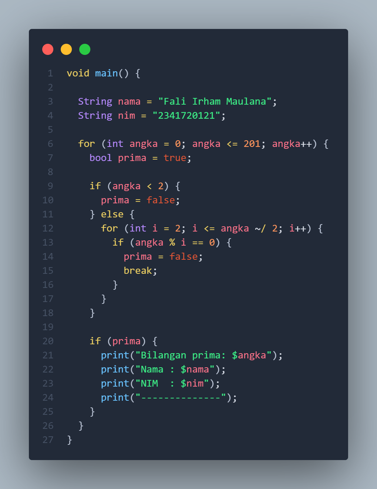

# **Pemrograman Mobile - Pertemuan 3 Pengantar Bahasa Pemrograman Dart - Bagian 2**

**NIM : 2341720121**

**NAMA : FALI IRHAM MAULANA**

---
##  **Praktikum 1: Menerapkan Control Flows ("if/else")**

**Langkah 1**

---

**Langkah 2**

**Penjelasan :** Kode Dart tersebut mendemonstrasikan bagaimana operator perbandingan dan struktur percabangan bekerja. Variabel test diberi nilai ``"test2"``, kemudian diperiksa dengan operator ==, yaitu operator perbandingan yang digunakan untuk mengecek apakah dua nilai sama. Pada blok pertama, program menggunakan `` if (test == "test1")`` untuk membandingkan nilai variabel test dengan string ``"test1"``. Karena hasil perbandingan ini bernilai salah (false), program melanjutkan ke bagian ``else if (test == "test2")``. Pada kondisi ini, perbandingan bernilai benar (true), sehingga program mengeksekusi perintah ``print("Test2")``. Apabila kedua perbandingan sebelumnya salah, barulah bagian else dijalankan untuk menampilkan "Something else". Setelah percabangan utama, terdapat pernyataan ``if (test == "test2")`` lagi, tetapi kali ini ditulis dalam bentuk singkat tanpa blok kurung kurawal, sehingga hanya satu baris kode ``print("Test2 again")`` yang dijalankan ketika kondisi bernilai benar. Karena nilai test memang "test2", kondisi ini terpenuhi dan baris tersebut dijalankan. Dengan demikian, output program adalah "Test2" dan "Test2 again", yang menunjukkan bahwa operator == berfungsi untuk membandingkan kesamaan nilai dan struktur if-else digunakan untuk mengatur alur eksekusi berdasarkan hasil perbandingan tersebut.

---

**Langkah 3** 

**Menambahkan kode program :**

``String test = "true";
if (test) {
   print("Kebenaran");
}``

**Outputnya adalah:**

**Perbaikan :**

**Penjelasan :**
variabel test didefinisikan sebagai String, sementara kondisi dalam if harus berupa boolean (true atau false tanpa tanda kutip). Maka"true" adalah string biasa, bukan nilai boolean. Karena itu kode tersebut akan error.Solusinya agar ingin menggunakan if else maka kita harus mengubah tipe datanya menjadi boolean

---

##  **Praktikum 2: Menerapkan Perulangan "while" dan "do-while"**

**Langkah 1**

---

**Langkah2**

**Penjelasan :** Kode Dart tersebut menggunakan perulangan while untuk mencetak angka dari 1 sampai 32. Pertama, sebuah variabel counter bertipe int didefinisikan dengan nilai awal 1. Variabel ini sangat penting karena menjadi syarat dalam perulangan dan juga nilai yang dicetak ke layar. Bagian while (counter < 33) berarti selama nilai counter lebih kecil dari 33, blok kode di dalam kurung kurawal akan dijalankan. Di dalam blok tersebut, program mencetak nilai counter dengan print(counter);, kemudian menambah nilainya satu per satu menggunakan counter++. Operator ++ di Dart berfungsi untuk menambah nilai variabel sebesar satu. Dengan mekanisme ini, perulangan akan berhenti secara otomatis ketika nilai counter mencapai 33, karena kondisi counter < 33 tidak lagi terpenuhi.

---

**Langkah 3**

**Menambahkan kode program :**

``do {
  print(counter);
  counter++;
} while (counter < 77);``

**Outputnya adalah:**

**Penjelasan :** Perbedaan utamanya dari kode perulangan ``while``sebelumnya adalah perulangan do...while akan selalu menjalankan blok kode setidaknya sekali sebelum mengecek kondisi. Pada bagian ``do { print(counter); counter++; } while (counter < 77);``, nilai counter yang saat itu sudah 33 langsung dicetak lebih dulu, lalu dinaikkan satu demi satu sampai kondisi counter < 77 tidak lagi terpenuhi. Artinya, perulangan do...while mencetak angka dari 33 hingga 76.

---

## **Praktikum 3: Menerapkan Perulangan "for" dan "break-continue" Selesaikan langkah**

**Langkah 1**

---

**Langkah 2**

Kode yang dihasilkan akan error dikarenakan variabel Index tidak didefinisikan sebelumnya. Dimana pada Dart, sebuah variabel harus dideklarasikan dengan tipe data, error selanjutnya karena penulisan variabel di dalam perulangan tidak konsisten dimana menulis Index dengan huruf besar di awal, tetapi juga menggunakan index dengan huruf kecil, sehingga Index dan index dianggap dua variabel yang berbeda. Selanjtnya, bagian update di for hanya index, seharusnya menggunakan operator ++ atau += agar nilainya berubah di setiap iterasi.

**Perbaikan :**

**Output :**

---

**Langkah 3**

**Menambahkan kode program :**

``If (Index == 21) break;
Else If (index > 1 || index < 7) continue;
print(index);``

**Outputnya adalah :**

**Penjelasan :**
Dengan logika di atas, program akan memulai perulangan dari 10, tetapi pada setiap iterasi selalu masuk ke bagian continue, sehingga tidak ada angka yang dicetak. Ketika index mencapai 21, break menghentikan loop, dan program selesai tanpa output.

---

## **Tugas Praktikum**

**Kode Program :**

**Outputnya :**

