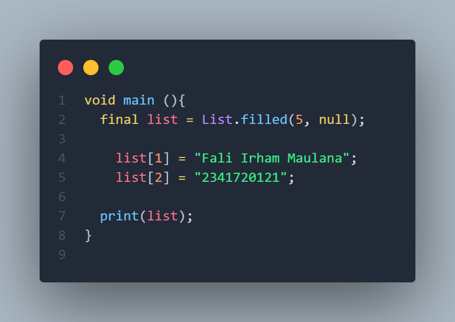

# **Pemrograman Mobile - Pertemuan 3 Pengantar Bahasa Pemrograman Dart - Bagian 2**

**NIM : 2341720121**

**NAMA : FALI IRHAM MAULANA**

---
##  **Praktikum 1: Eksperimen Tipe Data List**

**Langkah 1**


**Langkah 2**


**Penjelasan:**  Program tersebut mula-mula membuat sebuah list yang isinya tiga angka, yaitu [1, 2, 3]. Saat dicek dengan assert, program memastikan bahwa jumlah isi list memang tiga dan nilai pada posisi kedua adalah angka dua, dan hasilnya sesuai. Kemudian program mencetak panjang list, yaitu 3, lalu mencetak isi pada posisi kedua, yaitu 2. Setelah itu, nilai pada posisi kedua diganti dari 2 menjadi 1, sehingga isi list berubah menjadi [1, 1, 3]. Pengecekan kembali dilakukan untuk memastikan perubahan berhasil, dan saat dicetak lagi yang muncul adalah angka 1. Dari sini bisa dilihat bahwa list di Dart sifatnya bisa diubah, jadi meskipun sudah dibuat, isinya tetap bisa diganti sesuai kebutuhan.

**Langkah 3**



**Outputnya:**


**Penjelasan Error:**

Error terjadi karena Dart langsung menganggap kalau ini adalah final ```List<Null>```, artinya semua elemen di dalamnya hanya boleh null. Jadi begitu ketika diisakn dengan tipe data String maka akan terjadi conflict.

**Perbaikan Kode:**


**Output Perbaikan:**


---
## **Praktikum 2: Eksperimen Tipe Data Set**

**Langkah 1**


**Langkah 2**


**Penjelasan:**  Kode tersebut membuat sebuah set berisi lima yaitu fluorine, chlorine, bromine, iodine, dan astatine. set dalam Dart ditandai dengan tanda kurung kurawal {} dan setiap elemennya bersifat unik serta tidak memiliki urutan tetap. Ketika program dijalankan, perintah print(halogens); akan menampilkan isi set tersebut dalam bentuk daftar elemen yang dipisahkan koma di dalam kurung kurawal.

**Langkah 3**


**Menambahkan elemen nama dan NIM Anda pada kedua variabel Set tersebut dengan dua fungsi berbeda yaitu .add() dan .addAll(). dan variabel Map dihapus**


**Output**


---
## **Praktikum 3: Eksperimen Tipe Data Maps**

**Langkah 1**


**Langkah 2**


**Penjelasan:**   Kode tersebut mendefinisikan dua buah map di Dart. Map adalah struktur data yang menyimpan pasangan key–value, di mana setiap key harus unik dan dipakai untuk mengakses nilai tertentu. Pada map pertama yang diberi nama gifts, key-nya berupa string seperti 'first', 'second', dan 'fifth'. Nilai dari masing-masing key bisa berupa string maupun angka, misalnya 'first' dipetakan ke 'partridge', 'second' ke 'turtledoves', dan 'fifth' ke angka 1. Hal ini menunjukkan bahwa map di Dart bersifat fleksibel karena bisa menampung berbagai tipe data dalam value.

Map kedua, yaitu nobleGases, menggunakan key bertipe integer yang mewakili nomor atom unsur, misalnya 2 untuk helium dan 10 untuk neon. Pada key 18, nilainya justru angka 2 alih-alih string nama unsur, yang sekali lagi memperlihatkan fleksibilitas tipe data.

Ketika perintah print(gifts); dijalankan, seluruh isi map pertama ditampilkan dalam bentuk pasangan key–value di dalam kurung kurawal. Begitu juga dengan print(nobleGases); 

**Langkah 3**


**Outputnya**


---
## **Praktikum 4: Eksperimen Tipe Data List: Spread dan Control-flow Operators**

**Langkah 1**


**Langkah 2**


**Penjelasan:**   Kode tersebut membuat sebuah list pertama bernama list1 dengan isi [1, 2, 3]. Kemudian dibuat list kedua list2 yang berisi angka 0 diikuti seluruh isi list1 menggunakan operator spread (...list1). Dengan begitu, list2 akan berisi [0, 1, 2, 3]. Saat dicetak, program menampilkan isi list1 yaitu [1, 2, 3], kemudian isi list2 yaitu [0, 1, 2, 3], dan terakhir panjang list2 yang bernilai 4 karena terdapat empat elemen di dalamnya. Operator spread di sini memudahkan untuk menyalin isi dari list lain ke dalam list baru tanpa harus menambahkannya satu per satu.

**Langkah 3**


**Terjadi Error :**


**Perbaikan Kode dan penambahan NIM**


**Output**


**Langkah 4**


***Ketika promoActive true Outlet akan muncul:***


***Ketika promoActive false Outlet tidak muncul:***


**Langkah 5**


***Ketika login = 'Manager' Inventory akan muncul:***


***Ketika Login = 'Customer' Inventory tidak akan muncul:***


**Langkah 6**


**Output:**


**Penjelasan:**   Collection For di Dart digunakan untuk membuat list dengan cara yang lebih singkat dan jelas. Pada kode ini, listOfInts berisi [1, 2, 3], lalu listOfStrings dibuat dengan menambahkan '#0' dan hasil perulangan dari listOfInts sehingga terbentuk ['#0', '#1', '#2', '#3']. Dengan Collection For, proses membentuk list lebih ringkas dibanding harus menambahkan elemen satu per satu.


---

## **Praktikum 5: Eksperimen Tipe Data Records**

**Langkah 1**


**Langkah 2**


**Penjelasan:**   Kode tersebut membuat sebuah record yang berisi dua nilai positional yaitu 'first' dan 'last', serta dua nilai named yaitu a: 2 dan b: true. Record ini dicetak dengan print(record) sehingga hasilnya (first, last, a: 2, b: true). Record berguna untuk menyimpan beberapa data sekaligus tanpa harus membuat class atau map, dan lebih efisien ketika kita hanya butuh mengelompokkan nilai sederhana dengan kombinasi positional dan named fields.

**Langkah 3**


**Menggunakan fungsi tukar() di dalam main():**


**Outputnya:**


**Langkah 4**


**Outputnya:**


**Penjelasan:**

Kode Record dengan tipe (String, int), record ini hanya berisi dua data: elemen pertama berupa String dan elemen kedua berupa int. Nilai yang dimasukkan adalah 'Fali Irham Maulana' sebagai data String (nama) dan 2341720121 sebagai data int (NIM). Saat dipanggil dengan print(mahasiswa);

**Langkah 5** 


**Outputnya:**


**Penjelasan:**   Kode tersebut merupakan sebuah record bernama mahasiswa2 yang berisi kombinasi field positional dan named. Nilai 'first' dan '2341720121' disimpan sebagai positional field, sementara a: 'Fali Irham Maulana' dan b: true disimpan sebagai named field. Saat dicetak, mahasiswa2.$1 akan menampilkan 'first' karena $1 merujuk pada elemen positional pertama, mahasiswa2.a akan menampilkan 'Fali Irham Maulana' karena itu adalah field bernama a, mahasiswa2.b akan menampilkan true karena itu adalah field bernama b, dan mahasiswa2.$2 akan menampilkan '2341720121' karena $2 merujuk pada elemen positional kedua. Dengan demikian record ini memperlihatkan bagaimana Dart memungkinkan kita mencampur data positional dan named dalam satu struktur sederhana.

---
## **Tugas Praktikum**

1. Silakan selesaikan Praktikum 1 sampai 5, lalu dokumentasikan berupa screenshot hasil pekerjaan Anda beserta penjelasannya!
2. Jelaskan yang dimaksud Functions dalam bahasa Dart!

   **Jawaban:** Functions dalam bahasa Dart adalah sebuah blok kode yang dapat digunakan kembali untuk menjalankan suatu tugas tertentu. Dengan menggunakan function, program menjadi lebih terstruktur, lebih mudah dibaca, dan lebih efisien karena kode yang sama tidak perlu ditulis berulang-ulang.

3. Jelaskan jenis-jenis parameter di Functions beserta contoh sintaksnya!

   **Jawaban:**  Functions dalam bahasa Dart adalah sebuah blok kode yang dapat digunakan kembali untuk menjalankan suatu tugas tertentu. Dengan menggunakan function, program menjadi lebih terstruktur, lebih mudah dibaca, dan lebih efisien karena kode yang sama tidak perlu ditulis berulang-ulang.

4. Jelaskan maksud Functions sebagai first-class objects beserta contoh sintaknya!

    **Jawaban:** Functions di Dart juga disebut sebagai first-class objects, artinya function dapat diperlakukan seperti data lain, misalnya disimpan dalam variabel, dikirim sebagai argumen, atau bahkan dikembalikan dari function lain. Contoh sederhana:

    
    
    Di sini function salam disimpan ke variabel f lalu dipanggil kembali.

5. Apa itu Anonymous Functions? Jelaskan dan berikan contohnya!

   **Jawaban:** Anonymous function adalah function yang tidak memiliki nama. Biasanya digunakan ketika function hanya dipakai sekali, misalnya di callback. Contohnya:

    

    Function (item) { print(item); } adalah contoh anonymous function. 

6. Jelaskan perbedaan Lexical scope dan Lexical closures! Berikan contohnya!

    **Jawaban:** Perbedaan antara lexical scope dan lexical closure adalah lexical scope menentukan variabel mana yang bisa diakses berdasarkan posisi kode di dalam program, sedangkan lexical closure adalah function yang bisa mengingat variabel dari scope di mana function tersebut dibuat meskipun dipanggil di luar scope-nya. 
    
    Contoh lexical scope:

    

    Contoh lexical closure:

    

    Closure di sini mengingat nilai angka meskipun function hitung sudah selesai dipanggil.

7. Jelaskan dengan contoh cara membuat return multiple value di Functions!

    **Jawaban:**  Untuk membuat return multiple value di Dart bisa menggunakan record. 
    
    Contohnya:

    

    Dengan menggunakan cara ini, satu function bisa mengembalikan lebih dari satu nilai sekaligus.
