# Pemrograman Mobile - Pertemuan 5 Aplikasi Pertama dan Widget Dasar Flutter

**NIM : 2341720121**

**NAMA : FALI IRHAM MAULANA**

## Praktikum 1: Membuat Project Flutter Baru

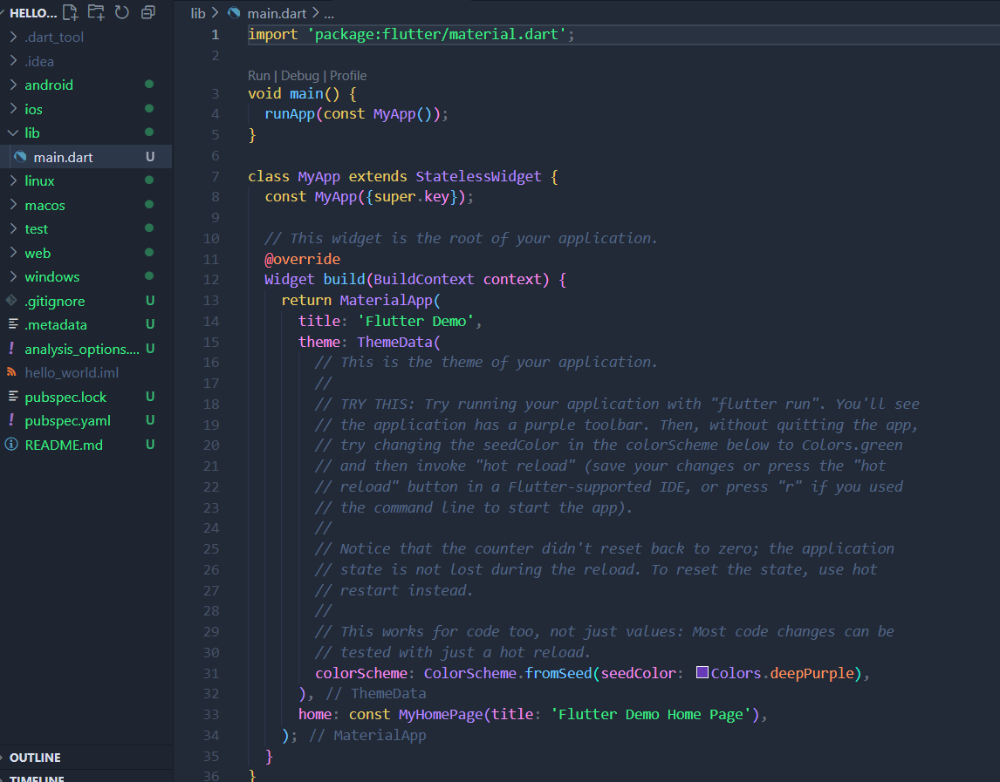

## Praktikum 2: Menghubungkan Perangkat Android atau Emulator

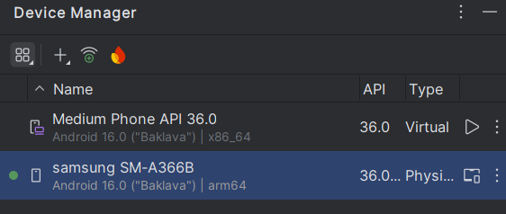

## Praktikum 3: Membuat Repository GitHub dan Laporan Praktikum

- Membuat Repositori
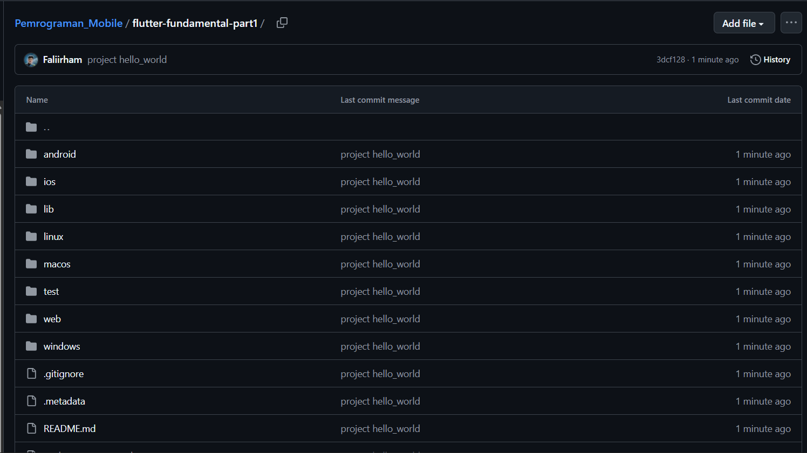

- Tampilan diChrome
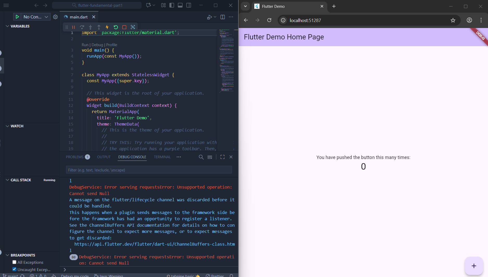

- A new Flutter Project
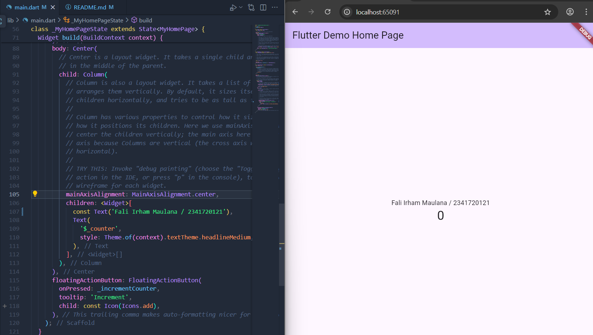

## Praktikum 4: Menerapkan Widget Dasar

### Langkah 1: Text Widget
- Kode di text_widget:

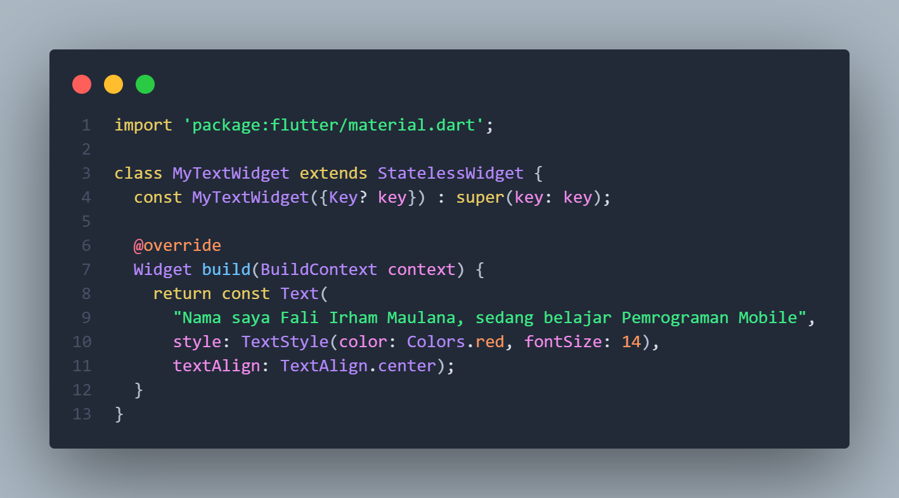

- Kode di main dart : 

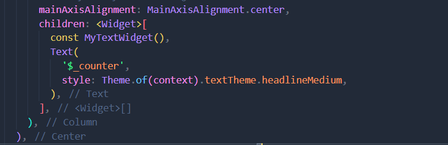

- Output :

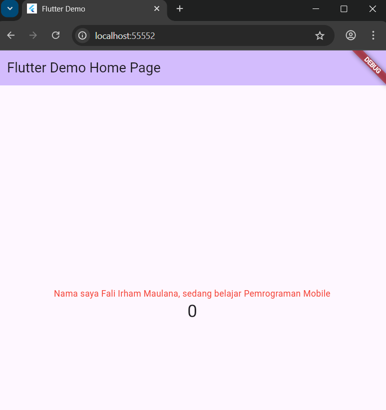

### Langkah 2: Image Widget

- Output : 

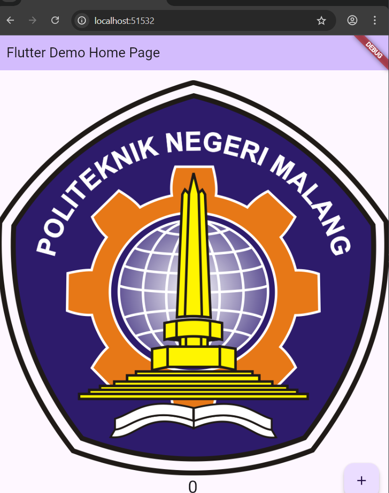

## Praktikum 5: Menerapkan Widget Material Design dan iOS Cupertino

### Langkah 1: Cupertino Button dan Loading Bar

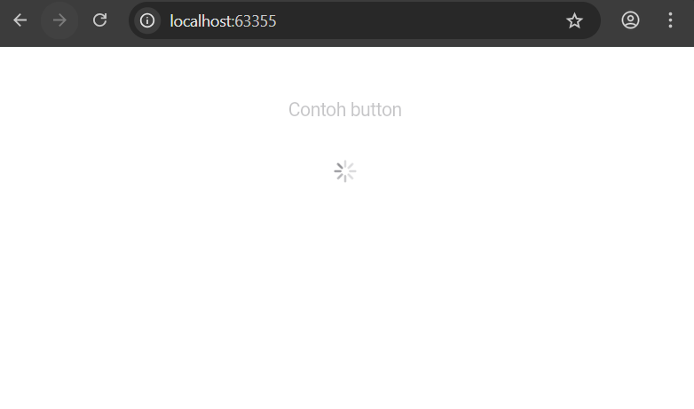

### Langkah 2: Floating Action Button (FAB)

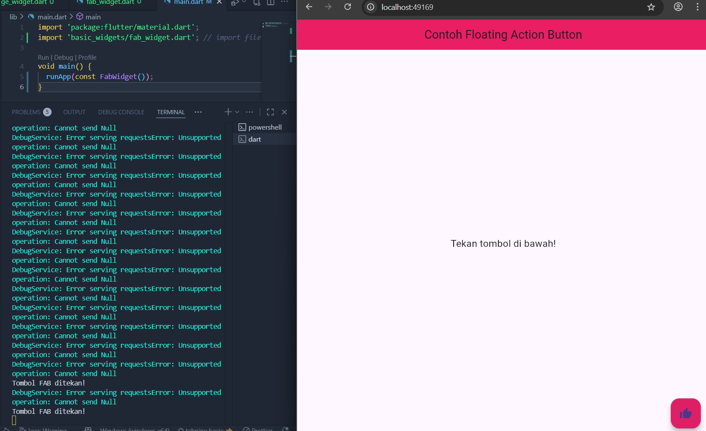

### Langkah 3: Scaffold Widget

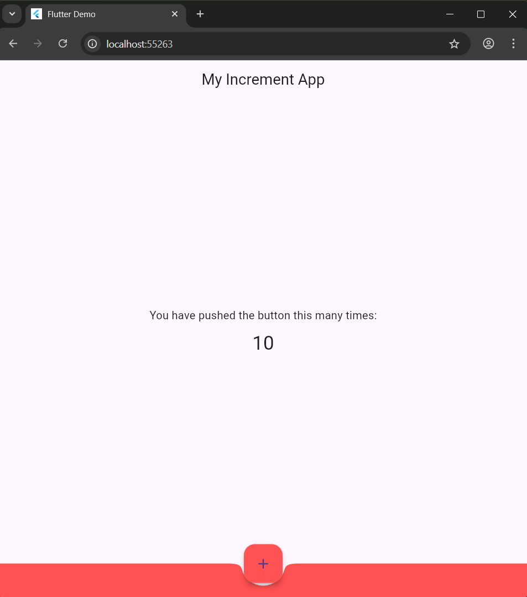

### Langkah 4: Dialog Widget

- Sebelum ditekan: 

- Setelah ditekan:

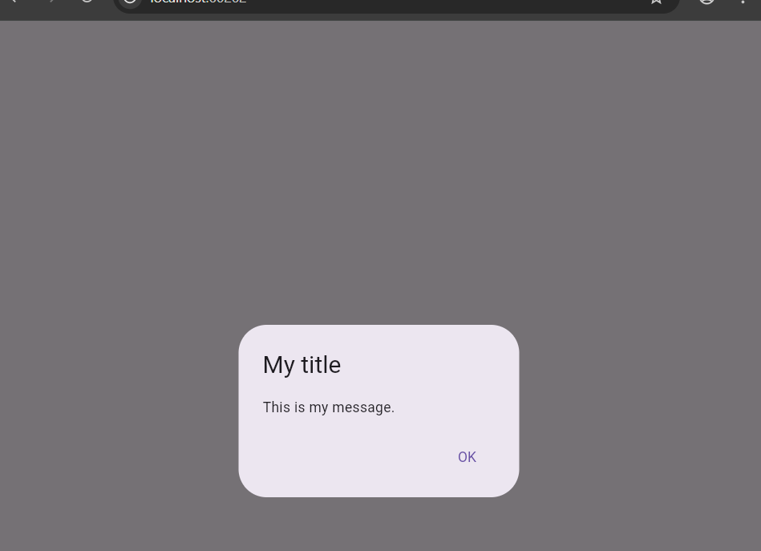

### Langkah 5: Input dan Selection Widget

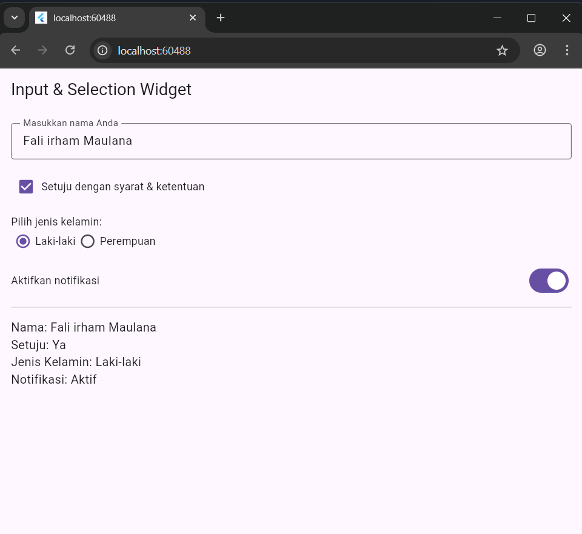

### Langkah 6: Date and Time Pickers

- Memilih Tanggal: 

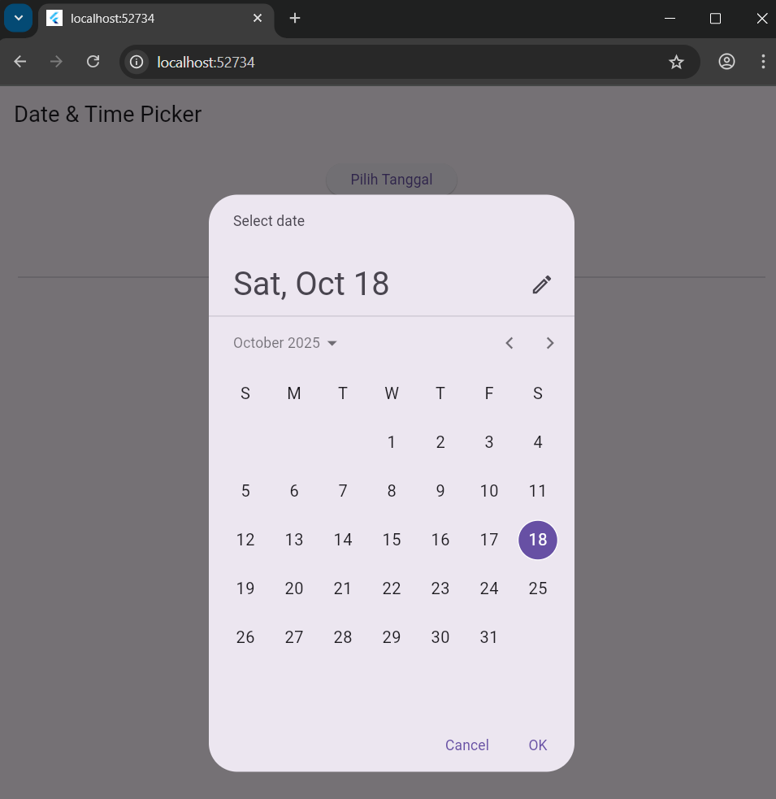

- Memilih Waktu:

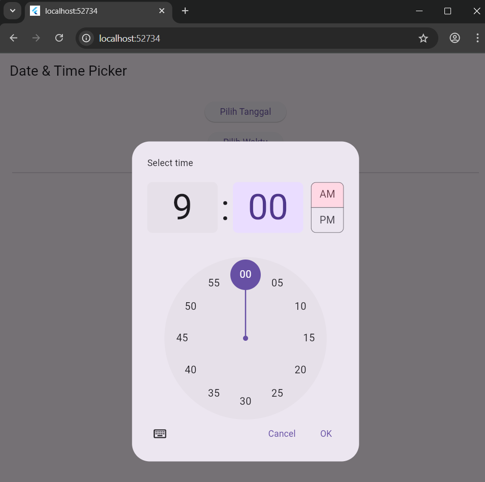