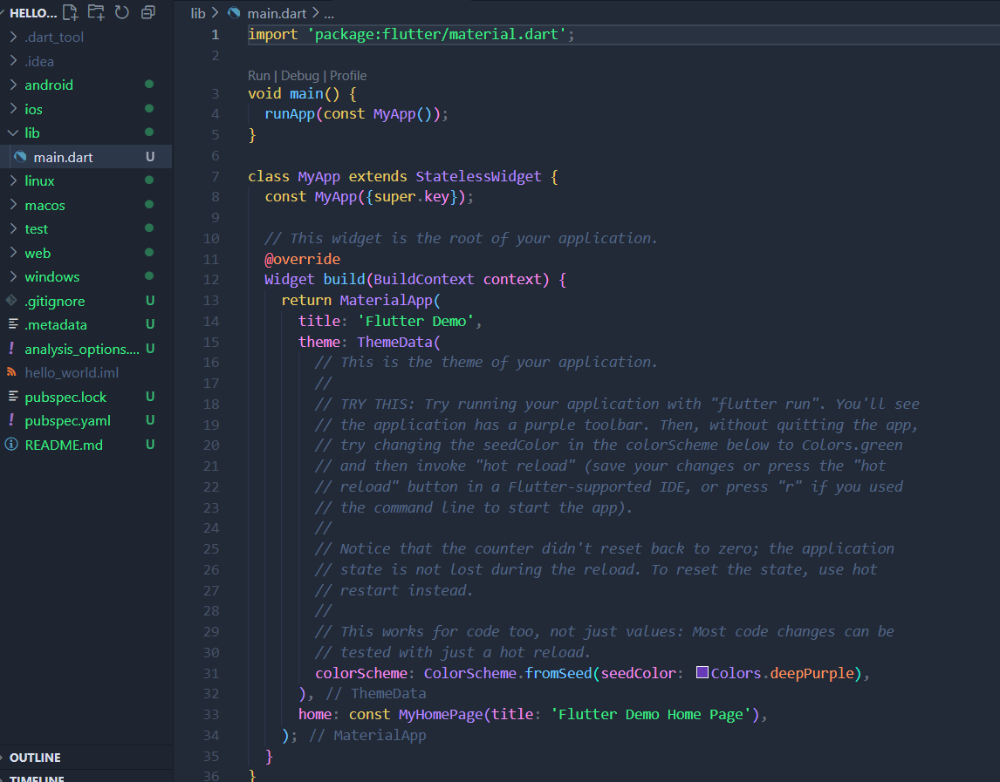

# Pemrograman Mobile - Pertemuan 5 Aplikasi Pertama dan Widget Dasar Flutter

**NIM : 2341720121**

**NAMA : FALI IRHAM MAULANA**

## Praktikum 1: Membuat Project Flutter Baru

## Praktikum 2: Menghubungkan Perangkat Android atau Emulator

## Praktikum 3: Membuat Repository GitHub dan Laporan Praktikum

