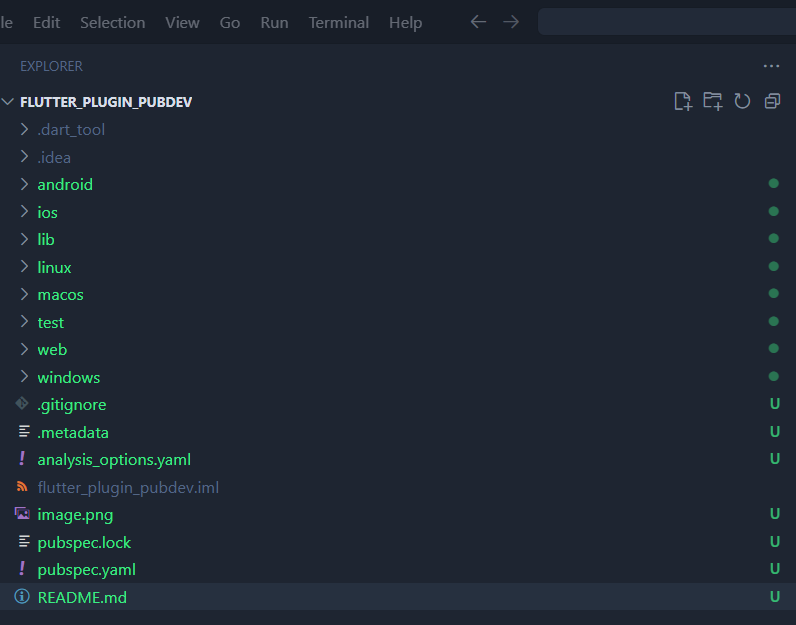
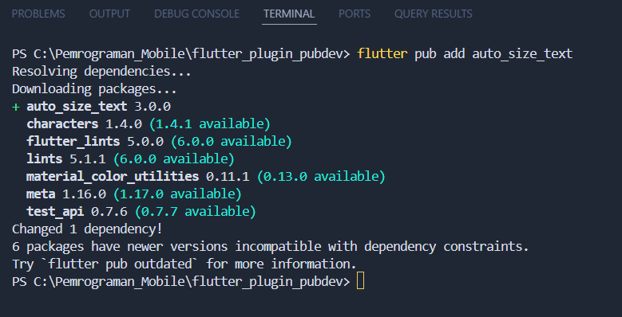
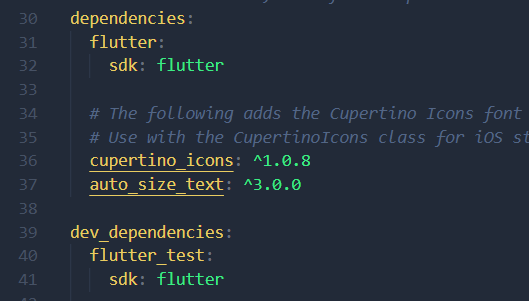
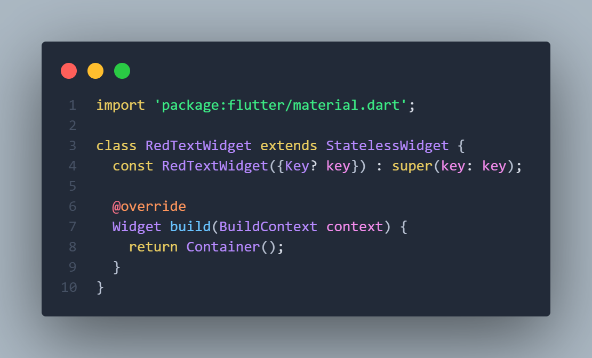
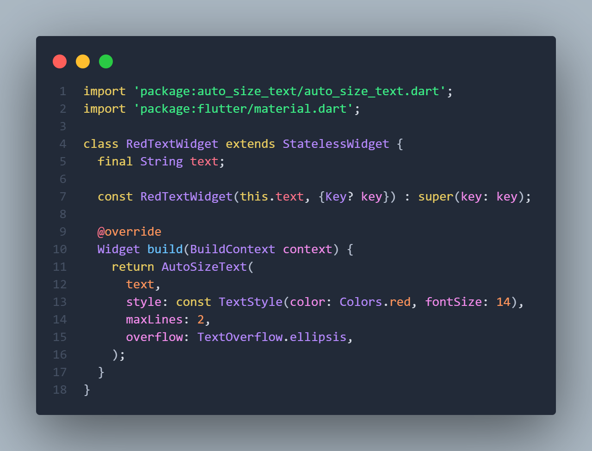
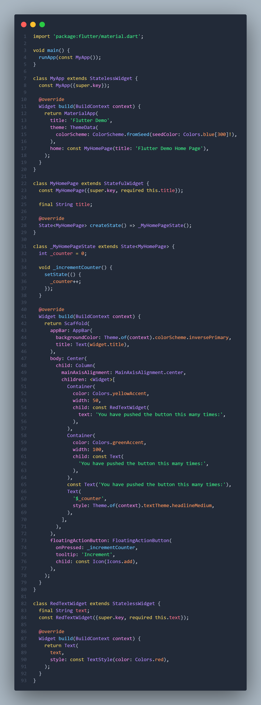
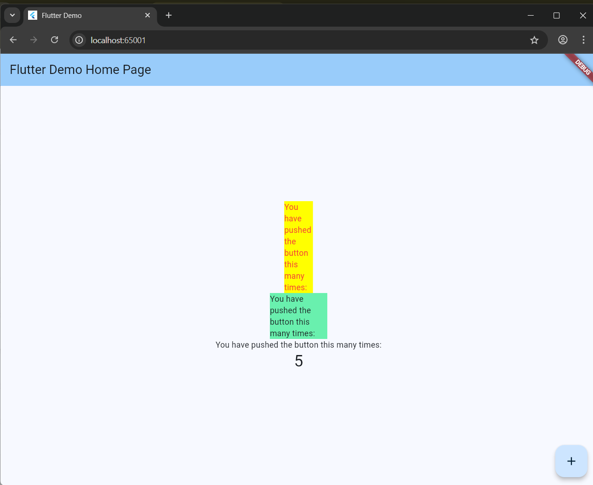

# Pemrograman Mobile - Pertemuan 7 

**NIM: 2341720121**

**NAMA: FALI IRHAM MAULANA**

## 7. Praktikum Menerapkan Plugin di Project Flutter

### Langkah 1: Buat Project Baru



### Langkah 2: Menambahkan Plugin

 - 

 - 

### Langkah 3: Buat file red_text_widget.dart



### Langkah 4 & Langkah 5



### Langkah 6: Tambakan widget di main.dart



### Output 



## 8. Tugas Praktikum

2. Langkah ini bertujuan untuk menambahkan dependensi plugin auto_size_text ke dalam proyek Flutter.
Plugin ini memungkinkan teks di dalam widget untuk menyesuaikan ukuran font-nya secara otomatis agar muat dalam batas lebar atau tinggi tertentu, tanpa menyebabkan overflow (teks terpotong).

   Setelah menjalankan perintah tersebut, nama dan versi plugin akan muncul pada bagian dependencies: di file pubspec.yaml.
Artinya plugin sudah berhasil ditambahkan dan bisa digunakan di dalam proyek Flutter.

3. Langkah ini dilakukan untuk memperbaiki error yang muncul di langkah sebelumnya (Langkah 4).
Error terjadi karena widget AutoSizeText membutuhkan teks yang akan ditampilkan, namun variabel text belum pernah didefinisikan di dalam kelas RedTextWidget.

   dengan menambahkan variabel:

   ``final String text``

   berarti widget ini memiliki field tetap (immutable) yang menyimpan teks yang akan ditampilkan.

   Kemudian konstruktor:

   ```const RedTextWidget({Key? key, required this.text}) : super(key: key);```


   berfungsi untuk menerima nilai teks dari luar saat widget dipanggil.

4. Pada langkah ini, terdapat dua widget yang ditambahkan ke dalam tampilan aplikasi.
Keduanya memiliki fungsi untuk menampilkan teks, tetapi dengan perbedaan penting pada cara tampilannya.

- ```RedTextWidget```	Menampilkan teks dengan warna merah dan ukuran font yang menyesuaikan secara otomatis menggunakan plugin AutoSizeText.	

   Teks akan mengecil secara otomatis agar tidak keluar dari batas Container.

- ```Text``` (bawaan Flutter)	Menampilkan teks biasa tanpa fitur penyesuaian ukuran otomatis.	Jika teks terlalu panjang dan ukuran kontainer kecil, teks dapat terpotong (overflow).

   Dengan demikian, langkah 6 bertujuan untuk menunjukkan perbandingan hasil antara penggunaan AutoSizeText dan Text biasa, agar mahasiswa memahami perbedaan perilaku keduanya dalam layout yang terbatas.

5. Berdasarkan dokumentasi resmi di pub.dev/packages/auto_size_text
, berikut penjelasan parameter yang digunakan dalam kode:

   ``AutoSizeText(
   text,
   style: const TextStyle(color: Colors.red, fontSize: 14),
   maxLines: 2,
   overflow: TextOverflow.ellipsis,
   );``


   | Parameter | Jenis | Penjelasan |
   |-----------|-------|------------|
   | `text` | `String` | Teks yang akan ditampilkan dan disesuaikan ukurannya. Nilainya diambil dari variabel `text` yang dikirim melalui konstruktor. |
   | `style` | `TextStyle` | Menentukan gaya tampilan teks seperti warna (`Colors.red`), ukuran font (`14`), ketebalan, dan lain-lain. |
   | `maxLines` | `int` | Menentukan jumlah maksimum baris yang boleh digunakan oleh teks. Jika teks melebihi batas ini, ukuran teks akan diperkecil agar tetap muat. |
   | `overflow` | `TextOverflow` | Menentukan bagaimana tampilan teks jika melebihi batas area tampilan. Nilai `TextOverflow.ellipsis` akan memotong teks dan menambahkan tanda tiga titik (...) di akhir. |


