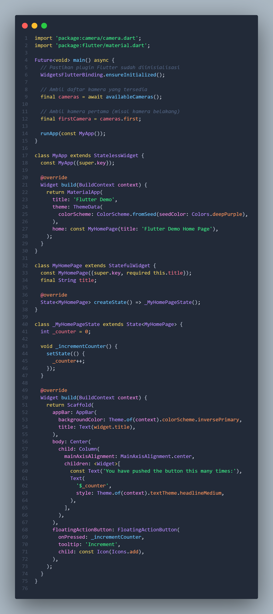

# Pemrograman Mobile - Pertemuan 9 

**NIM: 2341720121**

**NAMA: FALI IRHAM MAULANA**

## Praktikum 1: Mengambil Foto dengan Kamera di Flutter

### Langkah 1: Buat Project Baru

### Langkah 2: Tambah dependensi yang diperlukan

### Langkah 3: Ambil Sensor Kamera dari device

### Langkah 4: Buat dan inisialisasi CameraController

### Langkah 5: Gunakan CameraPreview untuk menampilkan preview foto
