# Pemrograman Mobile - Pertemuan 10

**NIM: 2341720121**

**NAMA: FALI IRHAM MAULANA**

---

## **Praktikum 1: Dasar State dengan Model-View**

### Langkah 1 - 9 : 

 - **models :**

 1. *task.dart :* 

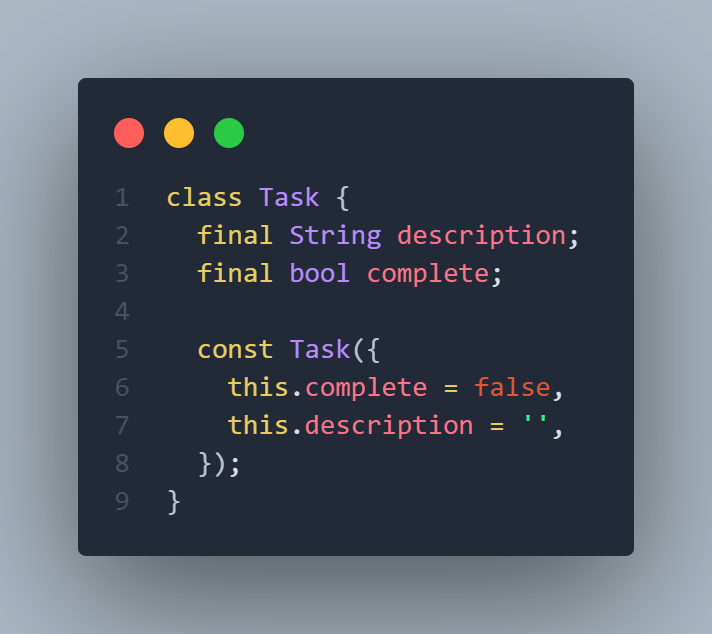

 2. *plan.dart :*

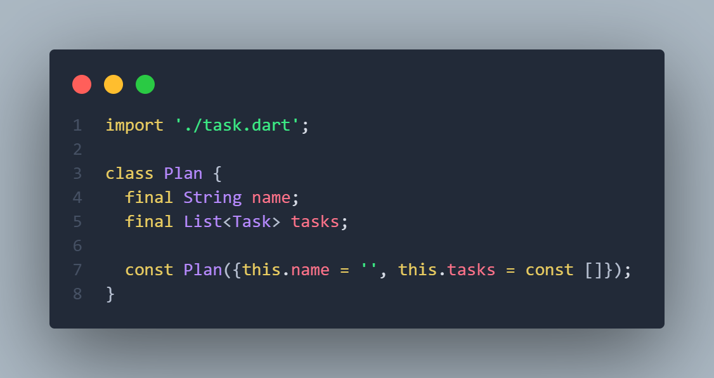

 3. *data_layer.dart :*

 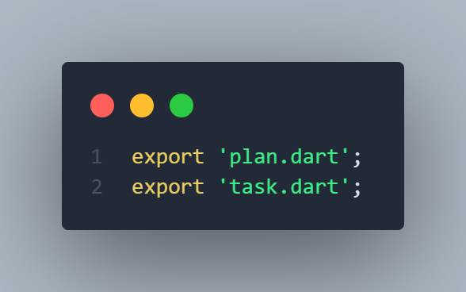

- **Main.dart :**

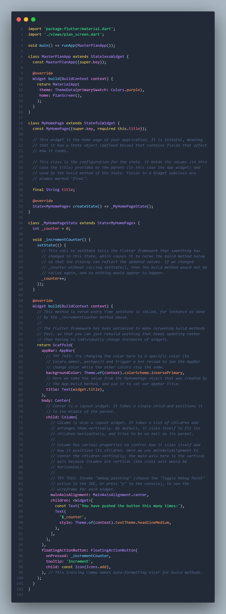

- **views :**

1. *plan_screen.dart :*

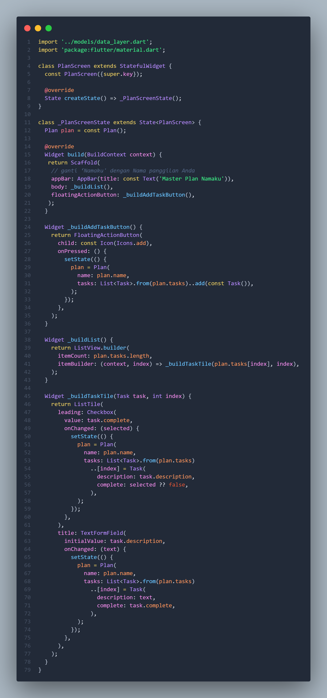

### Hasil Tampilan : 

### Langkah 10 - 13 : 

- **plan_screen.dart :**

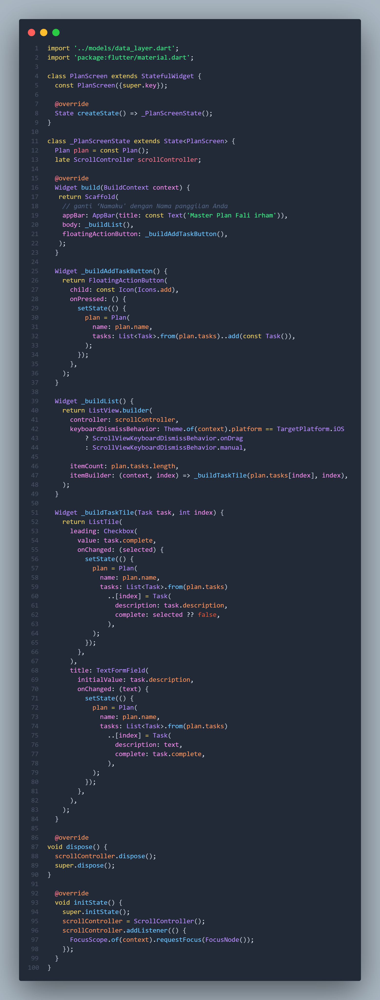

### Hasil Tampilan : 

## **Tugas Praktikum 1: Dasar State dengan Model-View**

2. **Jelaskan maksud dari langkah 4 pada praktikum tersebut! Mengapa dilakukan demikian?**

    **Jawaban :** Langkah 4 pada praktikum tersebut bertujuan untuk membuat satu berkas pusat yang berfungsi sebagai entry point bagi semua model yang ada di folder models. Dengan membuat file data_layer.dart yang hanya berisi perintah export terhadap plan.dart dan task.dart, Anda dapat mengimpor seluruh model cukup dari satu file saja, tanpa harus mengimpor setiap model secara terpisah. Cara ini menjadikan struktur proyek lebih rapi dan mudah dikelola, terutama ketika jumlah model semakin banyak seiring perkembangan aplikasi. Selain itu, pendekatan ini membantu menghindari penulisan impor yang panjang dan berulang di berbagai file lain, sehingga kode menjadi lebih bersih, terorganisir, dan lebih mudah dipelihara.

3. **Mengapa perlu variabel plan di langkah 6 pada praktikum tersebut? Mengapa dibuat konstanta ?**

    **Jawaban :** Variabel plan pada langkah 6 diperlukan karena layar PlanScreen harus memiliki sebuah objek Plan yang menjadi sumber data utama untuk menampilkan daftar tugas. Objek inilah yang akan menampung data seperti daftar task, jumlah task selesai, dan berbagai perubahan yang dilakukan pengguna. Tanpa variabel ini, layar tidak memiliki tempat untuk menyimpan dan mengelola state data yang terkait dengan rencana atau daftar tugas yang sedang dibuat. Dengan kata lain, variabel plan menjadi model yang diikat dengan tampilan sehingga setiap perubahan data dapat ditampilkan kembali melalui mekanisme setState.

    Objek plan dibuat sebagai konstanta karena pada saat pertama kali dibuat, objek tersebut tidak memiliki data yang berubah—artinya sifat awalnya tidak membutuhkan modifikasi langsung pada objeknya. Yang berubah nanti bukan objek Plan itu sendiri, tetapi daftar tugas (tasks) yang ada di dalamnya, yang biasanya dikelola dengan menyalin dan menghasilkan objek baru karena model dibuat immutable. Dengan menjadikannya const, Flutter dapat mengoptimalkan performa karena objek tersebut dianggap tidak berubah, sehingga tidak perlu dialokasikan ulang setiap kali widget dibangun ulang. Pendekatan ini membantu menjaga efisiensi, konsistensi, dan integritas data selama aplikasi berjalan.

4. **Lakukan capture hasil dari Langkah 9 berupa GIF, kemudian jelaskan apa yang telah Anda buat!**

    

    **Penjelasan :** Pada GIF tersebut terlihat bahwa aplikasi Master Plan sudah dapat menampilkan halaman utama dengan judul “Master Plan Fali Irham”, lalu sebuah FloatingActionButton berbentuk tombol tambah (“+”) berada di bagian kanan bawah layar. Ketika tombol tersebut ditekan, aplikasi menambahkan satu item tugas baru pada daftar, kemudian item tersebut dapat diedit. Anda bisa mengetik deskripsi tugas langsung pada TextFormField dan mencentang Checkbox untuk menandai apakah tugas tersebut sudah selesai atau belum. Setiap perubahan yang dibuat akan langsung memperbarui tampilan karena data plan diubah melalui mekanisme setState, sesuai konsep stateful widget dan immutable model yang digunakan dalam praktikum ini. Hasil akhirnya adalah daftar tugas yang bersifat dinamis dan responsif, sesuai dengan tujuan pembuatan widget _buildTaskTile pada langkah 9.

5. **Apa kegunaan method pada Langkah 11 dan 13 dalam lifecyle state ?**

    **Jawaban :** Pada langkah 11, method initState() digunakan untuk melakukan inisialisasi pertama kali ketika state dibuat. Di dalamnya Anda membuat sebuah ScrollController lalu menambahkan listener yang akan dijalankan setiap kali pengguna melakukan scroll. Listener tersebut memiliki fungsi untuk menutup keyboard secara otomatis saat layar digulir (karena fokus TextFormField dilepas). Method ini sangat tepat ditempatkan di dalam initState() karena listener hanya perlu dipasang satu kali saja sebelum widget ditampilkan, dan belum memiliki konteks build yang kompleks.

    Sedangkan langkah 13, yaitu method dispose(), dipanggil ketika widget sudah tidak digunakan lagi atau dihapus dari tree. Pada tahap ini, semua resource yang terikat dengan widget—seperti controller, listener, stream, dan animasi—harus dilepas agar tidak terjadi kebocoran memori. Pada contoh ini, scrollController.dispose() dipanggil untuk memastikan bahwa controller dan semua listener yang menempel dibersihkan dengan benar. Tanpa memanggil dispose(), aplikasi bisa mengalami penurunan performa atau perilaku yang tidak diinginkan karena controller tetap hidup meskipun widgetnya sudah hilang.

    Secara keseluruhan, langkah 11 dan 13 memastikan bahwa widget mengelola sumber daya secara benar sepanjang siklus hidupnya, dari inisialisasi hingga penghancuran, sehingga aplikasi tetap efisien dan bebas dari memory leak.

## **Praktikum 2: Mengelola Data Layer dengan InheritedWidget dan InheritedNotifier**

### Langkah 1 - 9 : 

- **plan_provider.dart :**

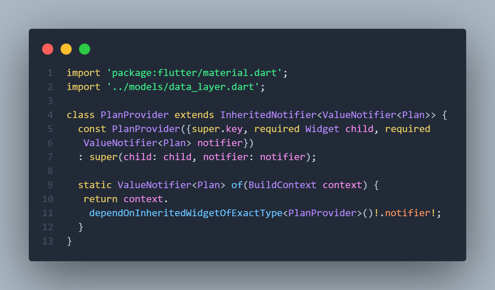

- **main.dart :**

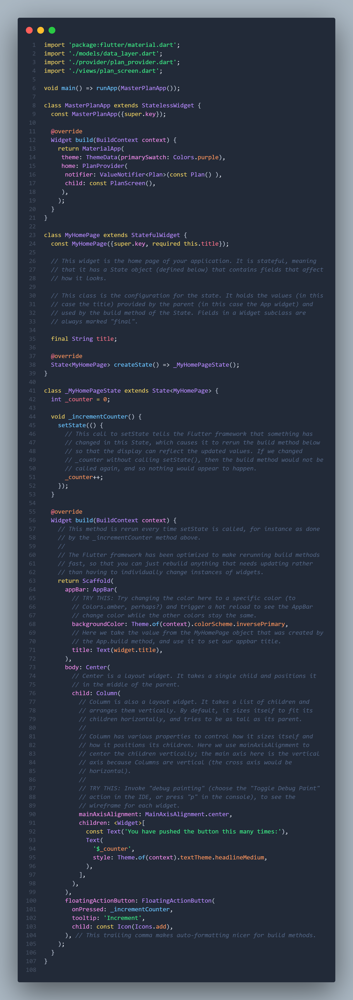

- **plan.dart :**

- **plan_screen.dart :**

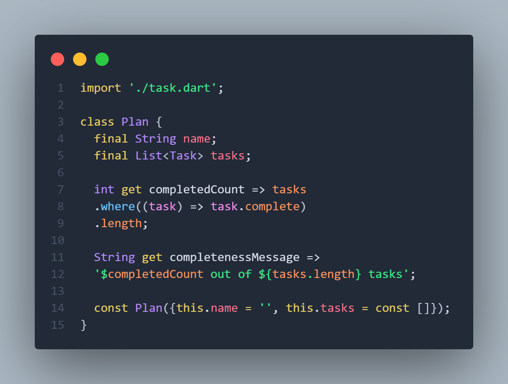

## **Tugas Praktikum 2: InheritedWidget**

2. **Jelaskan mana yang dimaksud InheritedWidget pada langkah 1 tersebut! Mengapa yang digunakan InheritedNotifier?**

    **Jawaban :** InheritedWidget yang dimaksud pada langkah tersebut sebenarnya adalah kelas PlanProvider itu sendiri, karena meskipun tidak secara langsung mewarisi InheritedWidget, kelas tersebut mewarisi seluruh perilaku dan mekanismenya melalui InheritedNotifier, yang merupakan subclass dari InheritedWidget. Dengan demikian, PlanProvider berfungsi sebagai jembatan yang memungkinkan widget lain di bawahnya mengakses dan bereaksi terhadap perubahan data secara otomatis. Penggunaan InheritedNotifier dipilih karena menawarkan cara yang lebih sederhana dan efisien untuk memantau perubahan nilai pada ValueNotifier<Plan>.

3. **Jelaskan maksud dari method di langkah 3 pada praktikum tersebut! Mengapa dilakukan demikian?**

    **Jawaban :** Method pada langkah 3 tersebut berfungsi untuk menyediakan informasi ringkas mengenai status penyelesaian tugas di dalam sebuah objek Plan. Getter completedCount menghitung berapa banyak task yang telah ditandai selesai dengan memfilter daftar tugas berdasarkan nilai task.complete yang bernilai true. Dengan cara ini, model tidak hanya menyimpan data mentah berupa daftar tugas, tetapi juga menyediakan perhitungan yang relevan dan sering dibutuhkan oleh UI. Getter kedua, yaitu completenessMessage, menyusun kalimat sederhana yang menunjukkan jumlah tugas yang sudah selesai dibandingkan dengan total tugas yang ada.

4. **Lakukan capture hasil dari Langkah 9 berupa GIF, kemudian jelaskan apa yang telah Anda buat!**

    

    **Penjelasan :** pada langkah tersebut sebenarnya tidak mengubah tampilan aplikasi sama sekali, karena UI tetap menampilkan informasi yang sama seperti sebelumnya. Perbedaannya justru ada pada cara pengelolaan logikanya. Perhitungan jumlah tugas yang selesai dan pembuatan pesan tentang progres dipindahkan ke dalam model, sehingga widget tidak lagi menangani proses tersebut secara langsung. Dengan cara ini, struktur kode menjadi lebih rapi dan terpisah antara bagian yang mengatur data dan bagian yang menampilkan data. Model menyediakan informasi yang sudah siap pakai, sementara UI hanya bertugas menampilkan hasilnya. Pendekatan ini membuat program lebih mudah dipahami, dirawat, dan dikembangkan tanpa mempengaruhi tampilan akhirnya.

## **Praktikum 3: Membuat State di Multiple Screens**

### Langkah 1 - 14 : 

- **plan_provider.dart :**

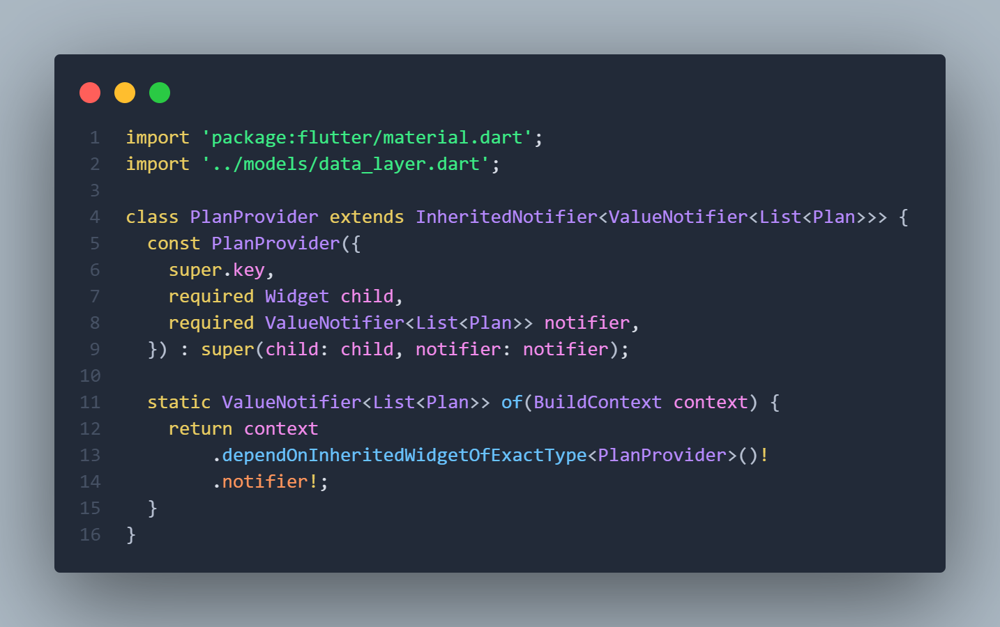

- **main.dart :**

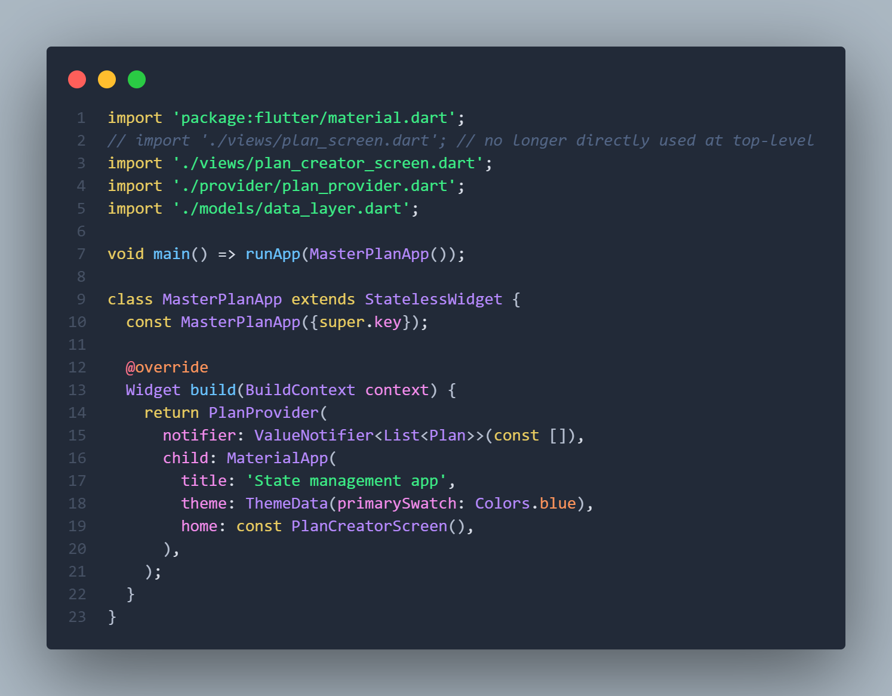

- **plan_screen.dart :**

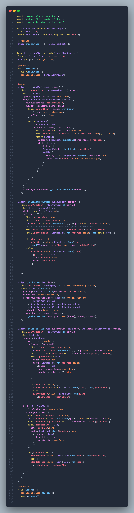

- **plan_creator_screen.dart :**

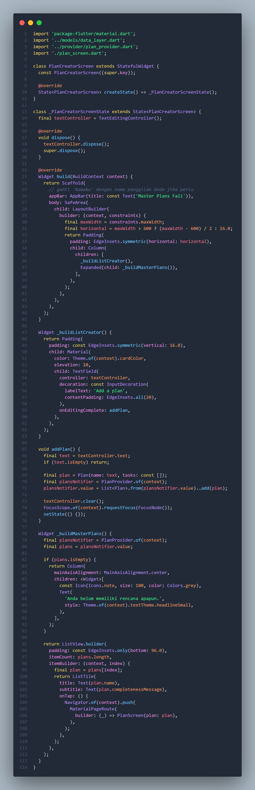

## **Tugas Praktikum 3: State di Multiple Screens**

2. **Berdasarkan Praktikum 3 yang telah Anda lakukan, jelaskan maksud dari gambar diagram berikut ini!**

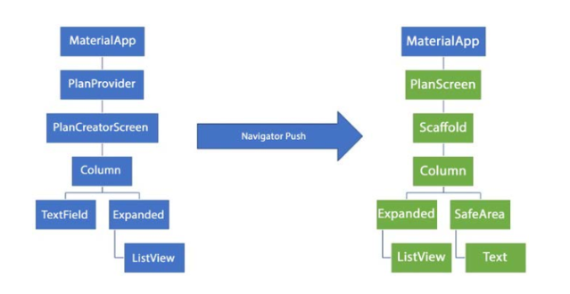 

**Jawaban :** Diagram tersebut menggambarkan alur perpindahan layar dan perubahan struktur widget ketika aplikasi Flutter melakukan navigasi menggunakan Navigator.push. Pada bagian kiri terlihat struktur awal aplikasi, di mana MaterialApp membungkus PlanProvider dan kemudian menampilkan PlanCreatorScreen yang di dalamnya terdapat susunan widget seperti Column, TextField, Expanded, dan ListView. Struktur ini menunjukkan bahwa layar pertama digunakan untuk membuat atau mengelola input data melalui tampilan formulir dan daftar. Ketika pengguna menekan tombol atau melakukan aksi tertentu yang memicu Navigator.push, aplikasi akan berpindah ke layar baru seperti yang ditunjukkan pada bagian kanan diagram. Di layar baru tersebut, susunan widget berubah menjadi PlanScreen yang berada di dalam Scaffold sehingga menyediakan struktur dasar seperti app bar, body, dan area aman. Isi body-nya berupa Column yang memiliki widget Expanded berisi ListView untuk menampilkan daftar, serta SafeArea yang berisi Text. Perubahan susunan widget ini menunjukkan bahwa layar kedua ditujukan untuk menampilkan hasil atau daftar rencana yang telah dibuat, dengan tampilan yang lebih terstruktur dan dilindungi oleh SafeArea agar konten tidak tertutup notch atau elemen sistem. Diagram ini pada dasarnya menjelaskan bagaimana navigasi memindahkan pengguna dari layar input menuju layar tampilan data sambil memperlihatkan perbedaan hierarki widget sebelum dan sesudah perpindahan layar.

3. **Lakukan capture hasil dari Langkah 14 berupa GIF, kemudian jelaskan apa yang telah Anda buat!**

    **Hasil dari Percobaan :**

    
