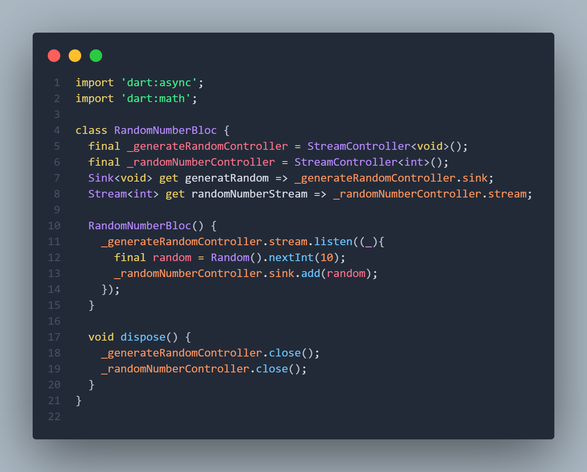
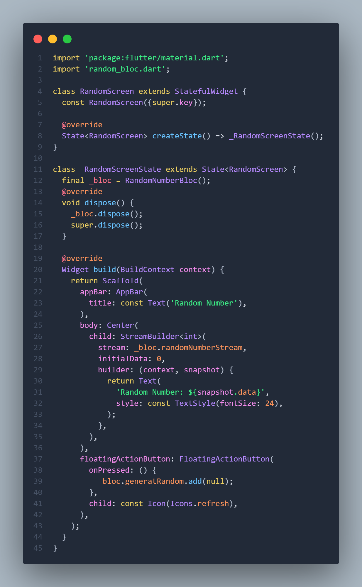
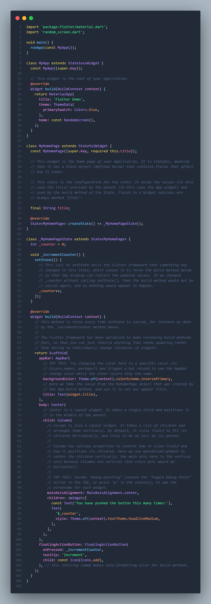

# Pemrograman Mobile - Pertemuan 12

**NIM: 2341720121**

**NAMA: FALI IRHAM MAULANA**

---

## **Praktikum 7: BLoC Pattern**

### Langkah 1 - 13 

- **random_bloc.dart :**



- **random_screen.dart :**



- **main.dart :**




```
Soal 13
- Jelaskan maksud praktikum ini ! Dimanakah letak konsep pola BLoC-nya ?
- Capture hasil praktikum Anda berupa GIF dan lampirkan di README.
- Lalu lakukan commit dengan pesan "W12: Jawaban Soal 13".
```

**Penjelasan :** Praktikum ini menunjukkan bagaimana alur data dan event dipisahkan dari tampilan menggunakan pola BLoC, sehingga logika bisnis tidak bercampur dengan UI. Pada kelas RandomNumberBloc, sebuah stream digunakan untuk menerima event ketika tombol ditekan melalui _generateRandomController, lalu event itu diproses untuk menghasilkan angka acak dan dikirim kembali melalui _randomNumberController. Dengan mekanisme ini, UI tidak perlu tahu bagaimana angka dihasilkan; UI hanya mendengarkan perubahan data melalui randomNumberStream. Pada widget RandomScreen, StreamBuilder menjadi jembatan antara stream yang dikirimkan BLoC dan tampilan, sehingga setiap angka baru yang masuk otomatis memperbarui teks di layar tanpa logika pemrosesan di dalam UI. Letak konsep BLoC ada pada pemisahan antara input event berupa _generateRandomController.sink, pemrosesan yang dilakukan oleh konstruktor RandomNumberBloc, dan output berupa randomNumberStream yang menjadi sumber data untuk UI.

