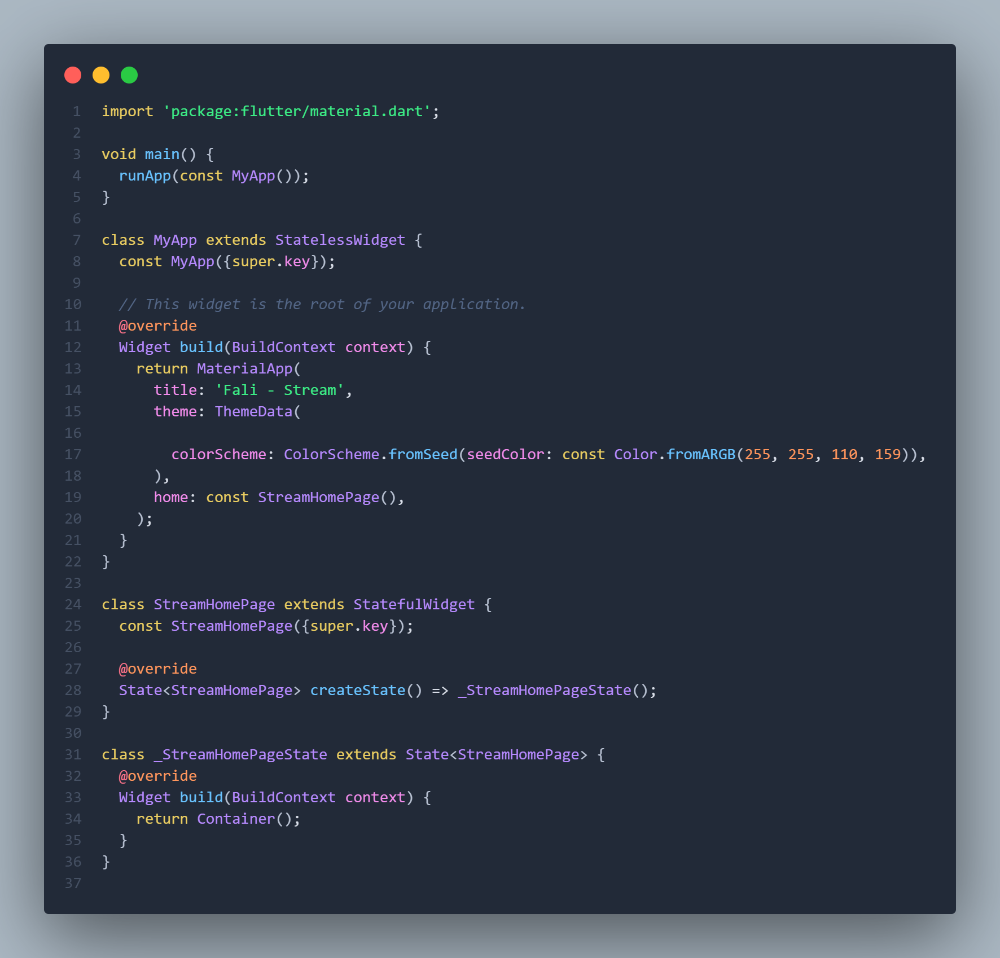
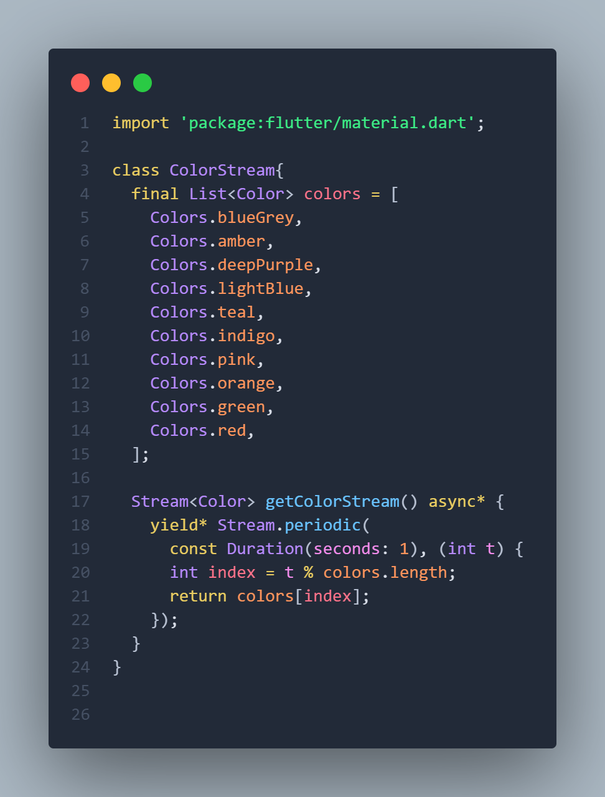
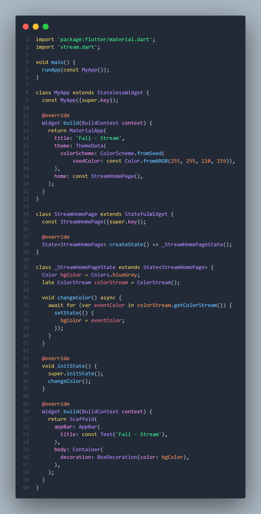
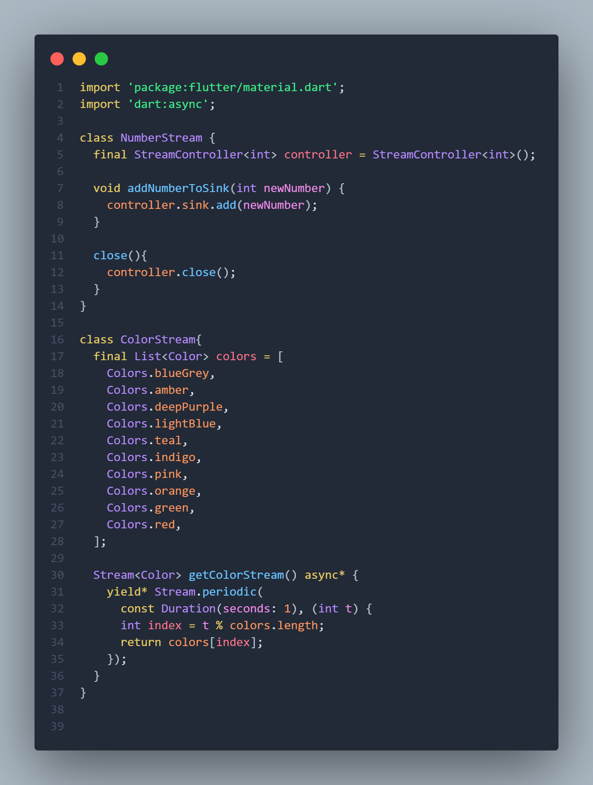
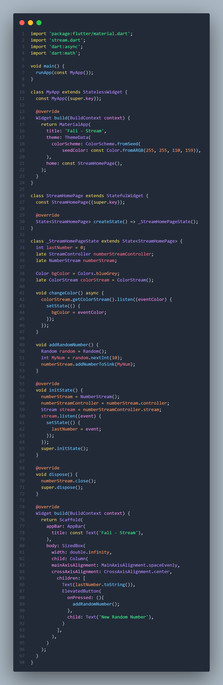
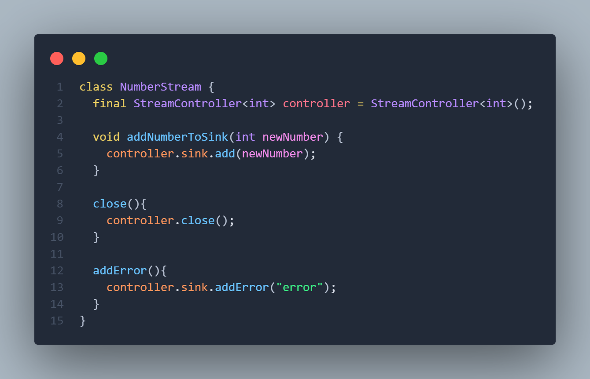
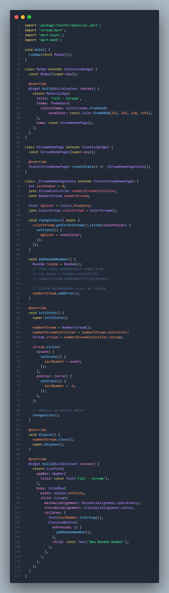
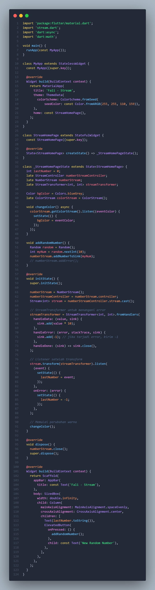
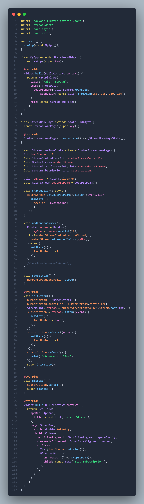
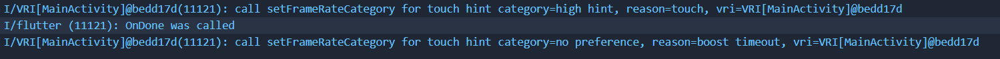

# Pemrograman Mobile - Pertemuan 12

**NIM: 2341720121**

**NAMA: FALI IRHAM MAULANA**

---

## **Praktikum 1: Dart Streams**

### Langkah 1 - 6 

- **main.dart :**



- **stream.dart :**



```
Soal 3
- Jelaskan fungsi keyword yield* pada kode tersebut!
- Apa maksud isi perintah kode tersebut?
- Lakukan commit hasil jawaban Soal 3 dengan pesan "W12: Jawaban Soal 3"
```

**Penjelasan :** Kode tersebut mendefinisikan sebuah fungsi getColorStream() yang menghasilkan stream warna secara periodik menggunakan Stream.periodic. Keyword yield* pada kode ini berfungsi untuk menyalurkan semua nilai yang dihasilkan oleh stream lain—dalam hal ini Stream.periodic—ke dalam stream yang sedang dibuat, sehingga setiap nilai dari Stream.periodic akan diteruskan ke stream getColorStream. Stream.periodic sendiri membuat sebuah stream yang memancarkan nilai secara berkala, di sini setiap satu detik. Fungsi callback (int t) menghitung indeks warna berdasarkan sisa bagi dari t dengan panjang daftar warna, sehingga warna yang dikembalikan dari list colors akan berulang secara melingkar. Dengan demikian, fungsi ini menghasilkan aliran warna yang berganti setiap detik sesuai urutan daftar colors dan terus berulang tanpa henti.

### Langkah 7 - 12 

- **main.dart**



```
Soal 4
- Capture hasil praktikum Anda berupa GIF dan lampirkan di README.
- Lakukan commit hasil jawaban Soal 4 dengan pesan "W12: Jawaban Soal 4"
```


### Langkah 13: Ganti isi method changeColor()

- **main.dart**

```
Soal 5
Jelaskan perbedaan menggunakan listen dan await for (langkah 9) !
Lakukan commit hasil jawaban Soal 5 dengan pesan "W12: Jawaban Soal 5"
```

Perbedaan antara listen dan await for pada stream terletak pada cara mereka menangani event yang dipancarkan oleh stream. Pada await for, setiap event stream diproses secara asinkron dalam sebuah loop, sehingga eksekusi kode bersifat sekuensial dan menunggu setiap event sebelum melanjutkan ke langkah berikutnya. Hal ini membuat aliran data lebih mudah diikuti karena terlihat seperti loop biasa, tetapi kode setelah await for tidak akan dijalankan sampai stream selesai atau dihentikan. Sementara itu, listen mendaftarkan sebuah callback yang dipanggil setiap kali stream memancarkan event, dengan eksekusi bersifat non-blok, sehingga kode setelah listen langsung dijalankan tanpa menunggu event. listen juga memberikan fleksibilitas lebih, misalnya untuk membatalkan langganan stream kapan saja. Secara singkat, await for lebih cocok untuk menangani event secara linear dan berurutan, sedangkan listen lebih cocok untuk menangani event secara asynchronous tanpa menghentikan eksekusi kode lain.

## **Praktikum 2: Stream controllers dan sinks**

### Langkah 1 - 12

- **stream.dart :**



- **main.dart :**


```
Soal 6
- Jelaskan maksud kode langkah 8 dan 10 tersebut!
- Capture hasil praktikum Anda berupa GIF dan lampirkan di README.
- Lalu lakukan commit dengan pesan "W12: Jawaban Soal 6"
```

**Penjelasana :** Pada langkah 8, metode addRandomNumber() membuat sebuah angka acak antara 0 sampai 9 menggunakan Random().nextInt(10) lalu mengirim angka tersebut ke sink dari stream numberStream melalui addNumberToSink(). Ini berarti setiap kali fungsi ini dipanggil (misalnya saat tombol ditekan), sebuah event baru berupa angka acak dikirim ke stream, yang nantinya akan diterima oleh listener untuk memperbarui UI.

Sedangkan pada langkah 10, di initState(), kode membuat instance NumberStream dan mengambil controller-nya. Lalu, melalui stream.listen(...), setiap event yang dikirim ke stream dipantau, dan ketika ada event baru, fungsi setState() dipanggil untuk memperbarui variabel lastNumber dengan nilai terbaru dari stream. Dengan begitu, widget yang menampilkan angka (Text(lastNumber.toString())) akan otomatis diperbarui setiap kali angka baru ditambahkan ke stream. Secara keseluruhan, langkah 8 bertugas mengirim angka baru ke stream, sedangkan langkah 10 bertugas mendengarkan stream dan memperbarui UI saat ada angka baru.


### Langkah 13 - 15 

- **stream.dart :**



- **main.dart :**



```
Soal 7
- Jelaskan maksud kode langkah 13 sampai 15 tersebut!
- Kembalikan kode seperti semula pada Langkah 15, comment addError() agar Anda dapat melanjutkan ke praktikum 3 berikutnya.
- Lalu lakukan commit dengan pesan "W12: Jawaban Soal 7".
```

**Penjelasan :** Kode pada langkah 13 sampai 15 berkaitan dengan bagaimana angka baru atau error dikirim ke stream dan diterima oleh aplikasi untuk memperbarui UI. Pada langkah 13, fungsi addRandomNumber() digunakan untuk menambahkan event baru ke dalam stream. Dalam kode ini, fungsi memanggil numberStream.addError(), yang artinya setiap kali tombol ditekan, sebuah error dikirim ke stream alih-alih angka acak. Fungsi ini sebelumnya juga bisa digunakan untuk menambahkan angka acak ke stream menggunakan addNumberToSink(), tetapi saat ini bagian itu dikomentari.

Pada langkah 14, di initState(), stream diinisialisasi dengan membuat instance NumberStream dan mengambil controller-nya. Stream tersebut kemudian didengarkan menggunakan stream.listen(...), sehingga setiap event yang diterima—baik angka maupun error—akan diproses. Ketika event normal diterima, variabel lastNumber diperbarui dengan angka tersebut, sedangkan jika terjadi error, variabel lastNumber diatur menjadi -1.

Langkah 15 berada pada build(), di mana widget menampilkan nilai lastNumber pada Text dan menyediakan ElevatedButton untuk memicu fungsi addRandomNumber(). Dengan demikian, UI akan selalu menampilkan angka terakhir dari stream, atau -1 jika terjadi error, dan pengguna dapat memicu event baru melalui tombol. Secara keseluruhan, ketiga langkah ini menunjukkan alur lengkap: mengirim data ke stream, mendengarkan stream, dan memperbarui UI secara real-time.

## **Praktikum 3: Injeksi data ke streams**

### Langkah 1 - 4 

- **main.dart :**



```
Soal 8
- Jelaskan maksud kode langkah 1-3 tersebut!
- Capture hasil praktikum Anda berupa GIF dan lampirkan di README.
Lalu lakukan commit dengan pesan "W12: Jawaban Soal 8".
```

**Penjelasan :** Pada langkah 1–3 bekerja untuk menyiapkan sebuah alur stream yang datanya akan diolah terlebih dahulu sebelum ditampilkan ke UI. Pada langkah pertama, sebuah variabel bernama transformer ditambahkan ke dalam kelas _StreamHomePageState untuk menampung objek StreamTransformer yang nantinya berfungsi memodifikasi data yang lewat di dalam stream. Pada langkah kedua, variabel tersebut diinisialisasi di dalam initState menggunakan StreamTransformer.fromHandlers, yaitu mekanisme yang memungkinkan setiap data yang masuk ke stream diolah terlebih dahulu. Di bagian ini, setiap data yang diterima akan dikalikan sepuluh sebelum diteruskan, lalu jika terjadi error, transformer akan mengirim nilai -1, dan ketika stream selesai, sink akan ditutup. Pada langkah ketiga, stream yang sudah ada dihubungkan dengan transformer menggunakan stream.transform(transformer) lalu didengarkan dengan listen. Setiap data hasil transformasi kemudian disimpan ke variabel lastNumber menggunakan setState agar UI memperbarui tampilan sesuai nilai terbaru, dan jika terjadi error, nilai -1 ditampilkan sebagai tanda kesalahan. Dengan demikian, ketiga langkah ini membentuk alur lengkap mulai dari menyiapkan transformer, mengatur cara data diproses, hingga menerapkannya ke stream untuk ditampilkan ke antarmuka aplikasi.


## **Praktikum 4: Subscribe ke stream events**

### Langkah 1 - 10

- **main.dart :**



```
Soal 9
- Jelaskan maksud kode langkah 2, 6 dan 8 tersebut!
- Capture hasil praktikum Anda berupa GIF dan lampirkan di README.
- Lalu lakukan commit dengan pesan "W12: Jawaban Soal 9".
```

**Penjelasan :** Pada langkah kedua, kode tersebut membuat sebuah stream dari numberStreamController dan memasang listener melalui subscription untuk memantau setiap data baru yang masuk. Setiap nilai yang diterima dari stream langsung digunakan untuk memperbarui variabel lastNumber melalui setState, sehingga tampilan UI berubah sesuai angka terbaru. Pada langkah keenam, metode dispose() dipanggil ketika widget dihapus dari tree, dan di dalamnya listener stream dibatalkan menggunakan subscription.cancel(). Tindakan ini diperlukan agar tidak ada proses yang tetap berjalan di background setelah halaman tidak digunakan lagi, sehingga mencegah memory leak atau error karena pembaruan UI yang mencoba berjalan padahal widget sudah tidak aktif. Pada langkah kedelapan, fungsi addRandomNumber() bertugas menghasilkan angka acak antara 0 sampai 9, kemudian mengirim angka tersebut ke stream melalui numberStream.addNumberToSink(myNum) selama controller belum ditutup. Jika controller sudah ditutup, kode menetapkan nilai -1 ke lastNumber sebagai penanda bahwa pengiriman data tidak bisa dilakukan lagi. Dengan alur ini, tiga langkah tersebut bekerja bersama untuk menghasilkan angka random, mengirimnya ke stream, menampilkan hasilnya di UI, dan memastikan proses dihentikan dengan benar ketika widget sudah tidak digunakan.


***Console ketika stop subscribtion ditekan :***



