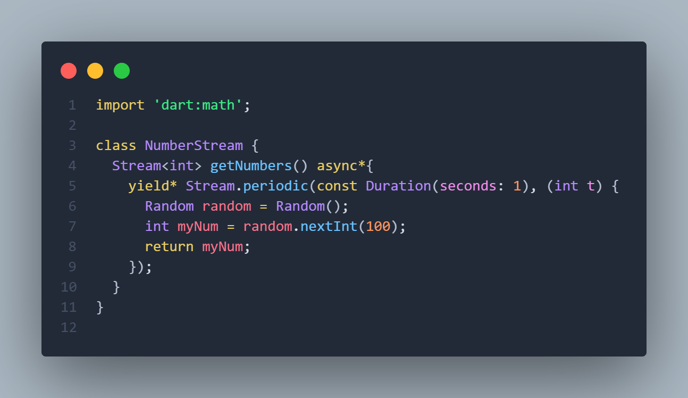
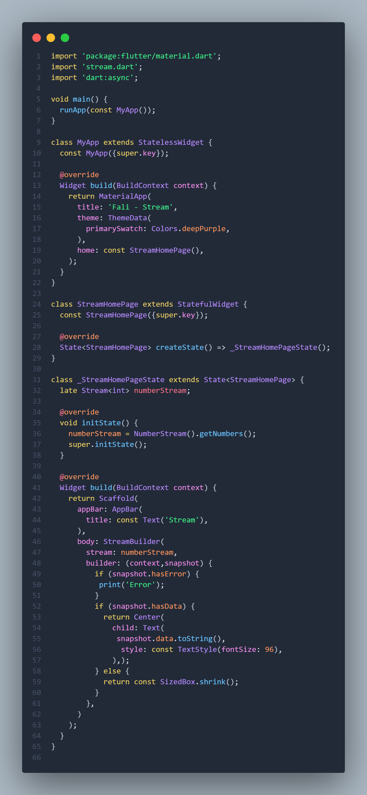

# Pemrograman Mobile - Pertemuan 12

**NIM: 2341720121**

**NAMA: FALI IRHAM MAULANA**

---

## **Praktikum 6: StreamBuilder**

### Langkah 1 - 8 

- **stream.dart :**



- **main.dart :**



```
Soal 12
- Jelaskan maksud kode pada langkah 3 dan 7 !
- Capture hasil praktikum Anda berupa GIF dan lampirkan di README.
- Lalu lakukan commit dengan pesan "W12: Jawaban Soal 12".
```

**Penjelasan :** Pada langkah ketiga, kode pada kelas NumberStream menggunakan fungsi getNumbers() yang didefinisikan sebagai async*, yang berarti fungsi tersebut menghasilkan stream secara bertahap menggunakan yield. Di dalamnya terdapat yield* Stream.periodic(...) yang membuat aliran data yang setiap satu detik menghasilkan angka acak baru. Setiap kali Stream.periodic mengeksekusi fungsinya, angka acak dari 0 sampai 99 dihasilkan oleh objek Random dan dikirimkan melalui stream. Dengan mekanisme ini, stream akan terus memancarkan angka baru tanpa henti selama widget masih aktif mendengarkan.

Pada langkah ketujuh, bagian StreamBuilder berfungsi sebagai widget yang membangun tampilan berdasarkan data terbaru yang diterima dari stream tersebut. Ketika stream memancarkan angka baru, snapshot.hasData akan bernilai benar dan StreamBuilder akan merender nilai itu ke layar dengan menampilkan angka besar di tengah aplikasi. Jika terjadi error, log akan menampilkan pesan bahwa ada kesalahan. Dengan kata lain, StreamBuilder adalah penghubung antara aliran data yang berubah setiap detik dengan UI, sehingga tampilan otomatis diperbarui setiap kali stream menghasilkan angka acak baru.

