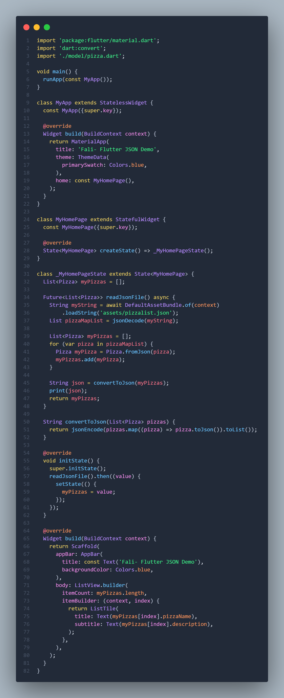
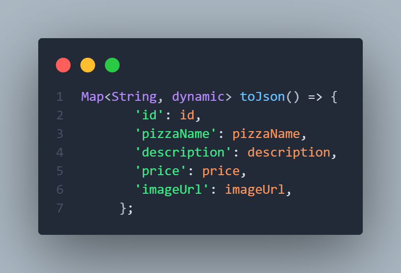
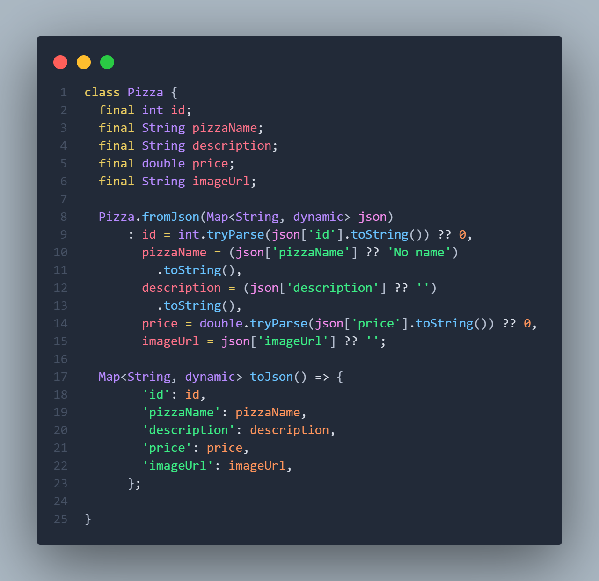
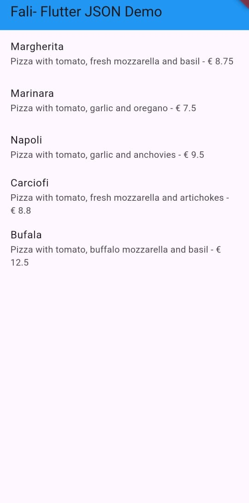
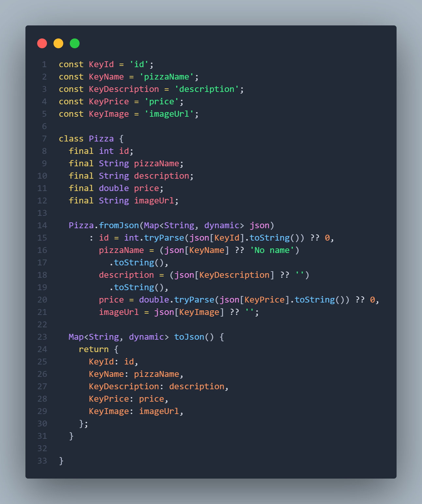
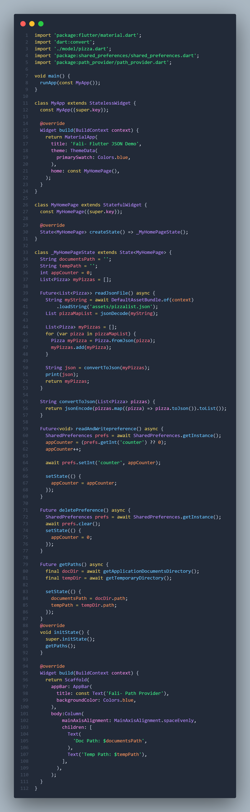
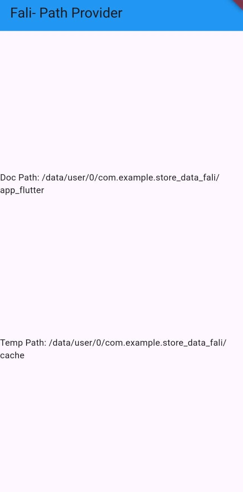
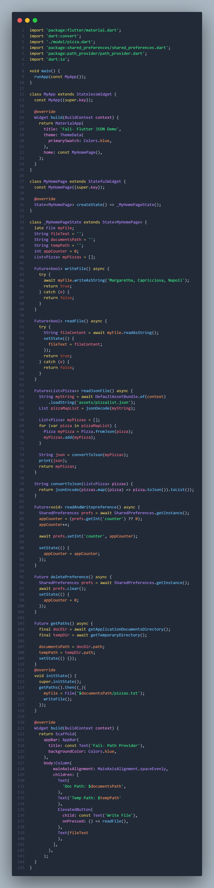

# Pemrograman Mobile - Pertemuan 13

**NIM: 2341720121**

**NAMA: FALI IRHAM MAULANA**

---

## **Praktikum 1: Konversi Dart model ke JSON**

### Langkah 1 - 10 

- **main.dart :**


- **pizzalist.json :**


```
Soal 2
- Masukkan hasil capture layar ke laporan praktikum Anda.
- Lakukan commit hasil jawaban Soal 2 dengan pesan "W13: Jawaban Soal 2"
```


### Langkah 11 - 22

- **main.dart :** 


- **model/pizza.dart :** 


```
Soal 3
- Masukkan hasil capture layar ke laporan praktikum Anda.
- Lakukan commit hasil jawaban Soal 2 dengan pesan "W13: Jawaban Soal 3"
```

x    

### Langkah 23 - 26

- **main.dart :** 



- **model/pizza.dart :** 



## **Praktikum 2: Handle kompatibilitas data JSON**

### Langkah 1 - 11

- **model/pizza.dart :** 



```
Soal 4
- Capture hasil running aplikasi Anda, kemudian impor ke laporan praktikum Anda!
- Lalu lakukan commit dengan pesan "W13: Jawaban Soal 4"
```


## **Praktikum 3: Menangani error JSON**

### 1 -4 

- **model/pizza.dart :** 



```
Soal 5
- Jelaskan maksud kode lebih safe dan maintainable!
- Capture hasil praktikum Anda dan lampirkan di README.
- Lalu lakukan commit dengan pesan "W13: Jawaban Soal 5".
```

**Penjelasan :** Kode tersebut dianggap lebih aman dan mudah dipelihara karena setiap bagian telah ditulis dengan pendekatan yang mencegah aplikasi mengalami error saat menerima data yang tidak sesuai ekspektasi. Dengan menggunakan tryParse, nilai seperti id dan price tetap bisa diproses meskipun formatnya salah atau bukan angka, sehingga konstruktor tidak akan memicu crash dan objek masih dapat dibuat dengan nilai default. Penggunaan operator null coalescing seperti ?? juga memastikan bahwa jika suatu field tidak ada atau bernilai null dalam JSON, aplikasi tetap mendapatkan nilai pengganti yang aman tanpa menyebabkan exception. Selain itu, pemisahan konstanta seperti KeyId, KeyName, dan lainnya membuat kode lebih mudah dipelihara karena jika suatu nama key berubah, cukup diperbarui pada satu tempat saja tanpa harus mencari dan mengganti di seluruh file. Struktur seperti ini menjadikan proses parsing terkontrol, mudah dicek, serta meminimalkan bug ketika sumber data berubah atau tidak konsisten.


## **Praktikum 4: SharedPreferences**

- **main.dart :** 


```
Soal 6
- Capture hasil praktikum Anda berupa GIF dan lampirkan di README.
- Lalu lakukan commit dengan pesan "W13: Jawaban Soal 6".
```


## **Praktikum 5: Akses filesystem dengan path_provider**

### Langkah 1 - 7 

- **main.dart :** 



```
Soal 7
Capture hasil praktikum Anda dan lampirkan di README.
Lalu lakukan commit dengan pesan "W13: Jawaban Soal 7".
```


## **Praktikum 6: Akses filesystem dengan direktori**

### Langkah 1 - 7 

- **main.dart :** 



```
Soal 8
- Jelaskan maksud kode pada langkah 3 dan 7 !
- Capture hasil praktikum Anda berupa GIF dan lampirkan di README.
- Lalu lakukan commit dengan pesan "W13: Jawaban Soal 8".
```
**Penjelasan :** Pada langkah 3, fungsi writeFile() digunakan untuk menuliskan sebuah teks ke dalam file yang sudah ditentukan sebelumnya. Fungsi ini bekerja secara asynchronous agar tidak menghambat proses utama aplikasi ketika file sedang ditulis. Di dalamnya, myFile.writeAsString(...) akan menyimpan teks “Margherita, Capricciosa, Napoli” ke file, dan jika proses menulis ini berhasil maka fungsi mengembalikan nilai true, sedangkan jika terjadi kesalahan fungsi akan menangkap error dan mengembalikan false. Dengan cara ini, aplikasi tetap aman dari crash ketika penulisan file gagal.

Pada langkah 7, ketika aplikasi dijalankan dan tombol "Read File" ditekan, isi file yang sebelumnya ditulis melalui writeFile() akan dibaca dan kemudian ditampilkan di layar. Artinya, konten yang ditulis pada langkah 3 menjadi bahan yang ditampilkan pada langkah 7. Proses ini memperlihatkan alur lengkap penulisan dan pembacaan file, sehingga pengguna dapat melihat bahwa data yang disimpan benar-benar berada di file dan dapat diakses kembali kapan pun aplikasi membacanya.

