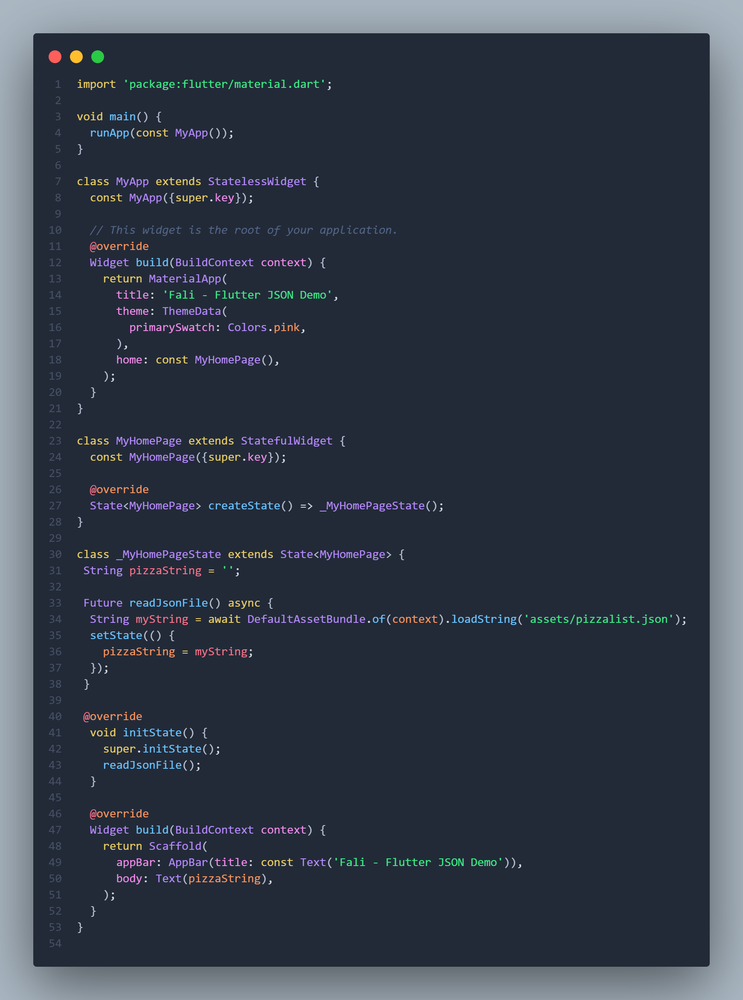
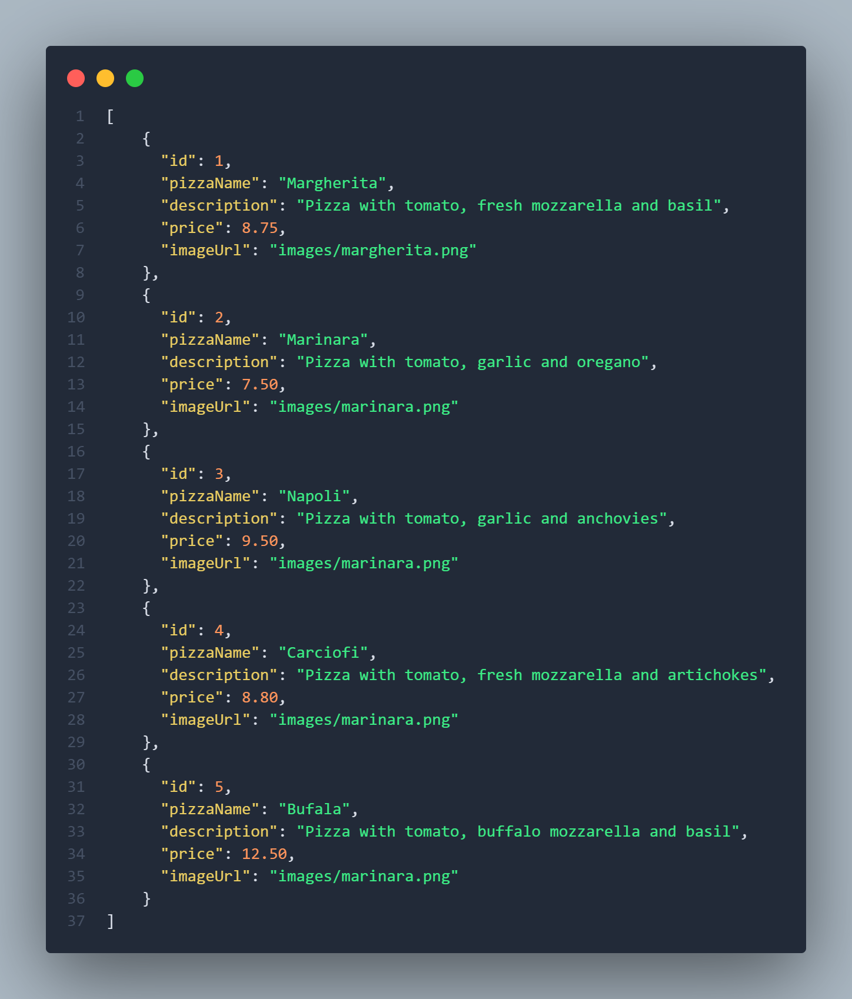
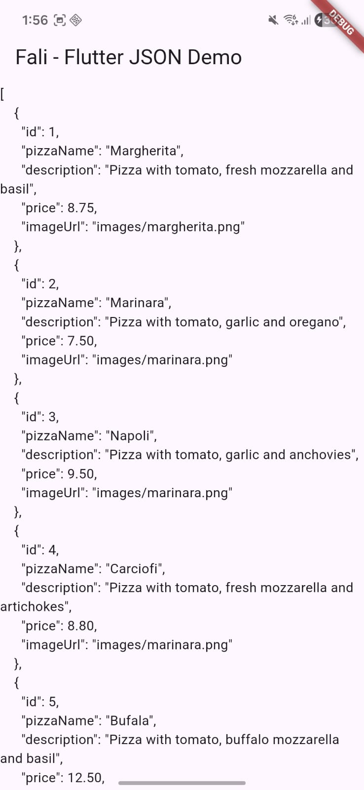
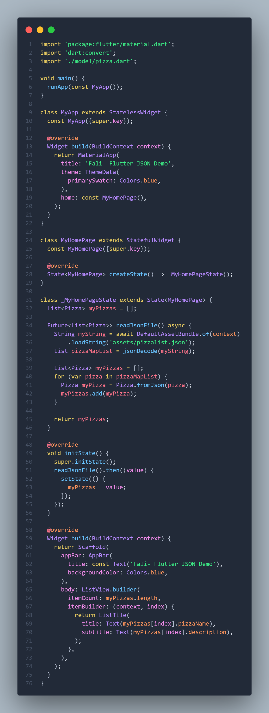
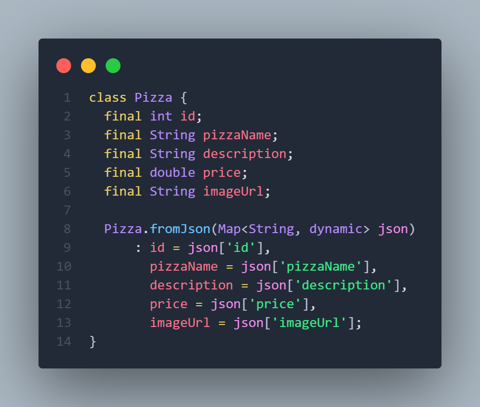
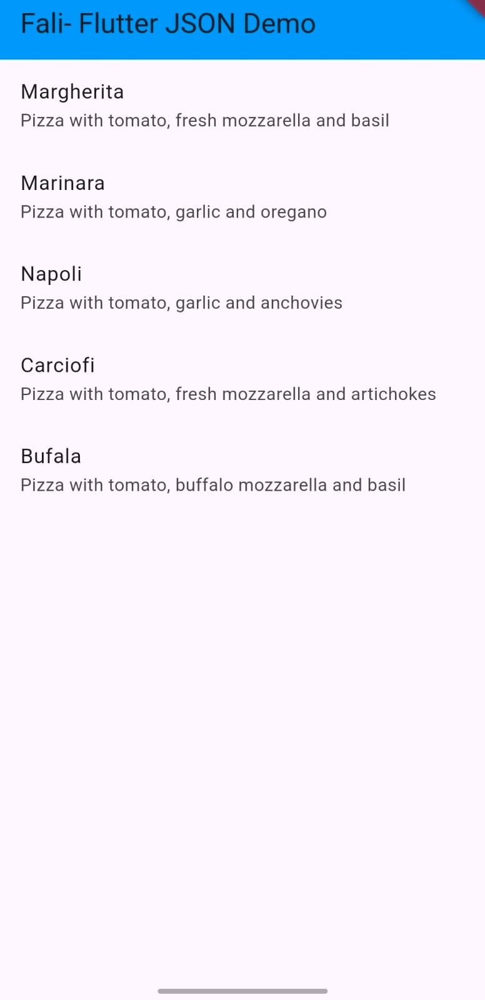

# Pemrograman Mobile - Pertemuan 13

**NIM: 2341720121**

**NAMA: FALI IRHAM MAULANA**

---

## **Praktikum 1: Konversi Dart model ke JSON**

### Langkah 1 - 10 

- **main.dart :**



- **pizzalist.json :**



```
Soal 2
- Masukkan hasil capture layar ke laporan praktikum Anda.
- Lakukan commit hasil jawaban Soal 2 dengan pesan "W13: Jawaban Soal 2"
```



### Langkah 11 - 22

- **main.dart :** 



- **model/pizza.dart :** 



```
Soal 3
- Masukkan hasil capture layar ke laporan praktikum Anda.
- Lakukan commit hasil jawaban Soal 2 dengan pesan "W13: Jawaban Soal 3"
```

