# Pemrograman Mobile - Pertemuan 14

**NIM: 2341720121**

**NAMA: FALI IRHAM MAULANA**

---

## **Praktikum 1: Membuat layanan Mock API**

### Langkah 1 - 10

- **Mockup API :**

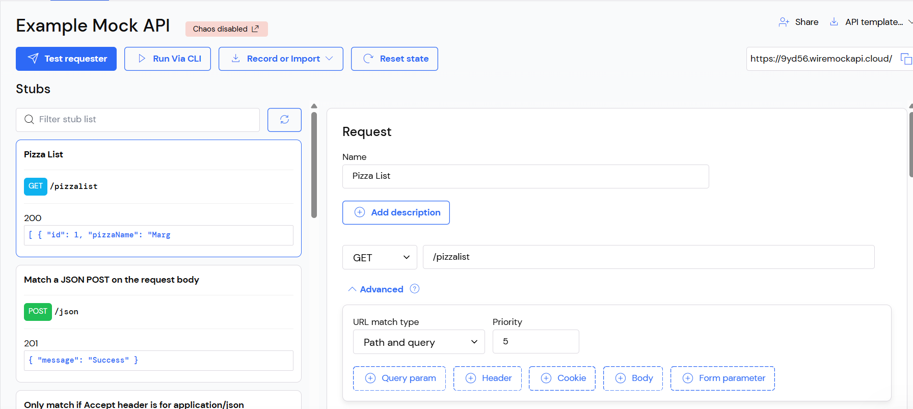

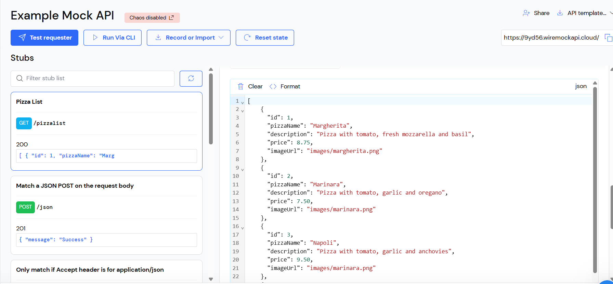

- **main.dart :**

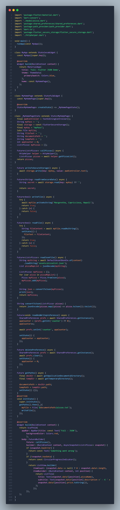

- **httphelper.dart :**

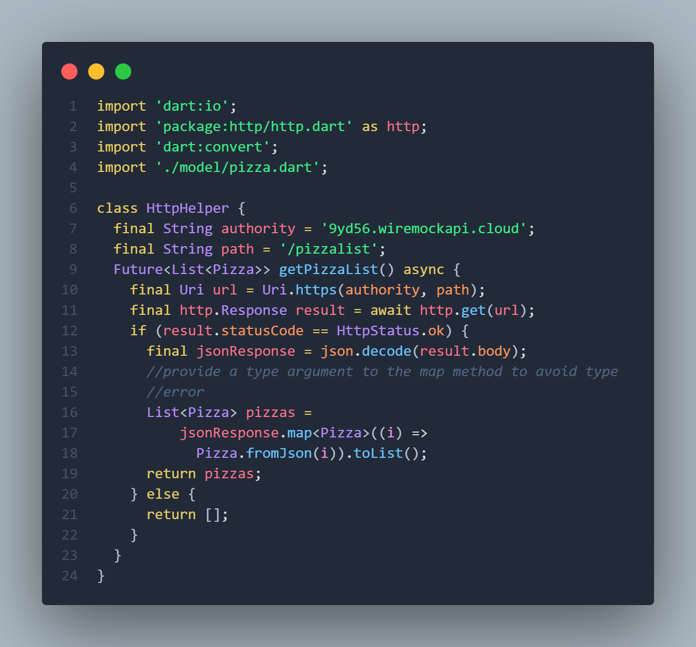

```
Soal 1
- Tambahkan nama panggilan Anda pada title app sebagai identitas hasil pekerjaan Anda.
- Gantilah warna tema aplikasi sesuai kesukaan Anda.
- Capture hasil aplikasi Anda, lalu masukkan ke laporan di README dan lakukan commit hasil jawaban Soal 1 dengan pesan "W14: Jawaban Soal 1"
```

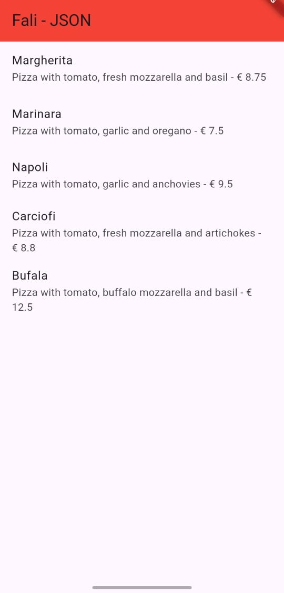

## **Praktikum 2: Mengirim Data ke Web Service (POST)**

### Langkah 1 - 16

- **Mockup API :**

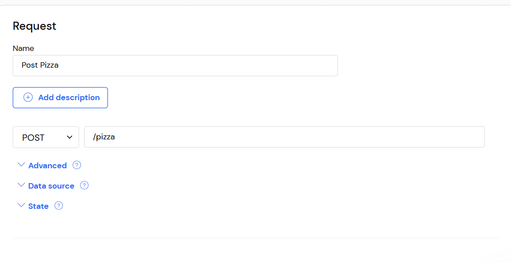

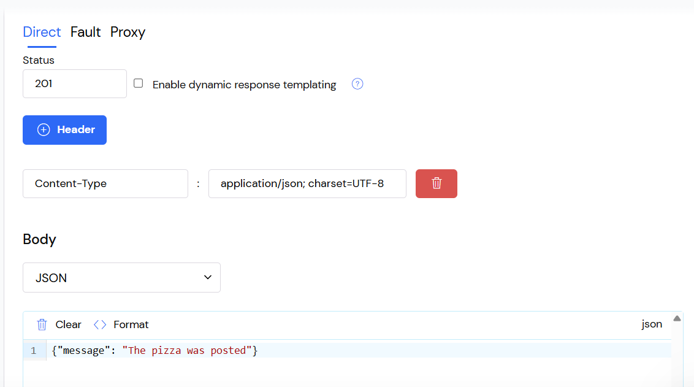

- **main.dart :**

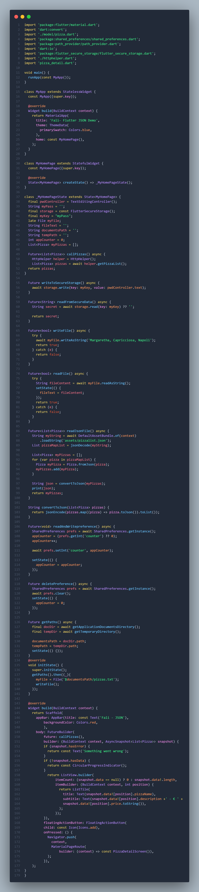

- **httphelper.dart:**

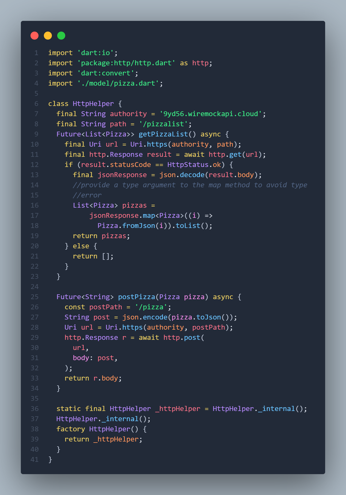

- **pizza_detail.dart :**

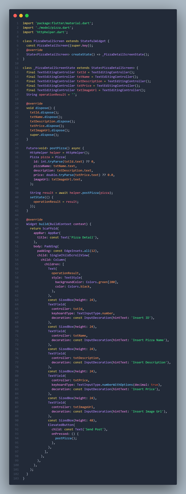

```
Soal 2
- Tambahkan field baru dalam JSON maupun POST ke Wiremock!
- Capture hasil aplikasi Anda berupa GIF di README dan lakukan commit hasil jawaban Soal 2 dengan pesan "W14: Jawaban Soal 2"
```


## **Praktikum 3: Memperbarui Data di Web Service (PUT)**

### Langkah 1 - 11

- **Mockup API :**

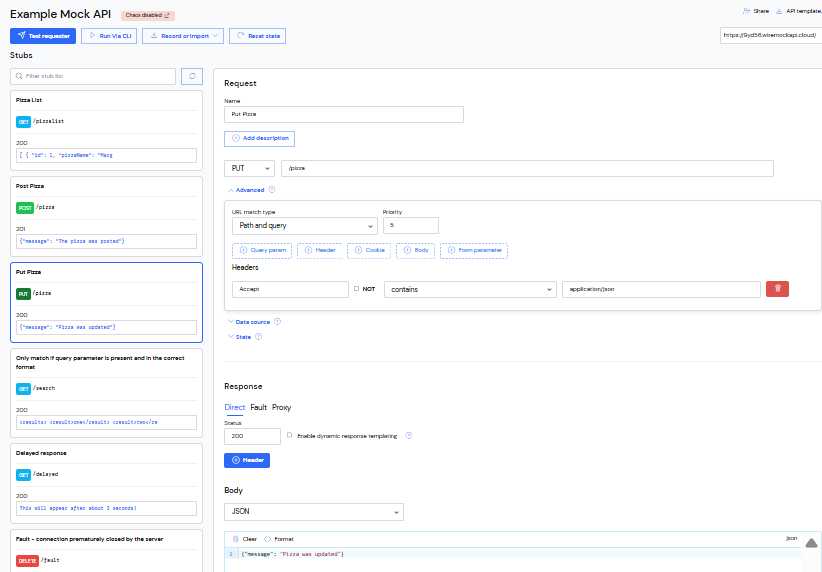


- **main.dart :**


- **httphelper.dart:**

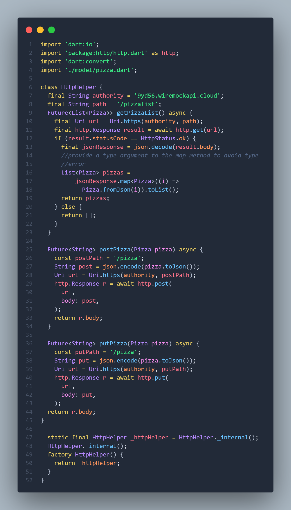

- **pizza_detail.dart :**

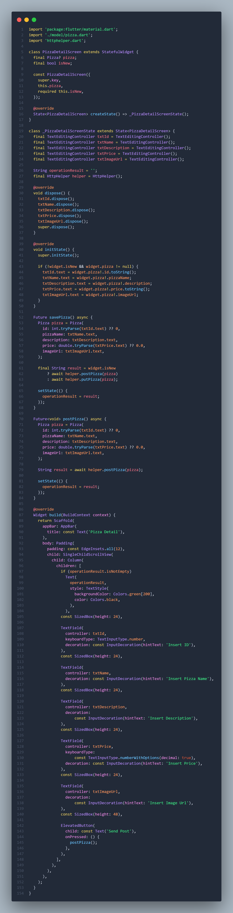


```
Soal 3
- Ubah salah satu data dengan Nama dan NIM Anda, lalu perhatikan hasilnya di Wiremock.
- Capture hasil aplikasi Anda berupa GIF di README dan lakukan commit hasil jawaban Soal 3 dengan pesan "W14: Jawaban Soal 3"
```

