# Pemrograman Mobile - Pertemuan 10

**NIM: 2341720121**

**NAMA: FALI IRHAM MAULANA**

---

## **Praktikum 1: Mengunduh Data dari Web Service (API)**

### Langkah 1 Buat Project Baru

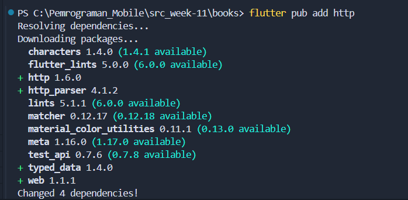

### Langkah 2: Cek file pubspec.yaml


### Langkah 3: Buka file main.dart

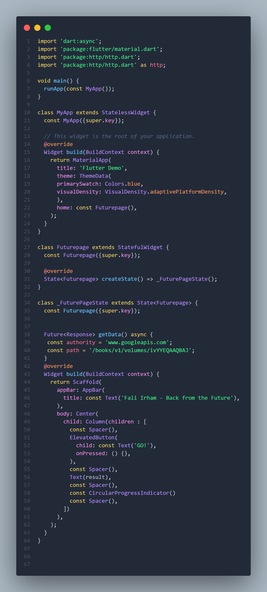

```
Soal 1. Tambahkan nama panggilan Anda pada title app sebagai identitas hasil pekerjaan Anda.
```

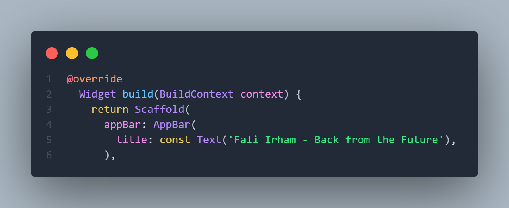

### Langkah 4: Tambah method getData()

```
Soal 2 Carilah judul buku favorit Anda di Google Books, lalu ganti ID buku pada variabel path di kode tersebut. Caranya ambil di URL browser Anda seperti gambar berikut ini.
Kemudian cobalah akses di browser URI tersebut dengan lengkap seperti ini. Jika menampilkan data JSON, maka Anda telah berhasil. Lakukan capture milik Anda dan tulis di README pada laporan praktikum. Lalu lakukan commit dengan pesan "W11: Soal 2"
```
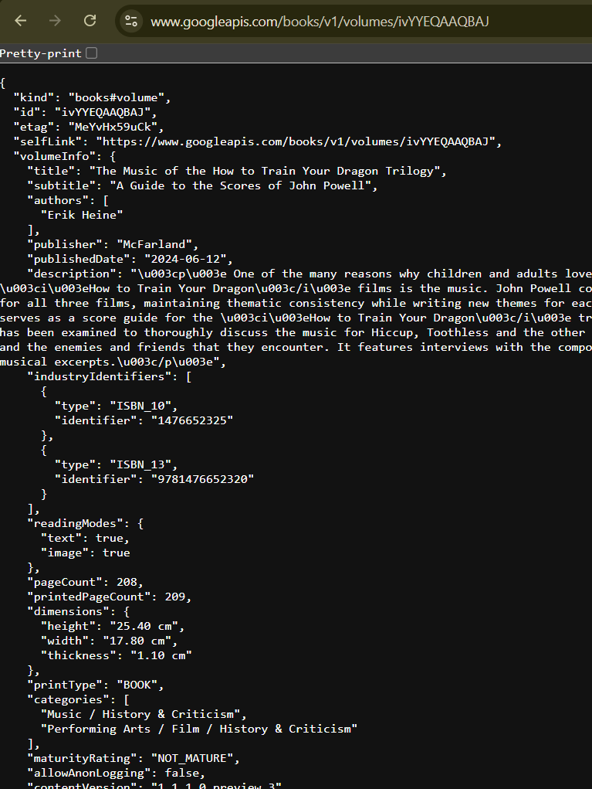

### Langkah 5: Tambah kode di ElevatedButton

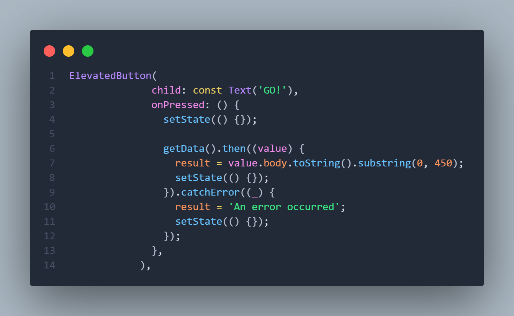

```
Soal 3
Jelaskan maksud kode langkah 5 tersebut terkait substring dan catchError!
Capture hasil praktikum Anda berupa GIF dan lampirkan di README. Lalu lakukan commit dengan pesan "W11: Soal 3".
```

**Jawaban :** Pada langkah tersebut, substring digunakan untuk mengambil sebagian isi respons dari server, tepatnya hanya karakter dari indeks 0 sampai 450, sehingga data yang ditampilkan tidak seluruhnya tetapi dipotong agar lebih ringkas atau menghindari teks yang terlalu panjang. Sementara itu, catchError berfungsi menangkap dan menangani error yang mungkin terjadi ketika proses getData dijalankan, misalnya ketika koneksi gagal atau server tidak merespons. Jika terjadi error, blok catchError akan men-set nilai result menjadi pesan “An error occurred” sehingga aplikasi tetap memberikan keluaran yang jelas dan tidak crash, kemudian memanggil setState untuk memperbarui tampilan sesuai kondisi tersebut.


## **Praktikum 2: Menggunakan await/async untuk menghindari callbacks**

### Langkah 1 - 4

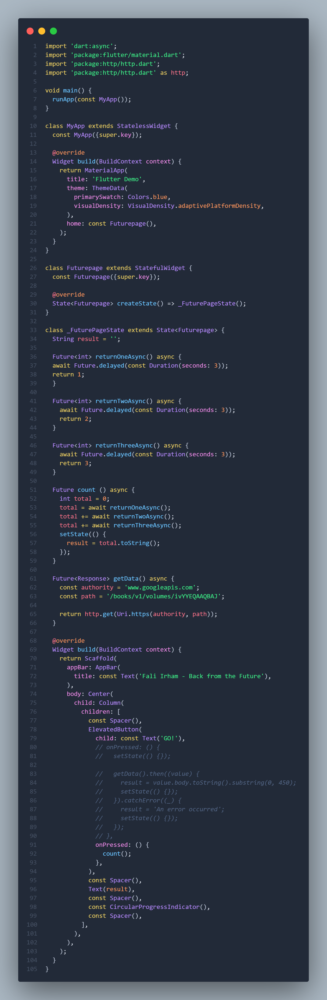

```
Soal 4
- Jelaskan maksud kode langkah 1 dan 2 tersebut!
- Capture hasil praktikum Anda berupa GIF dan lampirkan di README. Lalu lakukan commit dengan pesan "W11: Soal 4".
```
**Penjelasan :** Pada langkah pertama, tiga fungsi asynchronous dibuat untuk mensimulasikan proses yang memerlukan waktu, masing-masing menunggu tiga detik sebelum mengembalikan nilai 1, 2, dan 3. Fungsi returnOneAsync, returnTwoAsync, dan returnThreeAsync menggunakan await Future.delayed untuk menunda pengembalian hasil, sehingga dapat menggambarkan proses seperti pengambilan data dari server atau perhitungan berat yang tidak langsung selesai.

Pada langkah kedua, fungsi count menjalankan ketiga fungsi asynchronous tersebut secara berurutan menggunakan await sehingga setiap proses harus benar-benar selesai sebelum melanjutkan ke proses berikutnya. Nilai yang dikembalikan dari masing-masing fungsi dijumlahkan ke dalam variabel total, lalu hasil akhirnya ditampilkan ke antarmuka melalui setState dengan mengubah variabel result menjadi nilai total tersebut.


## **Praktikum 3: Menggunakan Completer di Future**

### Langkah 1- 4 

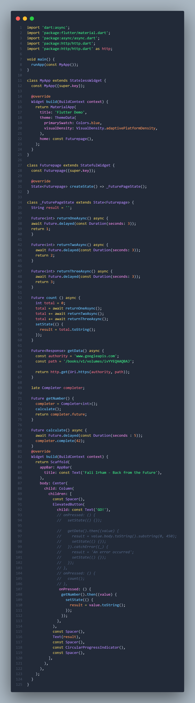

```
Soal 5
- Jelaskan maksud kode langkah 2 tersebut!
- Capture hasil praktikum Anda berupa GIF dan lampirkan di README. Lalu lakukan commit dengan pesan "W11: Soal 5".
```

**Penjelasan :** Kode pada langkah tersebut menunjukkan cara kerja Completer untuk membuat sebuah future yang kendali penyelesaiannya ditentukan secara manual. Variabel completer dideklarasikan sebagai late, artinya ia akan diinisialisasi nanti ketika fungsi getNumber dipanggil. Di dalam getNumber, sebuah objek Completer<int> dibuat sehingga menghasilkan future yang belum terselesaikan, lalu fungsi calculate dijalankan untuk melakukan proses asynchronous. Ketika calculate dijalankan, ia menunggu selama lima detik menggunakan Future.delayed sebagai simulasi proses yang memerlukan waktu, dan setelah waktu tersebut selesai, completer.complete dipanggil untuk memberikan nilai 42 sebagai hasil akhir.


### Langkah 5 - 6 

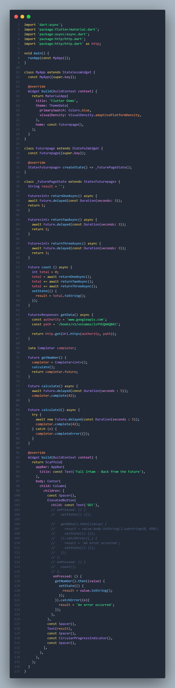

```
Soal 6
- Jelaskan maksud perbedaan kode langkah 2 dengan langkah 5-6 tersebut!
- Capture hasil praktikum Anda berupa GIF dan lampirkan di README. Lalu lakukan commit dengan pesan "W11: Soal 6".
```

**Penjelasan :** Perbedaan antara langkah 2 dan langkah 5–6 terletak pada cara keduanya menangani proses asynchronous serta bagaimana mereka menghadapi kemungkinan terjadinya error. Pada langkah 2, fungsi calculate berjalan tanpa mekanisme penanganan kesalahan; ia hanya menunggu lima detik dan kemudian memanggil completer.complete untuk menyelesaikan future dengan nilai 42. Jika terjadi kegagalan, misalnya completer sudah pernah diselesaikan sebelumnya, fungsi tersebut tidak memiliki cara untuk memberikan sinyal bahwa kesalahan terjadi sehingga errornya dapat menyebabkan aplikasi berhenti atau memunculkan pengecualian yang tidak tertangani. Sementara itu, langkah 5–6, yaitu calculate2 dan pemanggilan getNumber di dalam onPressed, menambahkan lapisan keamanan dengan try–catch. Jika terjadi error selama proses asynchronous, completer.completeError dipanggil untuk mengirimkan error sebagai nilai future. Bagian onPressed kemudian memanfaatkan catchError untuk menangkap error tersebut sehingga aplikasi dapat menampilkan pesan yang lebih ramah, seperti “An error occurred,” tanpa membuat aplikasi crash.


## **Praktikum 4: Memanggil Future secara paralel**

### Langkah 1 - 3

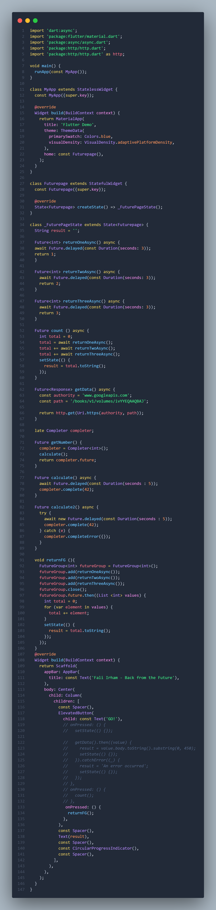

```
Soal 7
Capture hasil praktikum Anda berupa GIF dan lampirkan di README. Lalu lakukan commit dengan pesan "W11: Soal 7".
```


### Langkah 4: : Ganti variabel futureGroup

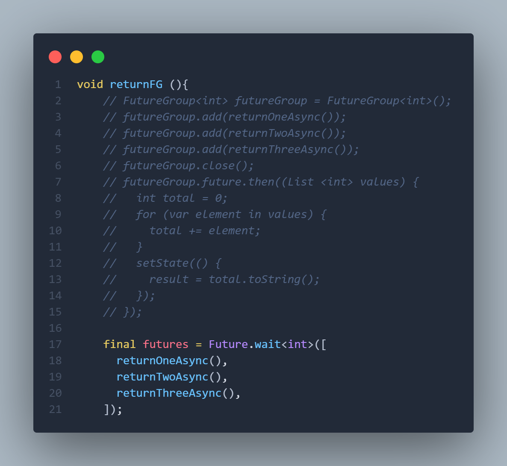

```
Soal 8
Jelaskan maksud perbedaan kode langkah 1 dan 4!
```

**Penjelasan :** Perbedaan antara langkah 1 dan langkah 4 terletak pada cara keduanya menjalankan beberapa future sekaligus serta bagaimana hasil akhirnya diproses. Pada langkah 1, kode menggunakan FutureGroup, yaitu mekanisme yang mengumpulkan beberapa future secara bertahap, menutup grup dengan close, lalu menunggu semua future selesai sebelum memberikan daftar hasil. Setelah semua nilai diterima, kode melakukan perulangan manual untuk menjumlahkan seluruh elemen dan menampilkannya melalui setState. Struktur ini lebih panjang karena FutureGroup bekerja seperti “keranjang future” yang dapat ditambahkan satu per satu sebelum ditutup.

Sebaliknya, pada langkah 4 digunakan Future.wait yang merupakan cara lebih ringkas dan langsung untuk menjalankan beberapa future secara paralel. Future.wait menerima list future dan mengembalikan sebuah future baru yang selesai ketika semua future di dalamnya selesai, serta menghasilkan list nilai yang urut sesuai posisi future yang diberikan. Dengan kata lain, Future.wait memberikan fungsi yang sama seperti FutureGroup tetapi dengan penulisan jauh lebih sederhana dan tanpa perlu langkah tambahan seperti close atau pengaturan grup. Pada kode langkah 4, nilai hasil dari Future.wait belum diproses, tetapi intinya mekanisme ini menggantikan seluruh proses FutureGroup dengan satu baris yang lebih efisien.

## **Praktikum 5: Menangani Respon Error pada Async Code**

### Langkah 1 - 3 

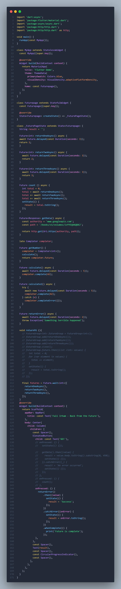

```
Soal 9
Capture hasil praktikum Anda berupa GIF dan lampirkan di README. Lalu lakukan commit dengan pesan "W11: Soal 9".
```


### Langkah 4: Tambah method handleError()

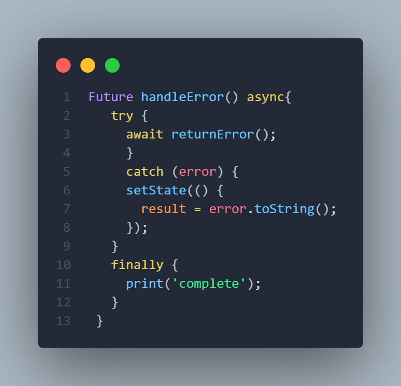

```
Soal 10
Panggil method handleError() tersebut di ElevatedButton, lalu run. Apa hasilnya? Jelaskan perbedaan kode langkah 1 dan 4!
```
**Penjelasan :** Langkah 1 menggunakan pendekatan berbasis future chaining dengan memanfaatkan .then(), .catchError(), dan .whenComplete() langsung pada fungsi yang mengembalikan future. Cara ini melakukan penanganan hasil dan error di luar fungsi, dengan memprosesnya melalui callback berantai. Jika future berhasil, .then() dijalankan; jika gagal, .catchError() menangani error; dan .whenComplete() tetap dipanggil pada akhir proses tanpa peduli sukses atau gagal.

Langkah 4, yaitu fungsi handleError(), menggunakan struktur try–catch–finally di dalam fungsi asynchronous itu sendiri. Penanganan error dilakukan secara internal sehingga alur lebih terpusat dan mirip gaya pemrograman sinkron. Ketika error terjadi, ia langsung tertangkap di dalam blok catch dan UI diperbarui melalui setState. Bagian finally memastikan kode tertentu tetap dijalankan setelah try maupun catch selesai.


## **Praktikum 6: Menggunakan Future dengan StatefulWidget**

### Langkah 1: install plugin geolocator

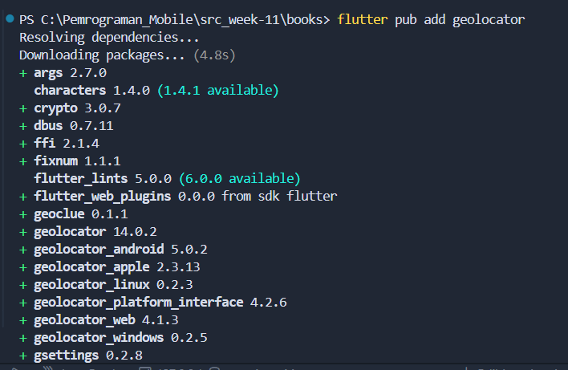

### Langkah 2: Tambah permission GPS

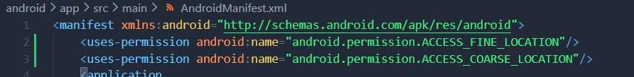

### Langkah 3 - 7 : 

- **geolocation.dart :**

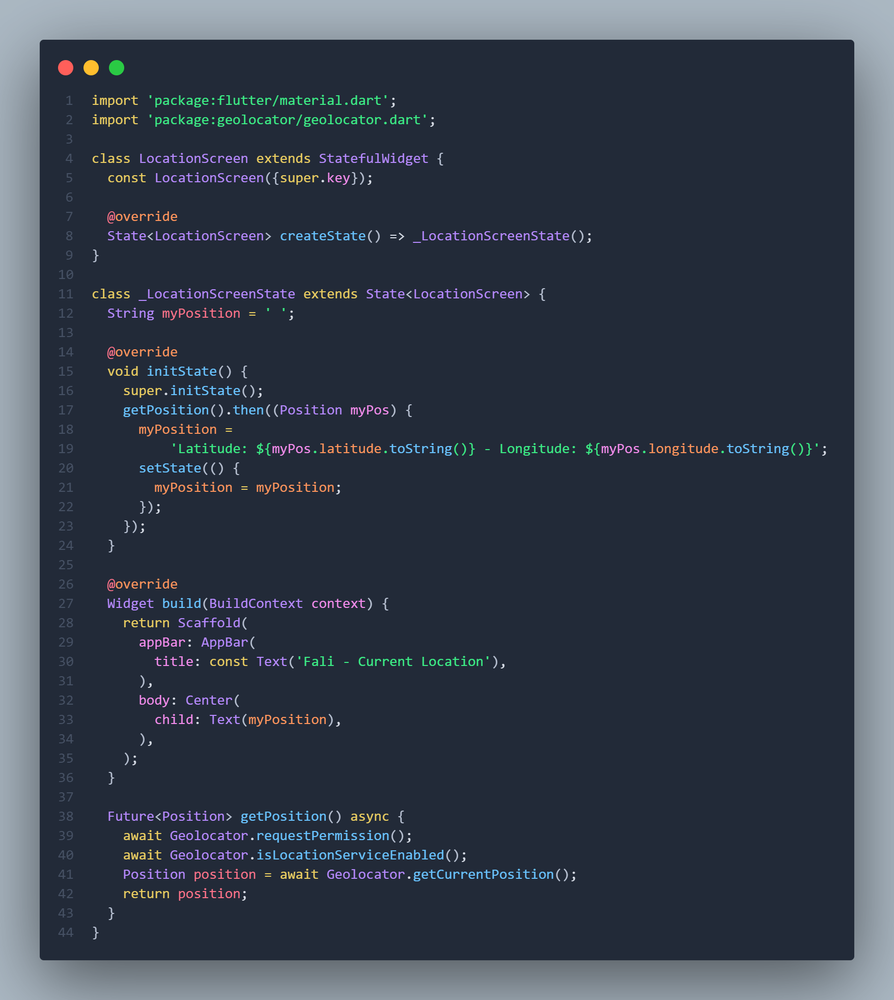

- **main.dart**

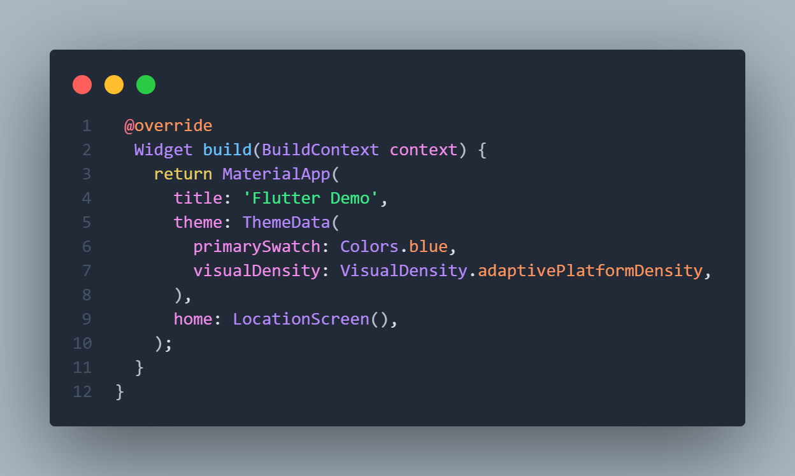

- **Output :**


### Langkah 8: Tambahkan animasi loading 

- **geolocation.dart :**

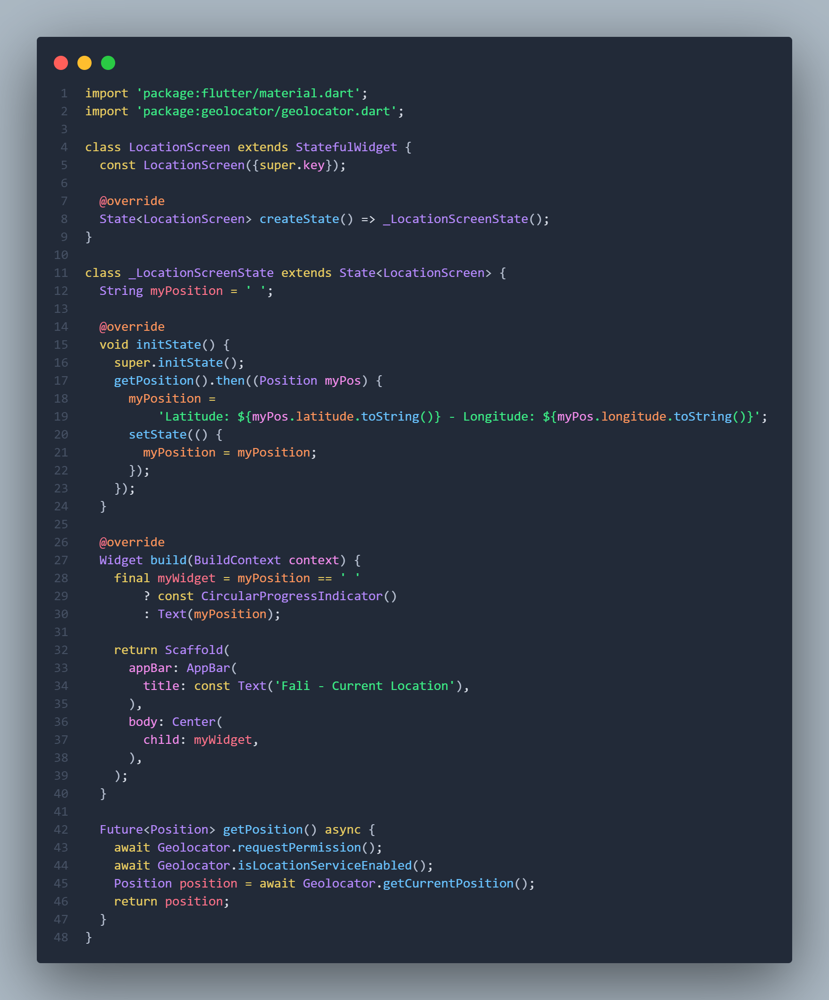

```
Soal 12
- Jika Anda tidak melihat animasi loading tampil, kemungkinan itu berjalan sangat cepat. Tambahkan delay pada method getPosition() dengan kode await Future.delayed(const Duration(seconds: 3));
- Apakah Anda mendapatkan koordinat GPS ketika run di browser? Mengapa demikian?
- Capture hasil praktikum Anda berupa GIF dan lampirkan di README. Lalu lakukan commit dengan pesan "W11: Soal 12".
```

**Jawaban :**

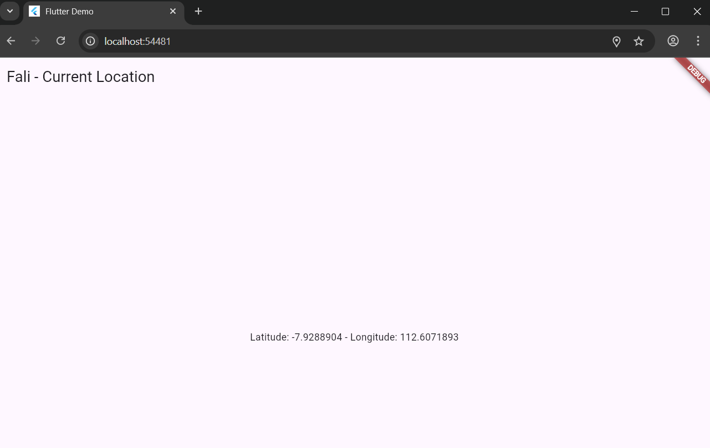

 aplikasi Flutter yang dijalankan melalui browser Chrome dapat memperoleh koordinat lokasi, tetapi mekanismenya berbeda dari aplikasi mobile. Pada Flutter Web, lokasi tidak diambil langsung dari sensor GPS perangkat, melainkan melalui Browser Geolocation API. Setelah  memberikan permission pada Chrome—biasanya berupa pop-up “Allow this site to access your location?”—browser akan mengizinkan aplikasi mengakses lokasi. Namun, lokasi yang diberikan oleh browser umumnya tidak seakurat GPS karena bersumber dari jaringan WiFi, alamat IP, atau data lokasi kasar yang tersedia pada perangkat. Selain itu, fitur geolokasi di browser hanya berfungsi jika aplikasi dijalankan melalui HTTPS atau http://localhost
, sehingga menjalankan Flutter dengan flutter run -d chrome tetap memungkinkan akses lokasi. Dengan demikian, meskipun permission sudah diberikan dan aplikasi berjalan normal, akurasi lokasi di Chrome mungkin tidak setinggi ketika aplikasi dijalankan di perangkat Android atau iOS yang menggunakan sensor GPS bawaan.


## **Praktikum 7: Manajemen Future dengan FutureBuilder**

### Langkah 1 - 4 : 

- **geolocation.dart :**

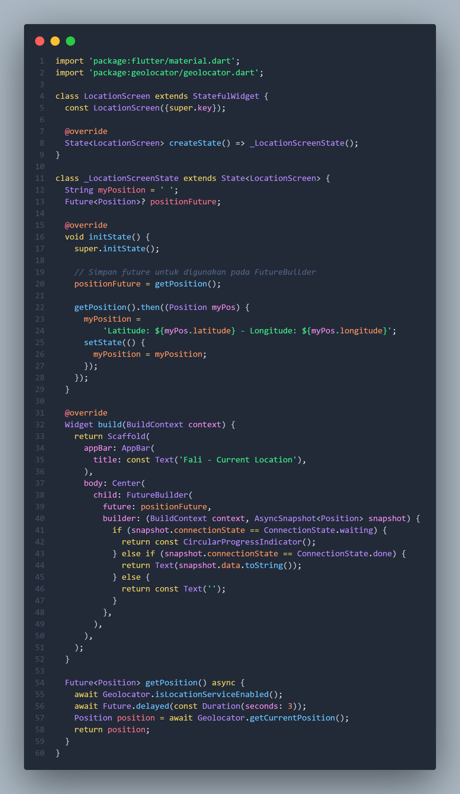

```
Soal 13
- Apakah ada perbedaan UI dengan praktikum sebelumnya? Mengapa demikian?
- Capture hasil praktikum Anda berupa GIF dan lampirkan di README. Lalu lakukan commit dengan pesan "W11: Soal 13".
- Seperti yang Anda lihat, menggunakan FutureBuilder lebih efisien, clean, dan reactive dengan Future bersama UI.
```

**Penjelasan :**

Ya, terdapat perbedaan tampilan UI dibandingkan praktikum sebelumnya. Pada praktikum sebelumnya, antarmuka langsung menampilkan teks berisi koordinat setelah proses pengambilan lokasi selesai dan setState() dipanggil, sehingga perubahan UI terjadi secara sederhana tanpa menampilkan status proses yang sedang berlangsung. Sementara itu, pada kode saat ini, UI menggunakan FutureBuilder yang membangun ulang tampilan berdasarkan status proses asynchronous. Akibatnya, sebelum lokasi berhasil diperoleh, pengguna melihat indikator loading terlebih dahulu, dan setelah proses selesai barulah koordinat ditampilkan. Perbedaan pendekatan dalam menangani data asynchronous inilah yang membuat UI tampak berbeda, meskipun fungsionalitas utama tetap sama.


### Langkah 5: Tambah handling error

- **geolocation.dart :**

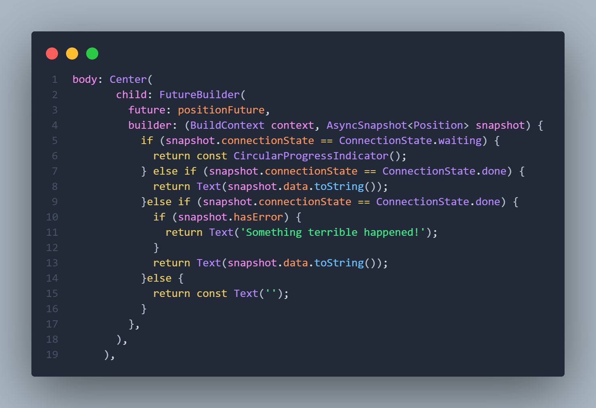

```
Soal 14
- Apakah ada perbedaan UI dengan langkah sebelumnya? Mengapa demikian?
- Capture hasil praktikum Anda berupa GIF dan lampirkan di README. Lalu lakukan commit dengan pesan "W11: Soal 14".
```
**Penjelasan :**

menampilkan hasil lokasi ketika Future selesai dijalankan, tanpa mempertimbangkan kemungkinan terjadinya error. Setelah penambahan blok pengecekan snapshot.hasError, FutureBuilder kini mampu menampilkan pesan error secara eksplisit ketika terjadi kegagalan dalam proses pengambilan lokasi. Perubahan ini membuat UI lebih informatif dan responsif karena pengguna dapat mengetahui apakah kegagalan terjadi akibat izin lokasi ditolak, layanan lokasi dimatikan, atau ada kendala lain. Dengan adanya penanganan error ini, tampilan UI menjadi sedikit berbeda, karena kini dapat menampilkan teks khusus ketika terjadi masalah, bukan hanya loading atau data yang berhasil diperoleh.


## **Praktikum 8: Navigation route dengan Future Function**

### Langkah 1 - 8 : 

- **navigation_first.dart :**

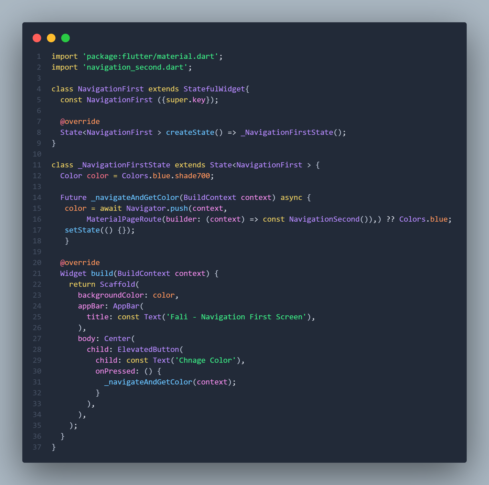

- **navigation_second.dart :**

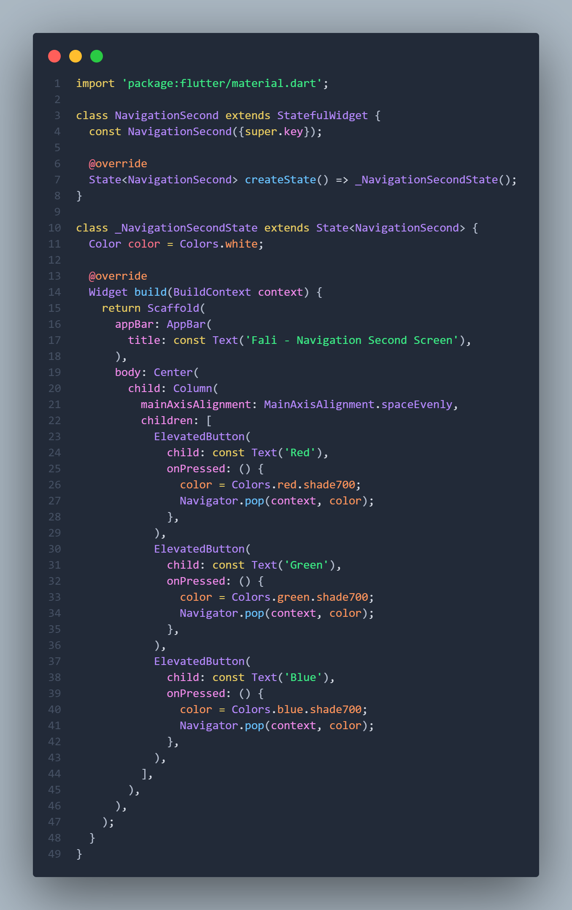

```
Soal 16
- Cobalah klik setiap button, apa yang terjadi ? Mengapa demikian ?
- Gantilah 3 warna pada langkah 5 dengan warna favorit Anda!
- Capture hasil praktikum Anda berupa GIF dan lampirkan di README. Lalu lakukan commit dengan pesan "W11: Soal 16".
```
**Penjelasan :** Ketika mengklik salah satu tombol di layar, aplikasi akan langsung menutup layar tersebut dan mengirimkan warna (Color) yang dipilih kembali ke layar sebelumnya melalui Navigator.pop(context, color). Misalnya, jika menekan tombol “Red”, layar kedua akan menutup dan mengirimkan Colors.red.shade700 ke layar pertama. Hal ini terjadi karena setiap tombol memanggil Navigator.pop dengan nilai warna sebagai argumen, sehingga nilai tersebut bisa diterima dan digunakan oleh layar yang memanggil NavigationSecond. Dengan kata lain, tombol tidak hanya memicu perubahan internal, tetapi juga mengembalikan data ke layar sebelumnya, sehingga UI di layar pertama bisa diperbarui sesuai warna yang dipilih.


## **Praktikum 9: Memanfaatkan async/await dengan Widget Dialog**

### Langkah 1 - 6 

- **navigation_dialog.dart :**

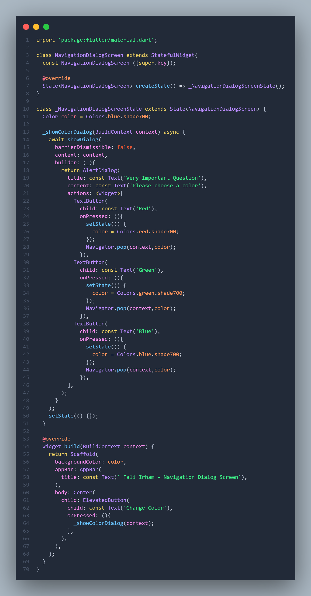

```
Soal 17
- Cobalah klik setiap button, apa yang terjadi ? Mengapa demikian ?
- Gantilah 3 warna pada langkah 3 dengan warna favorit Anda!
- Capture hasil praktikum Anda berupa GIF dan lampirkan di README. Lalu lakukan commit dengan pesan "W11: Soal 17".
```
**Penjelasan :** Ketika menekan tombol “Change Color”, sebuah AlertDialog akan muncul meminta memilih warna: Red, Green, atau Blue. Jika kemudian menemun salah satu tombol warna di dialog, beberapa hal terjadi secara berurutan:

State diubah: Fungsi setState() di dalam tombol dijalankan sehingga variabel color di state diubah sesuai warna yang dipilih. Misalnya, jika tombol “Red” ditekan, color = Colors.red.shade700.

Dialog ditutup: Navigator.pop(context, color) menutup dialog dan mengembalikan nilai color sebagai hasil dialog (walaupun nilai itu tidak digunakan di layar ini, tapi tetap dikembalikan ke Future dari showDialog).

UI dibangun ulang: Karena setState() dipanggil, Flutter melakukan rebuild widget Scaffold, sehingga properti backgroundColor yang menggunakan variabel color diperbarui. Akibatnya, latar belakang layar berubah menjadi warna yang dipilih.

Dengan kata lain, setiap tombol tidak hanya menutup dialog, tetapi juga memperbarui state color, yang kemudian memicu perubahan warna latar belakang layar. Itulah sebabnya setelah menekan tombol Red, Green, atau Blue, warna layar langsung berubah sesuai pilihan.


**Perubahan warna sesuai selera :**

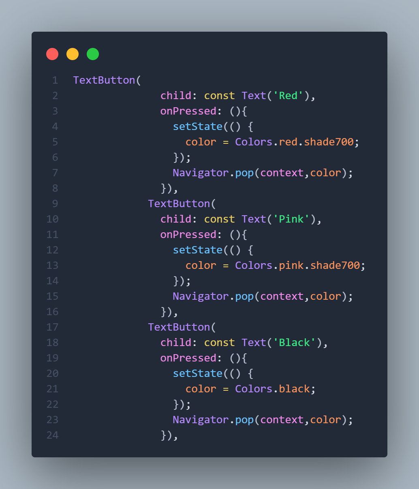


